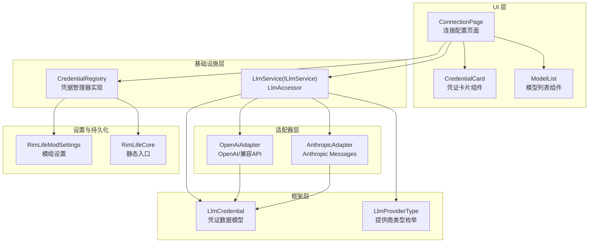
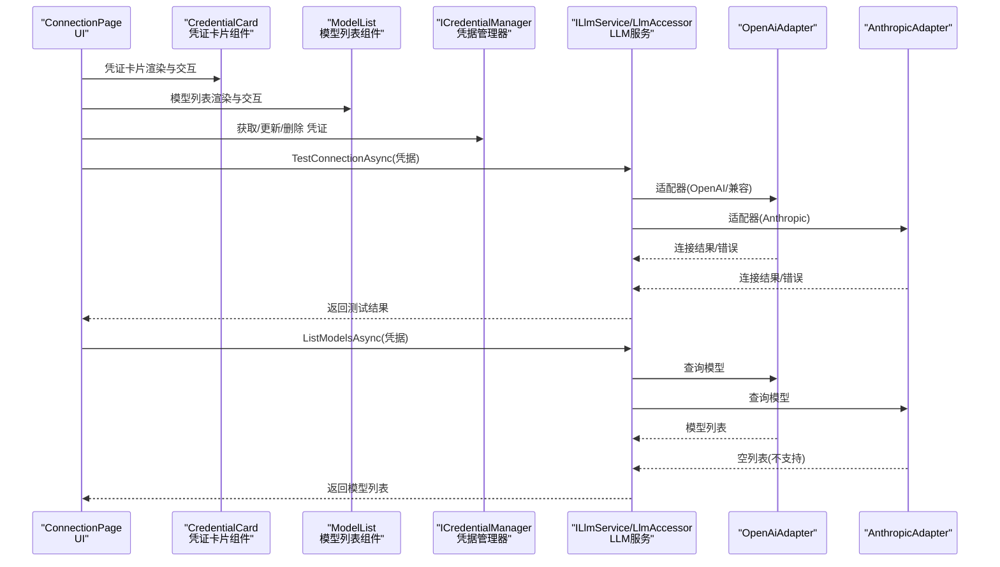
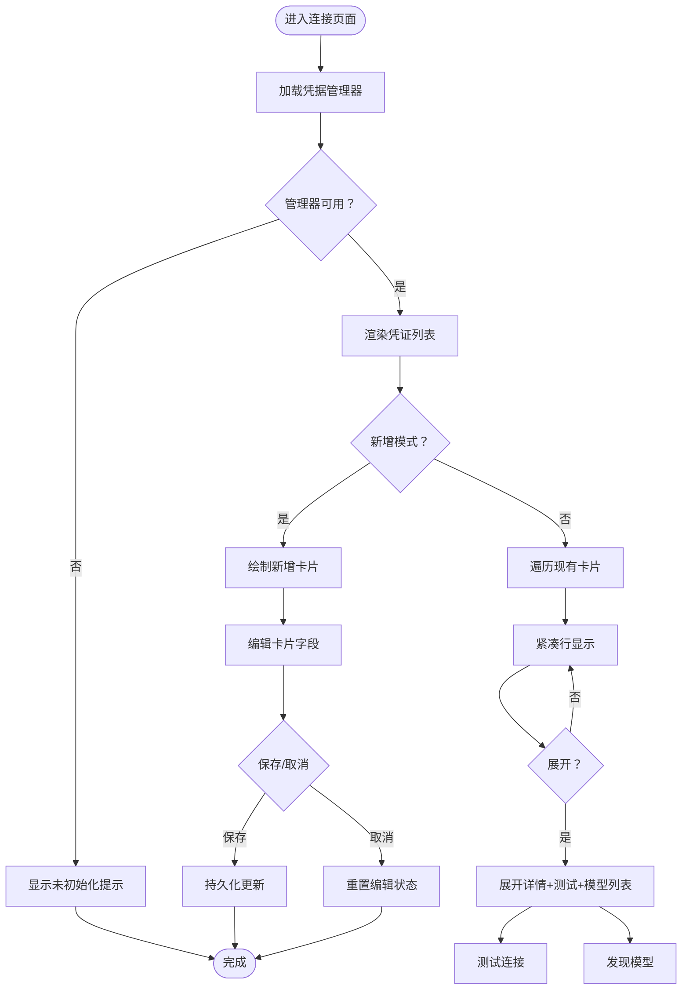
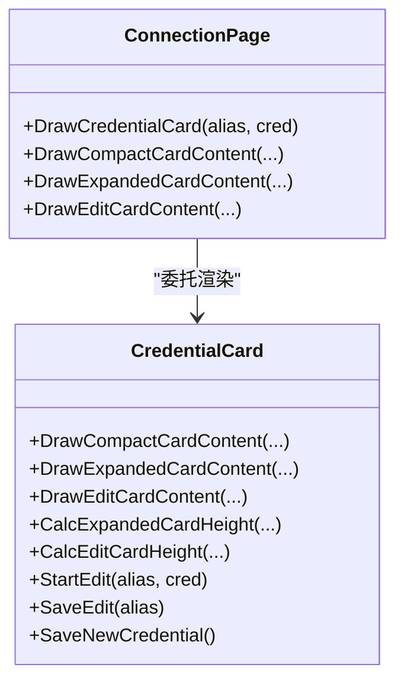
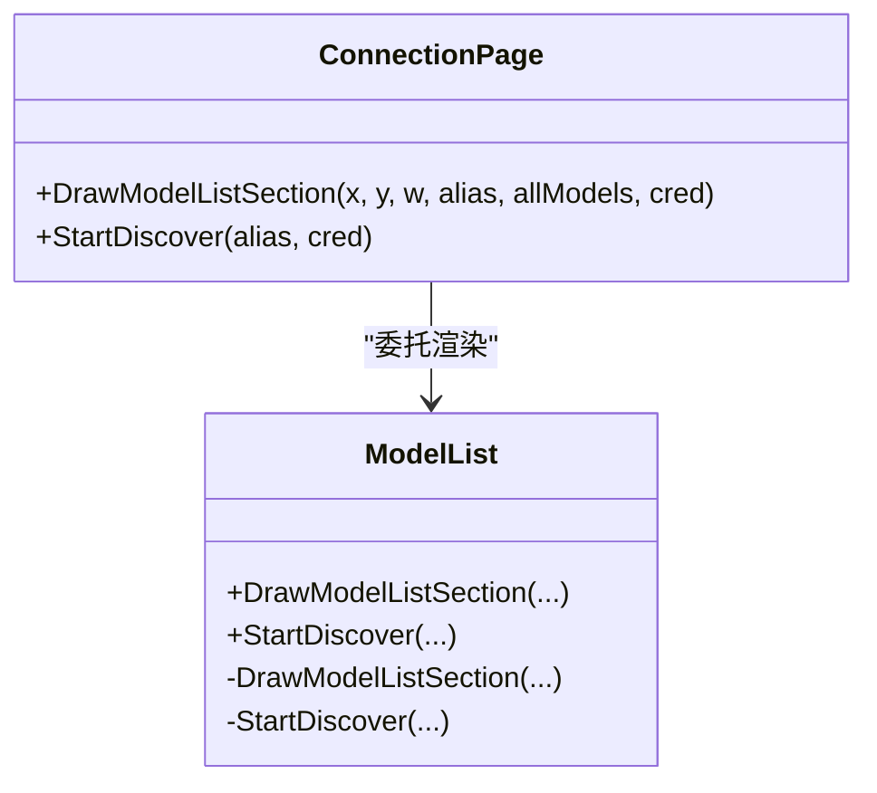
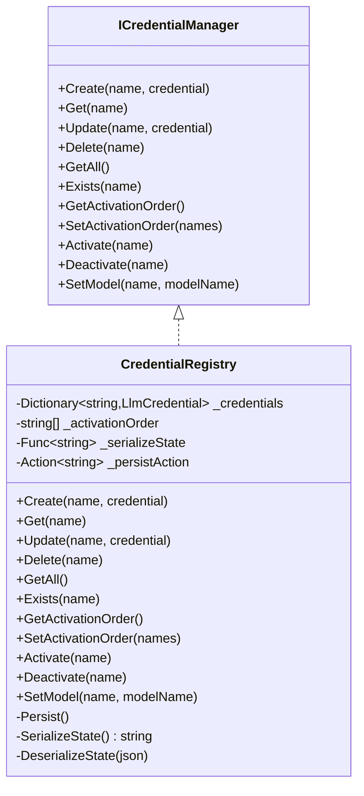
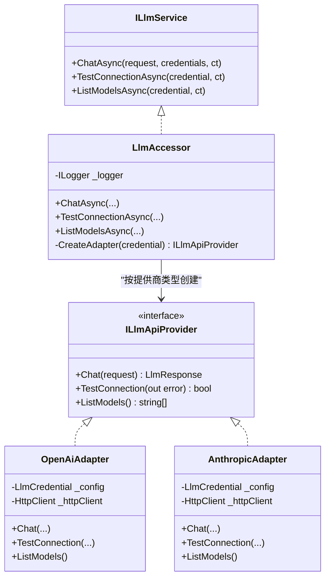
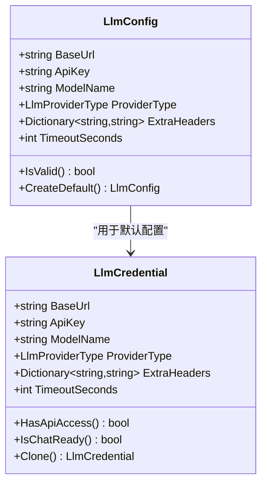
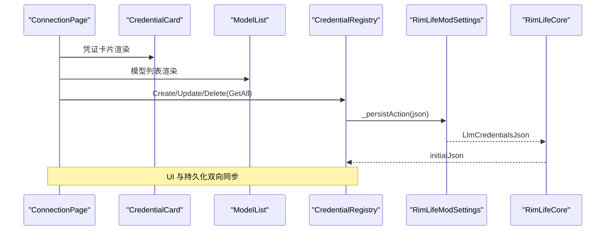
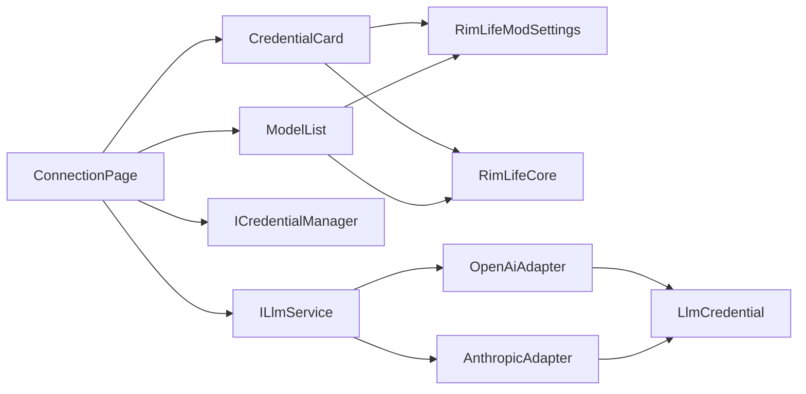

# 连接配置页面

<cite>
**本文档引用的文件**
- [ConnectionPage.cs](file://Source/UI/Pages/ConnectionPage.cs)
- [ConnectionPage.CredentialCard.cs](file://Source/UI/Pages/ConnectionPage.CredentialCard.cs)
- [ConnectionPage.ModelList.cs](file://Source/UI/Pages/ConnectionPage.ModelList.cs)
- [CredentialRegistry.cs](file://ext/npclife/src/NPCLife/Infrastructure/Llm/CredentialRegistry.cs)
- [OpenAiAdapter.cs](file://ext/npclife/src/NPCLife/Infrastructure/Llm/OpenAiAdapter.cs)
- [AnthropicAdapter.cs](file://ext/npclife/src/NPCLife/Infrastructure/Llm/AnthropicAdapter.cs)
- [LlmAccessor.cs](file://ext/npclife/src/NPCLife/Infrastructure/Llm/LlmAccessor.cs)
- [LlmCredential.cs](file://ext/npclife/src/NPCLife/Framework/Llm/LlmCredential.cs)
- [ICredentialManager.cs](file://ext/npclife/src/NPCLife/Core/ICredentialManager.cs)
- [ILlmService.cs](file://ext/npclife/src/NPCLife/Core/ILlmService.cs)
- [RimLifeMod.cs](file://Source/Settings/RimLifeMod.cs)
- [RimLifeCore.cs](file://Source/Infrastructure/RimLifeCore.cs)
</cite>

## 更新摘要
**变更内容**
- 连接页面进行了模块化重构，拆分为CredentialCard和ModelList组件
- 提高了代码组织性和可维护性
- 保持了原有的功能完整性

## 目录
1. [简介](#简介)
2. [项目结构](#项目结构)
3. [核心组件](#核心组件)
4. [架构总览](#架构总览)
5. [详细组件分析](#详细组件分析)
6. [依赖关系分析](#依赖关系分析)
7. [性能考虑](#性能考虑)
8. [故障排查指南](#故障排查指南)
9. [结论](#结论)
10. [附录](#附录)

## 简介
本文件面向连接配置页面，系统性阐述 LLM 凭证配置的完整流程，涵盖 OpenAI 与 Anthropic 提供商的集成方式、API 密钥安全存储机制、模型发现功能、连接状态验证、凭据管理器使用方法、激活顺序与模型优先级设置、连接测试、错误处理与网络超时处理，并提供配置向导与最佳实践建议，帮助快速定位常见连接问题与认证失败场景。

**更新** 页面现在采用模块化设计，将凭证卡片渲染和模型列表功能拆分为独立组件，提升了代码的可维护性和可读性。

## 项目结构
连接配置页面位于 UI 层，负责凭证的展示、编辑、测试与模型发现；底层通过凭据管理器与 LLM 服务进行交互，最终调用适配器对接不同提供商的 API。

**图表来源**
- [ConnectionPage.cs:22-27](file://Source/UI/Pages/ConnectionPage.cs#L22-L27)
- [ConnectionPage.CredentialCard.cs:10-14](file://Source/UI/Pages/ConnectionPage.CredentialCard.cs#L10-L14)
- [ConnectionPage.ModelList.cs:13-16](file://Source/UI/Pages/ConnectionPage.ModelList.cs#L13-L16)
- [CredentialRegistry.cs:19-51](file://ext/npclife/src/NPCLife/Infrastructure/Llm/CredentialRegistry.cs#L19-L51)
- [LlmAccessor.cs:26-36](file://ext/npclife/src/NPCLife/Infrastructure/Llm/LlmAccessor.cs#L26-L36)
- [OpenAiAdapter.cs:18-29](file://ext/npclife/src/NPCLife/Infrastructure/Llm/OpenAiAdapter.cs#L18-L29)
- [AnthropicAdapter.cs:23-37](file://ext/npclife/src/NPCLife/Infrastructure/Llm/AnthropicAdapter.cs#L23-L37)
- [LlmCredential.cs:12-31](file://ext/npclife/src/NPCLife/Framework/Llm/LlmCredential.cs#L12-L31)
- [RimLifeMod.cs:13-41](file://Source/Settings/RimLifeMod.cs#L13-L41)
- [RimLifeCore.cs:1019-1057](file://Source/Infrastructure/RimLifeCore.cs#L1019-L1057)

**章节来源**
- [ConnectionPage.cs:22-27](file://Source/UI/Pages/ConnectionPage.cs#L22-L27)
- [ConnectionPage.CredentialCard.cs:10-14](file://Source/UI/Pages/ConnectionPage.CredentialCard.cs#L10-L14)
- [ConnectionPage.ModelList.cs:13-16](file://Source/UI/Pages/ConnectionPage.ModelList.cs#L13-L16)
- [CredentialRegistry.cs:19-51](file://ext/npclife/src/NPCLife/Infrastructure/Llm/CredentialRegistry.cs#L19-L51)
- [LlmAccessor.cs:26-36](file://ext/npclife/src/NPCLife/Infrastructure/Llm/LlmAccessor.cs#L26-L36)
- [RimLifeMod.cs:13-41](file://Source/Settings/RimLifeMod.cs#L13-L41)
- [RimLifeCore.cs:1019-1057](file://Source/Infrastructure/RimLifeCore.cs#L1019-L1057)

## 核心组件
- **连接配置页面（UI）**：负责凭证卡片的渲染、编辑、测试与模型发现，维护每张卡片的 UI 状态与异步操作状态。现在采用模块化设计，将凭证卡片渲染和模型列表功能拆分为独立组件。
- **凭证卡片组件（UI）**：处理单个凭证卡片的三种状态（紧凑行、展开详情、编辑表单）渲染与交互逻辑。
- **模型列表组件（UI）**：处理模型发现、搜索过滤、选择管理等功能。
- **凭证管理器（Infrastructure）**：提供凭据的 CRUD、激活顺序管理与持久化，确保凭据状态与模组设置同步。
- **LLM 服务（Infrastructure）**：封装异步调用，支持多凭证 fallback、连接测试与模型发现。
- **适配器（Infrastructure）**：针对 OpenAI/兼容 API 与 Anthropic Messages API 的请求构建与响应解析。
- **数据模型（Framework）**：凭证数据结构与提供商类型枚举，定义 API 访问与聊天级校验规则。
- **设置与持久化（Settings/Infrastructure）**：通过模组设置进行 JSON 序列化持久化，RimLifeCore 提供静态入口。

**更新** 代码现在采用模块化架构，ConnectionPage 主文件仅包含主要逻辑，凭证卡片渲染和模型列表功能分别在独立的文件中实现，提高了代码的可维护性和可读性。

**章节来源**
- [ConnectionPage.cs:17-1117](file://Source/UI/Pages/ConnectionPage.cs#L17-L1117)
- [ConnectionPage.CredentialCard.cs:10-410](file://Source/UI/Pages/ConnectionPage.CredentialCard.cs#L10-L410)
- [ConnectionPage.ModelList.cs:13-151](file://Source/UI/Pages/ConnectionPage.ModelList.cs#L13-L151)
- [CredentialRegistry.cs:19-329](file://ext/npclife/src/NPCLife/Infrastructure/Llm/CredentialRegistry.cs#L19-L329)
- [LlmAccessor.cs:26-331](file://ext/npclife/src/NPCLife/Infrastructure/Llm/LlmAccessor.cs#L26-L331)
- [OpenAiAdapter.cs:18-392](file://ext/npclife/src/NPCLife/Infrastructure/Llm/OpenAiAdapter.cs#L18-L392)
- [AnthropicAdapter.cs:23-434](file://ext/npclife/src/NPCLife/Infrastructure/Llm/AnthropicAdapter.cs#L23-L434)
- [LlmCredential.cs:12-84](file://ext/npclife/src/NPCLife/Framework/Llm/LlmCredential.cs#L12-L84)
- [RimLifeMod.cs:13-69](file://Source/Settings/RimLifeMod.cs#L13-L69)
- [RimLifeCore.cs:1019-1057](file://Source/Infrastructure/RimLifeCore.cs#L1019-L1057)

## 架构总览
连接配置页面通过凭据管理器与 LLM 服务交互，服务根据提供商类型选择对应适配器，完成连接测试与模型发现。UI 层负责状态展示与用户交互，底层负责数据持久化与网络通信。现在采用模块化设计，将凭证卡片渲染和模型列表功能分离到独立组件中。

**图表来源**
- [ConnectionPage.cs:868-956](file://Source/UI/Pages/ConnectionPage.cs#L868-L956)
- [ConnectionPage.CredentialCard.cs:18-201](file://Source/UI/Pages/ConnectionPage.CredentialCard.cs#L18-L201)
- [ConnectionPage.ModelList.cs:21-148](file://Source/UI/Pages/ConnectionPage.ModelList.cs#L21-L148)
- [LlmAccessor.cs:196-281](file://ext/npclife/src/NPCLife/Infrastructure/Llm/LlmAccessor.cs#L196-L281)
- [OpenAiAdapter.cs:79-143](file://ext/npclife/src/NPCLife/Infrastructure/Llm/OpenAiAdapter.cs#L79-L143)
- [AnthropicAdapter.cs:70-100](file://ext/npclife/src/NPCLife/Infrastructure/Llm/AnthropicAdapter.cs#L70-L100)

**章节来源**
- [ConnectionPage.cs:868-956](file://Source/UI/Pages/ConnectionPage.cs#L868-L956)
- [ConnectionPage.CredentialCard.cs:18-201](file://Source/UI/Pages/ConnectionPage.CredentialCard.cs#L18-L201)
- [ConnectionPage.ModelList.cs:21-148](file://Source/UI/Pages/ConnectionPage.ModelList.cs#L21-L148)
- [LlmAccessor.cs:196-281](file://ext/npclife/src/NPCLife/Infrastructure/Llm/LlmAccessor.cs#L196-L281)

## 详细组件分析

### 凭证卡片与 UI 状态管理
- 单张凭证卡片包含名称、提供商类型、Base URL、API Key、当前模型、测试状态与错误信息。
- UI 维护每张卡片的展开/收起、编辑、显示/隐藏 API Key、模型列表搜索与选择等状态。
- 支持新增、编辑、删除凭证，删除采用二次确认，防止误操作。

**更新** 凭证卡片功能现在集中在独立的CredentialCard组件中，包含三种状态的渲染逻辑：
- 紧凑行：显示基本信息和基本操作按钮
- 展开详情：显示完整信息、测试连接、获取模型列表等
- 编辑表单：提供完整的编辑界面，支持新增和修改

**图表来源**
- [ConnectionPage.cs:77-164](file://Source/UI/Pages/ConnectionPage.cs#L77-L164)
- [ConnectionPage.CredentialCard.cs:18-201](file://Source/UI/Pages/ConnectionPage.CredentialCard.cs#L18-L201)
- [ConnectionPage.CredentialCard.cs:227-386](file://Source/UI/Pages/ConnectionPage.CredentialCard.cs#L227-L386)
- [ConnectionPage.CredentialCard.cs:506-687](file://Source/UI/Pages/ConnectionPage.CredentialCard.cs#L506-L687)

**章节来源**
- [ConnectionPage.cs:77-222](file://Source/UI/Pages/ConnectionPage.cs#L77-L222)
- [ConnectionPage.CredentialCard.cs:18-201](file://Source/UI/Pages/ConnectionPage.CredentialCard.cs#L18-L201)
- [ConnectionPage.CredentialCard.cs:227-386](file://Source/UI/Pages/ConnectionPage.CredentialCard.cs#L227-L386)
- [ConnectionPage.CredentialCard.cs:506-687](file://Source/UI/Pages/ConnectionPage.CredentialCard.cs#L506-L687)

### 凭证卡片组件（新增）
- **紧凑行渲染**：显示凭证名称、提供商类型、Base URL 摘要和基本操作按钮
- **展开详情渲染**：显示完整 Base URL、API Key（支持显示/隐藏）、当前模型、测试错误信息和操作按钮
- **编辑表单渲染**：提供完整的编辑界面，包括名称、Base URL、API Key、模型名和提供商类型选择
- **状态管理**：维护每卡片的展开/收起、编辑、显示/隐藏 API Key 等状态

**新增** 凭证卡片组件专门处理单个凭证卡片的所有渲染和交互逻辑，包括三种不同的显示状态和复杂的编辑功能。

**图表来源**
- [ConnectionPage.cs:176-228](file://Source/UI/Pages/ConnectionPage.cs#L176-L228)
- [ConnectionPage.CredentialCard.cs:18-386](file://Source/UI/Pages/ConnectionPage.CredentialCard.cs#L18-L386)

**章节来源**
- [ConnectionPage.CredentialCard.cs:18-386](file://Source/UI/Pages/ConnectionPage.CredentialCard.cs#L18-L386)

### 模型列表组件（新增）
- **模型发现**：通过 LLM 服务查询可用模型，支持异步操作和错误处理
- **搜索过滤**：支持正则表达式搜索和简单包含匹配
- **选择管理**：提供模型选择开关，自动将第一个选中的模型设为当前模型
- **状态管理**：维护每凭证的模型列表、搜索文本、滚动位置等状态

**新增** 模型列表组件专门处理模型发现、搜索和选择功能，提供完整的模型管理体验。

**图表来源**
- [ConnectionPage.cs:196-201](file://Source/UI/Pages/ConnectionPage.cs#L196-L201)
- [ConnectionPage.ModelList.cs:21-148](file://Source/UI/Pages/ConnectionPage.ModelList.cs#L21-L148)

**章节来源**
- [ConnectionPage.ModelList.cs:21-148](file://Source/UI/Pages/ConnectionPage.ModelList.cs#L21-L148)

### 凭证管理器（CredentialRegistry）
- 提供凭据的创建、读取、更新、删除与全量查询。
- 维护激活顺序（fallback 链路），支持追加、移除与重新排序。
- 持久化采用 JSON 序列化，字段兼容历史版本，通过模组设置写入磁盘。
- 线程安全：内部使用锁保护状态变更，持久化失败不影响运行时。

**图表来源**
- [ICredentialManager.cs:11-80](file://ext/npclife/src/NPCLife/Core/ICredentialManager.cs#L11-L80)
- [CredentialRegistry.cs:19-329](file://ext/npclife/src/NPCLife/Infrastructure/Llm/CredentialRegistry.cs#L19-L329)

**章节来源**
- [ICredentialManager.cs:11-80](file://ext/npclife/src/NPCLife/Core/ICredentialManager.cs#L11-L80)
- [CredentialRegistry.cs:19-329](file://ext/npclife/src/NPCLife/Infrastructure/Llm/CredentialRegistry.cs#L19-L329)

### LLM 服务与适配器
- LlmAccessor 作为 ILlmService 的实现，负责：
  - ChatAsync：支持多凭证 fallback，按顺序尝试，成功即返回。
  - TestConnectionAsync：测试连通性（先尝试 /v1/models，失败则最小请求）。
  - ListModelsAsync：查询可用模型（OpenAI/兼容支持，Anthropic 返回空）。
- 适配器根据提供商类型创建：
  - OpenAiAdapter：构建 OpenAI Chat Completions 请求，解析响应与用量。
  - AnthropicAdapter：构建 Messages API 请求，解析 content 数组与 tool_use。

**图表来源**
- [ILlmService.cs:17-51](file://ext/npclife/src/NPCLife/Core/ILlmService.cs#L17-L51)
- [LlmAccessor.cs:26-331](file://ext/npclife/src/NPCLife/Infrastructure/Llm/LlmAccessor.cs#L26-L331)
- [OpenAiAdapter.cs:18-392](file://ext/npclife/src/NPCLife/Infrastructure/Llm/OpenAiAdapter.cs#L18-L392)
- [AnthropicAdapter.cs:23-434](file://ext/npclife/src/NPCLife/Infrastructure/Llm/AnthropicAdapter.cs#L23-L434)

**章节来源**
- [ILlmService.cs:17-51](file://ext/npclife/src/NPCLife/Core/ILlmService.cs#L17-L51)
- [LlmAccessor.cs:26-331](file://ext/npclife/src/NPCLife/Infrastructure/Llm/LlmAccessor.cs#L26-L331)
- [OpenAiAdapter.cs:18-392](file://ext/npclife/src/NPCLife/Infrastructure/Llm/OpenAiAdapter.cs#L18-L392)
- [AnthropicAdapter.cs:23-434](file://ext/npclife/src/NPCLife/Infrastructure/Llm/AnthropicAdapter.cs#L23-L434)

### 凭证数据模型与提供商类型
- LlmCredential：包含 BaseUrl、ApiKey、ModelName、ProviderType、ExtraHeaders、TimeoutSeconds，提供 API 访问级与聊天级校验。
- LlmConfig：框架默认配置，包含默认 OpenAI Base URL、ProviderType 等。

**图表来源**
- [LlmCredential.cs:12-84](file://ext/npclife/src/NPCLife/Framework/Llm/LlmCredential.cs#L12-L84)
- [LlmConfig.cs:23-69](file://ext/npclife/src/NPCLife/Framework/Llm/LlmConfig.cs#L23-L69)

**章节来源**
- [LlmCredential.cs:12-84](file://ext/npclife/src/NPCLife/Framework/Llm/LlmCredential.cs#L12-L84)
- [LlmConfig.cs:23-69](file://ext/npclife/src/NPCLife/Framework/Llm/LlmConfig.cs#L23-L69)

### 持久化与设置集成
- 模组设置通过 ExposeData 持久化 LLM 凭证 JSON。
- RimLifeCore 提供静态入口，延迟初始化凭据管理器，注入持久化动作与初始 JSON。
- LlmAccessor 通过 MainThreadDispatcher 回调主线程，保证 UI 更新线程安全。

**图表来源**
- [RimLifeMod.cs:13-41](file://Source/Settings/RimLifeMod.cs#L13-L41)
- [RimLifeCore.cs:1019-1057](file://Source/Infrastructure/RimLifeCore.cs#L1019-L1057)
- [CredentialRegistry.cs:234-249](file://ext/npclife/src/NPCLife/Infrastructure/Llm/CredentialRegistry.cs#L234-L249)

**章节来源**
- [RimLifeMod.cs:13-41](file://Source/Settings/RimLifeMod.cs#L13-L41)
- [RimLifeCore.cs:1019-1057](file://Source/Infrastructure/RimLifeCore.cs#L1019-L1057)
- [CredentialRegistry.cs:234-249](file://ext/npclife/src/NPCLife/Infrastructure/Llm/CredentialRegistry.cs#L234-L249)

## 依赖关系分析
- UI 依赖凭据管理器与 LLM 服务接口，不直接依赖具体实现。
- 凭证管理器依赖持久化委托与 JSON 工具，负责状态同步与兼容性迁移。
- LLM 服务根据提供商类型动态创建适配器，适配器依赖 HTTP 客户端与 JSON 解析。
- 设置与核心入口提供持久化与静态访问点，确保 UI 与服务解耦。
- **更新** 现在采用模块化设计，ConnectionPage 通过 CredentialCard 和 ModelList 组件进行功能分解。

**图表来源**
- [ConnectionPage.cs:33-34](file://Source/UI/Pages/ConnectionPage.cs#L33-L34)
- [ConnectionPage.CredentialCard.cs:30-31](file://Source/UI/Pages/ConnectionPage.CredentialCard.cs#L30-L31)
- [ConnectionPage.ModelList.cs:30-31](file://Source/UI/Pages/ConnectionPage.ModelList.cs#L30-L31)
- [CredentialRegistry.cs:30-31](file://ext/npclife/src/NPCLife/Infrastructure/Llm/CredentialRegistry.cs#L30-L31)
- [LlmAccessor.cs:290-303](file://ext/npclife/src/NPCLife/Infrastructure/Llm/LlmAccessor.cs#L290-L303)
- [OpenAiAdapter.cs:24-28](file://ext/npclife/src/NPCLife/Infrastructure/Llm/OpenAiAdapter.cs#L24-L28)
- [AnthropicAdapter.cs:32-36](file://ext/npclife/src/NPCLife/Infrastructure/Llm/AnthropicAdapter.cs#L32-L36)

**章节来源**
- [ConnectionPage.cs:33-34](file://Source/UI/Pages/ConnectionPage.cs#L33-L34)
- [ConnectionPage.CredentialCard.cs:30-31](file://Source/UI/Pages/ConnectionPage.CredentialCard.cs#L30-L31)
- [ConnectionPage.ModelList.cs:30-31](file://Source/UI/Pages/ConnectionPage.ModelList.cs#L30-L31)
- [CredentialRegistry.cs:30-31](file://ext/npclife/src/NPCLife/Infrastructure/Llm/CredentialRegistry.cs#L30-L31)
- [LlmAccessor.cs:290-303](file://ext/npclife/src/NPCLife/Infrastructure/Llm/LlmAccessor.cs#L290-L303)

## 性能考虑
- 异步回调：所有网络调用在后台线程执行，通过主线程调度器回调 UI，避免阻塞。
- 多凭证 fallback：在 ChatAsync 中按顺序尝试，减少调用方复杂度，提升成功率。
- 适配器复用：每次调用创建新的适配器实例，避免状态共享导致的竞态。
- UI 状态缓存：每卡片 UI 状态与异步状态字典化，降低重复计算与重绘成本。
- 超时控制：适配器基于 HttpClient.Timeout 控制请求超时，UI 层对测试过程增加 5 秒超时保护。
- **更新** 模块化设计提升了代码的可维护性，但不会影响运行时性能。

## 故障排查指南
- **连接测试失败**
  - 检查 Base URL 与 API Key 是否正确填写。
  - UI 层测试逻辑包含 5 秒超时保护，若超时请检查网络与代理设置。
  - 适配器层捕获 HTTP 异常与任务取消异常，返回明确错误信息。
- **模型发现为空**
  - Anthropic 不支持列出模型，返回空数组属预期行为。
  - OpenAI/兼容 API 需确保 /v1/models 可访问，检查鉴权与跨域设置。
- **激活顺序与优先级**
  - 在"激活顺序"区域调整凭证优先级，上方优先尝试。
  - 多凭证 fallback：任一成功即返回，失败自动切换下一个。
- **API 密钥安全**
  - UI 默认隐藏 API Key，仅在需要时显示。
  - 凭证管理器与持久化均不存储明文密钥，仅在内存中使用。
- **模块化相关问题**
  - **凭证卡片显示异常**：检查 CredentialCard 组件的状态管理逻辑。
  - **模型列表不显示**：检查 ModelList 组件的模型发现和渲染逻辑。
  - **编辑功能失效**：验证编辑缓冲区和状态同步机制。
- **常见错误场景**
  - 凭证不存在或不可用：检查激活列表与模型名是否设置。
  - 网络超时：适当提高 TimeoutSeconds 或检查本地网络/代理。
  - 认证失败：确认 API Key 权限范围与提供商限制。

**章节来源**
- [ConnectionPage.cs:868-956](file://Source/UI/Pages/ConnectionPage.cs#L868-L956)
- [ConnectionPage.CredentialCard.cs:388-408](file://Source/UI/Pages/ConnectionPage.CredentialCard.cs#L388-L408)
- [ConnectionPage.ModelList.cs:116-148](file://Source/UI/Pages/ConnectionPage.ModelList.cs#L116-L148)
- [OpenAiAdapter.cs:62-74](file://ext/npclife/src/NPCLife/Infrastructure/Llm/OpenAiAdapter.cs#L62-L74)
- [AnthropicAdapter.cs:56-68](file://ext/npclife/src/NPCLife/Infrastructure/Llm/AnthropicAdapter.cs#L56-L68)
- [LlmCredential.cs:36-49](file://ext/npclife/src/NPCLife/Framework/Llm/LlmCredential.cs#L36-L49)

## 结论
连接配置页面提供了完整的 LLM 凭证生命周期管理：从凭据录入、提供商选择、连接测试、模型发现到激活顺序与优先级设置。通过凭据管理器与 LLM 服务的清晰分层，系统实现了良好的可扩展性与安全性。UI 层专注于用户体验，底层负责稳定可靠的网络通信与错误处理。

**更新** 通过模块化重构，现在采用 CredentialCard 和 ModelList 组件分离了凭证卡片渲染和模型列表功能，提高了代码的可维护性和可读性。这种设计使得每个组件职责更加明确，便于单独测试和维护，同时保持了原有的功能完整性。

## 附录

### 配置向导与最佳实践
- **配置向导步骤**
  - 新增凭证：填写名称、Base URL、API Key、提供商类型。
  - 测试连接：点击"测试连接"，观察 5 秒超时内的结果。
  - 发现模型：点击"获取模型列表"，在模型列表中选择一个作为当前模型。
  - 设置激活顺序：将已配置的凭证加入激活列表，并调整优先级。
- **最佳实践**
  - 优先使用官方或可信代理地址，确保 /v1/chat/completions 与 /v1/models 可用。
  - 为不同环境准备多个凭证，利用激活顺序实现自动切换。
  - 合理设置超时时间，兼顾响应速度与稳定性。
  - 严格管理 API Key，避免泄露；仅在必要时显示明文。
  - **模块化开发最佳实践**：遵循单一职责原则，每个组件只负责特定功能；保持组件间的松耦合；确保状态管理的一致性。