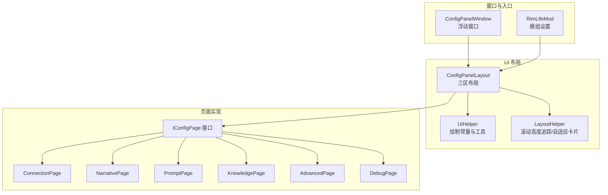
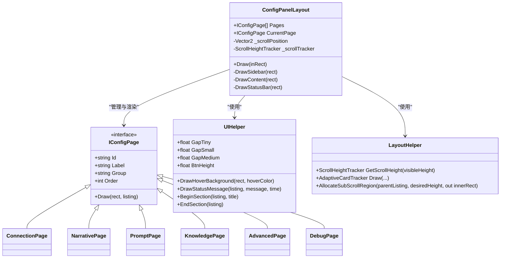
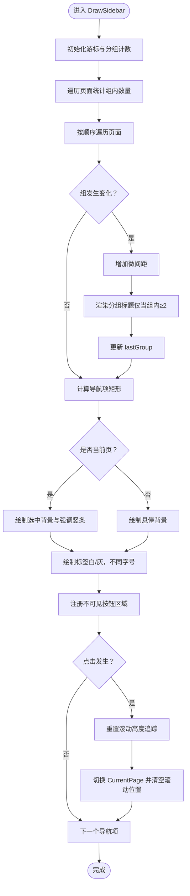
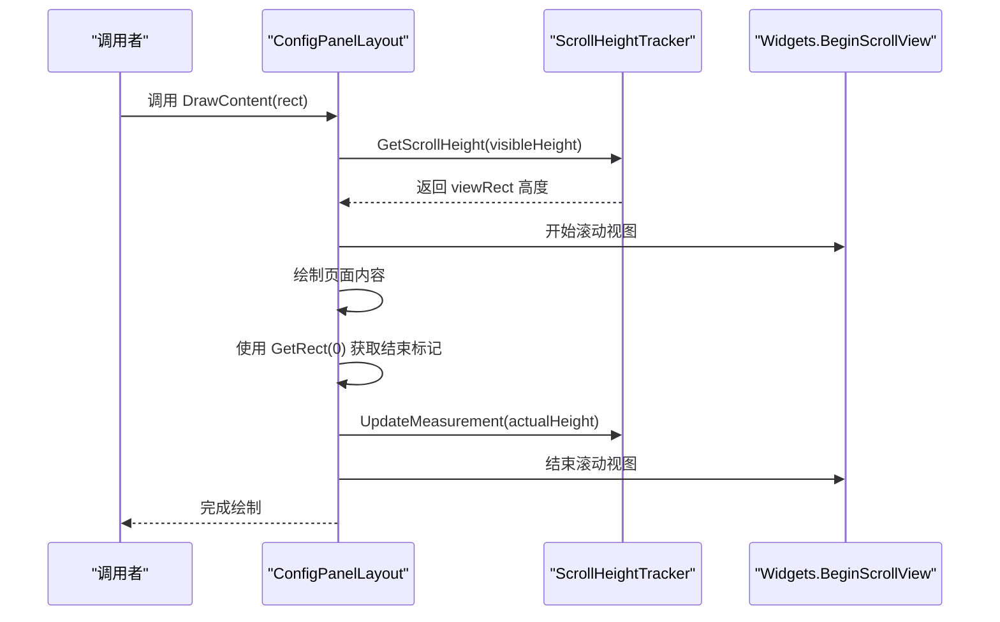
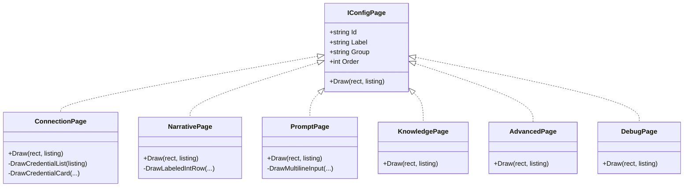
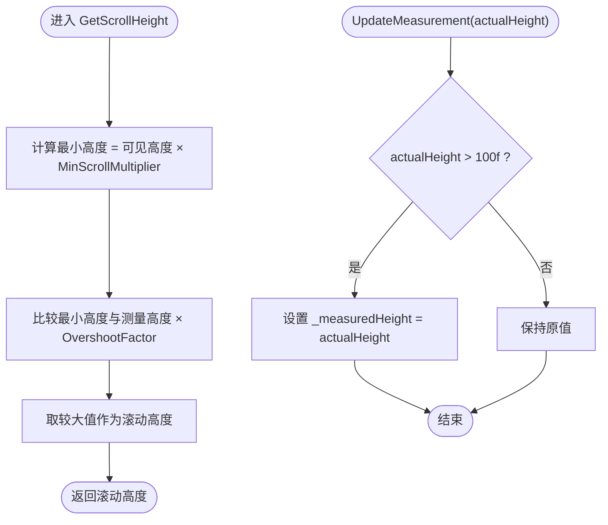
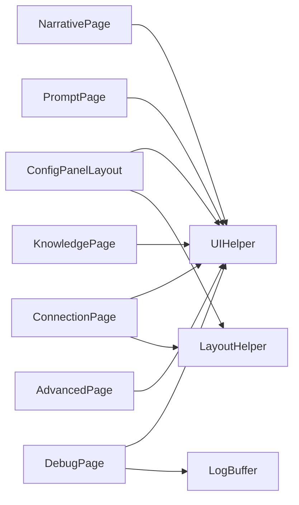

# 配置面板布局

<cite>
**本文档引用的文件**
- [ConfigPanelLayout.cs](file://Source/UI/ConfigPanelLayout.cs)
- [ConfigPanelWindow.cs](file://Source/UI/ConfigPanelWindow.cs)
- [LayoutHelper.cs](file://Source/UI/Helpers/LayoutHelper.cs)
- [UIHelper.cs](file://Source/UI/Helpers/UIHelper.cs)
- [IConfigPage.cs](file://Source/UI/Pages/IConfigPage.cs)
- [ConnectionPage.cs](file://Source/UI/Pages/ConnectionPage.cs)
- [NarrativePage.cs](file://Source/UI/Pages/NarrativePage.cs)
- [PromptPage.cs](file://Source/UI/Pages/PromptPage.cs)
- [KnowledgePage.cs](file://Source/UI/Pages/KnowledgePage.cs)
- [AdvancedPage.cs](file://Source/UI/Pages/AdvancedPage.cs)
- [DebugPage.cs](file://Source/UI/Pages/DebugPage.cs)
- [LogBuffer.cs](file://Source/UI/LogBuffer.cs)
- [RimLifeMod.cs](file://Source/Settings/RimLifeMod.cs)
</cite>

## 目录
1. [简介](#简介)
2. [项目结构](#项目结构)
3. [核心组件](#核心组件)
4. [架构概览](#架构概览)
5. [详细组件分析](#详细组件分析)
6. [依赖关系分析](#依赖关系分析)
7. [性能考量](#性能考量)
8. [故障排除指南](#故障排除指南)
9. [结论](#结论)
10. [附录](#附录)

## 简介
本文件系统性阐述配置面板布局系统的设计与实现，重点覆盖三区布局（侧栏导航、内容区域、状态栏）的规范与细节，包括布局常量、页面排序机制、导航项渲染逻辑、滚动高度追踪（IMGUI 双帧收敛）、颜色主题与交互反馈（悬停、选中）、组件复用与扩展模式，以及常见布局冲突与性能优化策略。目标读者既包括需要快速上手的开发者，也包括希望理解实现原理的非技术用户。

## 项目结构
配置面板布局系统位于 Source/UI 目录，采用“共享布局 + 页面实现”的分层设计：
- 布局层：ConfigPanelLayout 负责三区布局的划分与绘制
- 页面层：IConfigPage 接口及多个具体页面（连接、叙事、提示词、知识库、高级、调试）
- 辅助层：UIHelper 提供统一的绘制常量与工具函数；LayoutHelper 提供滚动高度追踪与自适应卡片等能力
- 窗口层：ConfigPanelWindow 与 RimLifeModSettings 将布局委托给 ConfigPanelLayout 并在模组设置与浮动窗口中呈现

**图表来源**
- [ConfigPanelLayout.cs:15-54](file://Source/UI/ConfigPanelLayout.cs#L15-L54)
- [UIHelper.cs:9-464](file://Source/UI/Helpers/UIHelper.cs#L9-L464)
- [LayoutHelper.cs:11-162](file://Source/UI/Helpers/LayoutHelper.cs#L11-L162)
- [IConfigPage.cs:10-29](file://Source/UI/Pages/IConfigPage.cs#L10-L29)
- [ConfigPanelWindow.cs:10-27](file://Source/UI/ConfigPanelWindow.cs#L10-L27)
- [RimLifeMod.cs:47-66](file://Source/Settings/RimLifeMod.cs#L47-L66)

**章节来源**
- [ConfigPanelLayout.cs:15-54](file://Source/UI/ConfigPanelLayout.cs#L15-L54)
- [UIHelper.cs:9-464](file://Source/UI/Helpers/UIHelper.cs#L9-L464)
- [LayoutHelper.cs:11-162](file://Source/UI/Helpers/LayoutHelper.cs#L11-L162)
- [IConfigPage.cs:10-29](file://Source/UI/Pages/IConfigPage.cs#L10-L29)
- [ConfigPanelWindow.cs:10-27](file://Source/UI/ConfigPanelWindow.cs#L10-L27)
- [RimLifeMod.cs:47-66](file://Source/Settings/RimLifeMod.cs#L47-L66)

## 核心组件
- 三区布局常量：侧栏宽度、内容内边距、分组标题高度、导航项高度、状态栏高度
- 页面集合与当前页：按 Order 排序的页面列表，当前页状态与滚动位置
- 滚动高度追踪：基于 LayoutHelper.ScrollHeightTracker 的双帧收敛策略，避免内容截断
- 导航渲染：分组标题、选中态高亮、悬停背景、标签颜色与尺寸
- 状态栏：凭据状态、模型信息、版本信息

**章节来源**
- [ConfigPanelLayout.cs:21-54](file://Source/UI/ConfigPanelLayout.cs#L21-L54)
- [ConfigPanelLayout.cs:75-144](file://Source/UI/ConfigPanelLayout.cs#L75-L144)
- [ConfigPanelLayout.cs:150-187](file://Source/UI/ConfigPanelLayout.cs#L150-L187)
- [ConfigPanelLayout.cs:193-214](file://Source/UI/ConfigPanelLayout.cs#L193-L214)
- [LayoutHelper.cs:21-62](file://Source/UI/Helpers/LayoutHelper.cs#L21-L62)

## 架构概览
配置面板布局系统遵循“布局解耦 + 页面聚合”的架构原则：
- ConfigPanelLayout 负责整体布局与导航渲染，不关心页面具体内容
- IConfigPage 抽象页面行为，每个页面专注自身业务逻辑
- UIHelper/ LayoutHelper 提供跨页面的通用能力，保证一致性与可维护性
- 窗口层（ConfigPanelWindow、RimLifeMod）负责生命周期与入口调用

**图表来源**
- [ConfigPanelLayout.cs:15-217](file://Source/UI/ConfigPanelLayout.cs#L15-L217)
- [IConfigPage.cs:10-29](file://Source/UI/Pages/IConfigPage.cs#L10-L29)
- [UIHelper.cs:9-464](file://Source/UI/Helpers/UIHelper.cs#L9-L464)
- [LayoutHelper.cs:11-162](file://Source/UI/Helpers/LayoutHelper.cs#L11-L162)
- [ConnectionPage.cs:22-1117](file://Source/UI/Pages/ConnectionPage.cs#L22-L1117)
- [NarrativePage.cs:14-221](file://Source/UI/Pages/NarrativePage.cs#L14-L221)
- [PromptPage.cs:13-288](file://Source/UI/Pages/PromptPage.cs#L13-L288)
- [KnowledgePage.cs:10-51](file://Source/UI/Pages/KnowledgePage.cs#L10-L51)
- [AdvancedPage.cs:13-242](file://Source/UI/Pages/AdvancedPage.cs#L13-L242)
- [DebugPage.cs:14-175](file://Source/UI/Pages/DebugPage.cs#L14-L175)

## 详细组件分析

### 三区布局与导航渲染
- 布局划分：根据输入矩形计算侧栏、内容区、状态栏的绝对坐标与尺寸
- 侧栏分组：统计每组页面数量，仅当组内页面≥2时显示分组标题
- 导航项：选中态绘制强调色竖条与高亮背景；悬停态绘制半透明背景；标签颜色随状态变化
- 切换页面：重置滚动高度追踪，清空滚动位置，避免旧高度影响新页面

**图表来源**
- [ConfigPanelLayout.cs:75-144](file://Source/UI/ConfigPanelLayout.cs#L75-L144)
- [UIHelper.cs:403-411](file://Source/UI/Helpers/UIHelper.cs#L403-L411)

**章节来源**
- [ConfigPanelLayout.cs:60-69](file://Source/UI/ConfigPanelLayout.cs#L60-L69)
- [ConfigPanelLayout.cs:75-144](file://Source/UI/ConfigPanelLayout.cs#L75-L144)
- [UIHelper.cs:98-108](file://Source/UI/Helpers/UIHelper.cs#L98-L108)

### 内容区域与滚动高度追踪（IMGUI 双帧收敛）
- 内容区背景与内边距：统一使用 UIHelper 的颜色与间距常量
- 滚动区域：使用 LayoutHelper.ScrollHeightTracker 计算滚动高度，结合过估算因子消除截断
- 双帧收敛：页面绘制结束后，通过 GetRect(0) 获取当前位置作为实际内容高度，更新追踪器
- 切换页面重置：避免旧页面高度对新页面造成干扰

**图表来源**
- [ConfigPanelLayout.cs:150-187](file://Source/UI/ConfigPanelLayout.cs#L150-L187)
- [LayoutHelper.cs:21-62](file://Source/UI/Helpers/LayoutHelper.cs#L21-L62)

**章节来源**
- [ConfigPanelLayout.cs:150-187](file://Source/UI/ConfigPanelLayout.cs#L150-L187)
- [LayoutHelper.cs:21-62](file://Source/UI/Helpers/LayoutHelper.cs#L21-L62)

### 状态栏与凭据状态
- 左侧：显示 LLM 状态（已配置/未配置）、当前模型、会话 Token
- 右侧：显示版本信息
- 状态来源：通过 RimLifeCore.CredentialManager 获取激活顺序与凭据状态

**章节来源**
- [ConfigPanelLayout.cs:193-214](file://Source/UI/ConfigPanelLayout.cs#L193-L214)

### 页面排序机制与导航项渲染
- 排序依据：页面实现的 Order 字段，升序排列
- 分组显示：Group 字段决定分组标题；仅当组内页面数量≥2时显示
- 标签颜色：选中态为白色，未选中态为浅灰，字号略有差异
- 悬停效果：未选中项在鼠标悬停时显示半透明高亮背景

**章节来源**
- [ConfigPanelLayout.cs:40-54](file://Source/UI/ConfigPanelLayout.cs#L40-L54)
- [ConfigPanelLayout.cs:75-144](file://Source/UI/ConfigPanelLayout.cs#L75-L144)
- [UIHelper.cs:98-108](file://Source/UI/Helpers/UIHelper.cs#L98-L108)

### 颜色主题系统与视觉反馈
- 颜色常量：侧栏背景、内容背景、卡片背景、状态栏背景、选中项、悬停项、强调色、分隔线、危险色等
- 视觉反馈：选中态强调竖条、悬停半透明背景、标签颜色与字号随状态变化
- 状态指示器：UIHelper 提供统一的状态颜色映射与指示器绘制

**章节来源**
- [UIHelper.cs:98-108](file://Source/UI/Helpers/UIHelper.cs#L98-L108)
- [UIHelper.cs:257-274](file://Source/UI/Helpers/UIHelper.cs#L257-L274)
- [ConfigPanelLayout.cs:116-132](file://Source/UI/ConfigPanelLayout.cs#L116-L132)

### 页面实现与复用模式
- IConfigPage 接口：统一的页面契约，包含 Id、Label、Group、Order、Draw 方法
- 复用模式：UIHelper 提供 BeginSection/EndSection、DrawInfoRow、DrawButtonRow、DrawStatusMessage 等通用绘制工具
- 扩展方法：新增页面只需实现 IConfigPage，并在 ConfigPanelLayout 构造函数中加入到 Pages 列表，即可自动参与排序与导航

**图表来源**
- [IConfigPage.cs:10-29](file://Source/UI/Pages/IConfigPage.cs#L10-L29)
- [ConnectionPage.cs:22-1117](file://Source/UI/Pages/ConnectionPage.cs#L22-L1117)
- [NarrativePage.cs:14-221](file://Source/UI/Pages/NarrativePage.cs#L14-L221)
- [PromptPage.cs:13-288](file://Source/UI/Pages/PromptPage.cs#L13-L288)
- [KnowledgePage.cs:10-51](file://Source/UI/Pages/KnowledgePage.cs#L10-L51)
- [AdvancedPage.cs:13-242](file://Source/UI/Pages/AdvancedPage.cs#L13-L242)
- [DebugPage.cs:14-175](file://Source/UI/Pages/DebugPage.cs#L14-L175)

**章节来源**
- [IConfigPage.cs:10-29](file://Source/UI/Pages/IConfigPage.cs#L10-L29)
- [ConnectionPage.cs:77-90](file://Source/UI/Pages/ConnectionPage.cs#L77-L90)
- [NarrativePage.cs:46-157](file://Source/UI/Pages/NarrativePage.cs#L46-L157)
- [PromptPage.cs:36-152](file://Source/UI/Pages/PromptPage.cs#L36-L152)
- [KnowledgePage.cs:17-48](file://Source/UI/Pages/KnowledgePage.cs#L17-L48)
- [AdvancedPage.cs:39-179](file://Source/UI/Pages/AdvancedPage.cs#L39-L179)
- [DebugPage.cs:27-79](file://Source/UI/Pages/DebugPage.cs#L27-L79)

### 滚动高度追踪系统详解（IMGUI 双帧收敛）
- 过估算因子：滚动区高度为实际内容高度的 1.2 倍，避免首帧截断
- 最小滚动倍数：滚动高度至少为可见高度的 3 倍，防止小页面出现无意义短滚动
- 初始高度：2400f，足以覆盖大多数页面内容，避免首帧截断
- 更新策略：使用 GetRect(0) 获取绘制结束位置，更新测量值；过滤异常值（>100f）
- 切换页面重置：避免旧高度影响新页面

**图表来源**
- [LayoutHelper.cs:21-62](file://Source/UI/Helpers/LayoutHelper.cs#L21-L62)

**章节来源**
- [LayoutHelper.cs:21-62](file://Source/UI/Helpers/LayoutHelper.cs#L21-L62)
- [ConfigPanelLayout.cs:164-183](file://Source/UI/ConfigPanelLayout.cs#L164-L183)

### 窗口与入口集成
- ConfigPanelWindow：继承 Window，设置可拖拽、可调整大小、可关闭，初始尺寸 820×600，委托 ConfigPanelLayout 绘制
- RimLifeMod：在模组设置窗口中调用 ConfigPanelLayout.Draw，并在主页每帧手动 Drain 主线程调度队列，确保异步回调正常执行

**章节来源**
- [ConfigPanelWindow.cs:10-27](file://Source/UI/ConfigPanelWindow.cs#L10-L27)
- [RimLifeMod.cs:47-66](file://Source/Settings/RimLifeMod.cs#L47-L66)

## 依赖关系分析
- ConfigPanelLayout 依赖 UIHelper（颜色、间距、按钮行、状态消息等）与 LayoutHelper（滚动高度追踪）
- 页面实现依赖 UIHelper（Section、InfoRow、ButtonRow、状态消息等）与 LayoutHelper（子滚动区域分配）
- DebugPage 使用 LogBuffer 与 UIHelper 的文本高度补偿能力

**图表来源**
- [ConfigPanelLayout.cs:15-217](file://Source/UI/ConfigPanelLayout.cs#L15-L217)
- [UIHelper.cs:9-464](file://Source/UI/Helpers/UIHelper.cs#L9-L464)
- [LayoutHelper.cs:11-162](file://Source/UI/Helpers/LayoutHelper.cs#L11-L162)
- [ConnectionPage.cs:22-1117](file://Source/UI/Pages/ConnectionPage.cs#L22-L1117)
- [NarrativePage.cs:14-221](file://Source/UI/Pages/NarrativePage.cs#L14-L221)
- [PromptPage.cs:13-288](file://Source/UI/Pages/PromptPage.cs#L13-L288)
- [KnowledgePage.cs:10-51](file://Source/UI/Pages/KnowledgePage.cs#L10-L51)
- [AdvancedPage.cs:13-242](file://Source/UI/Pages/AdvancedPage.cs#L13-L242)
- [DebugPage.cs:14-175](file://Source/UI/Pages/DebugPage.cs#L14-L175)
- [LogBuffer.cs:39-141](file://Source/UI/LogBuffer.cs#L39-L141)

**章节来源**
- [ConfigPanelLayout.cs:15-217](file://Source/UI/ConfigPanelLayout.cs#L15-L217)
- [UIHelper.cs:9-464](file://Source/UI/Helpers/UIHelper.cs#L9-L464)
- [LayoutHelper.cs:11-162](file://Source/UI/Helpers/LayoutHelper.cs#L11-L162)
- [LogBuffer.cs:39-141](file://Source/UI/LogBuffer.cs#L39-L141)

## 性能考量
- 双帧收敛策略：通过过估算因子与测量更新，减少滚动区域反复调整，提升稳定性
- 文本高度补偿：CJK 文本高度补偿避免自动换行导致的截断与二次测量
- 子滚动区域分配：在父 ScrollView 中明确预留固定高度，避免嵌套滚动导致的复杂布局计算
- 状态消息统一：集中处理消息显示与淡出，减少重复逻辑与绘制开销
- 日志缓冲区：线程安全、容量限制与增量文本缓冲，避免大规模重建

**章节来源**
- [LayoutHelper.cs:21-62](file://Source/UI/Helpers/LayoutHelper.cs#L21-L62)
- [UIHelper.cs:50-92](file://Source/UI/Helpers/UIHelper.cs#L50-L92)
- [UIHelper.cs:316-350](file://Source/UI/Helpers/UIHelper.cs#L316-L350)
- [LogBuffer.cs:49-103](file://Source/UI/LogBuffer.cs#L49-L103)

## 故障排除指南
- 内容被截断：检查是否正确使用 LayoutHelper.ScrollHeightTracker，并在页面绘制结束时调用 UpdateMeasurement
- 悬停无反馈：确认 UIHelper.DrawHoverBackground 的调用与鼠标区域重叠
- 分组标题不显示：确保同一组内页面数量≥2，否则不会显示分组标题
- 页面切换滚动位置异常：确认切换时调用了 _scrollTracker.Reset() 与重置 _scrollPosition
- 日志不显示或滚动异常：检查 AllocateSubScrollRegion 的使用与 innerRect 的计算，确保父 ScrollView 的 viewRect 包含子区域

**章节来源**
- [ConfigPanelLayout.cs:137-140](file://Source/UI/ConfigPanelLayout.cs#L137-L140)
- [ConfigPanelLayout.cs:182-183](file://Source/UI/ConfigPanelLayout.cs#L182-L183)
- [UIHelper.cs:403-411](file://Source/UI/Helpers/UIHelper.cs#L403-L411)
- [LayoutHelper.cs:78-94](file://Source/UI/Helpers/LayoutHelper.cs#L78-L94)

## 结论
配置面板布局系统通过清晰的职责分离与统一的绘制工具，实现了稳定、可扩展且具有良好视觉反馈的三区布局。借助 IMGUI 双帧收敛的滚动高度追踪与 CJK 文本高度补偿，系统在复杂页面与多语言环境下均能保持良好的用户体验。通过 IConfigPage 接口与 UIHelper/ LayoutHelper 的复用模式，新增页面的成本极低，便于长期演进与维护。

## 附录
- 布局常量建议：可根据目标分辨率与字体缩放比例进行微调，确保在不同分辨率下的观感一致
- 扩展最佳实践：新增页面时优先使用 UIHelper 的 Section/InfoRow/ButtonRow 等工具，减少重复代码；必要时使用 LayoutHelper 的自适应卡片或子滚动区域分配
- 性能优化清单：避免在每帧进行昂贵的文本测量；合理使用过估算因子；控制日志缓冲区容量；在页面切换时及时重置滚动追踪