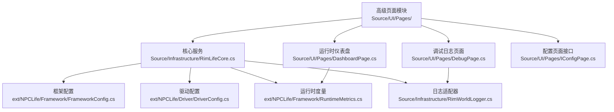
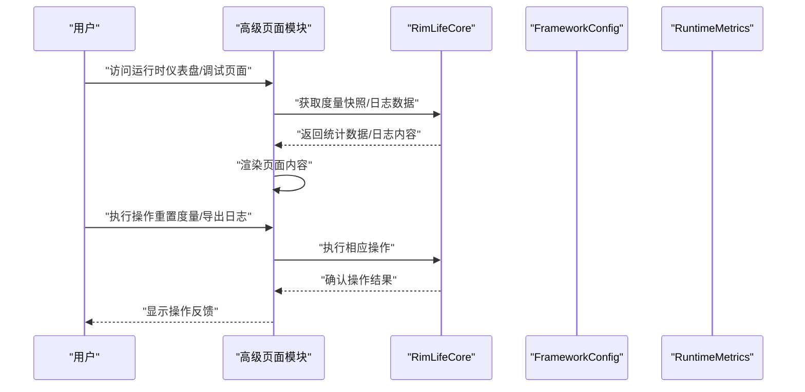
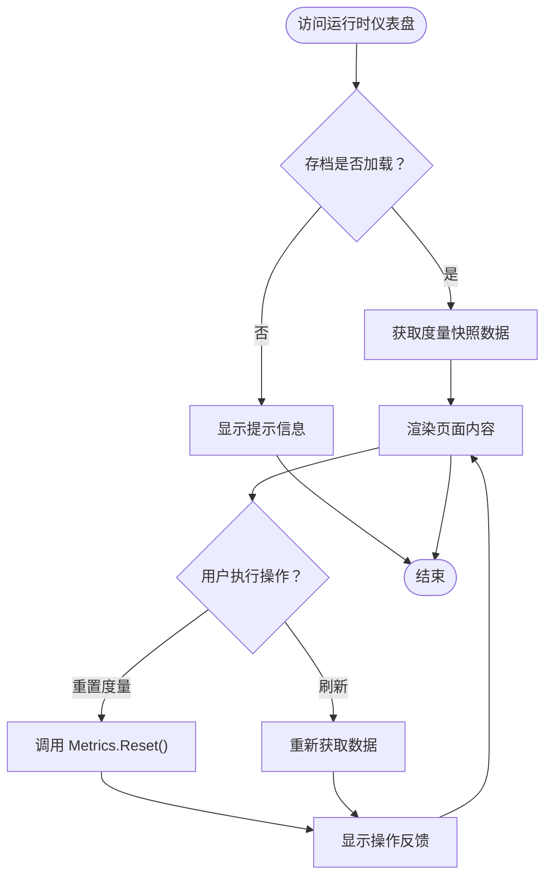
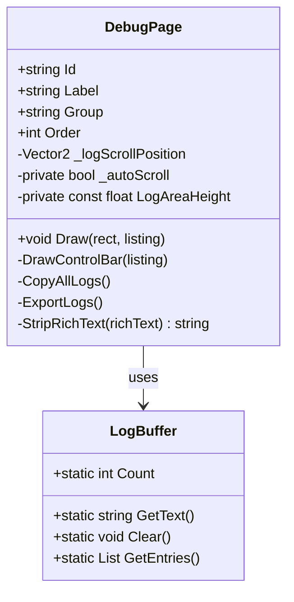
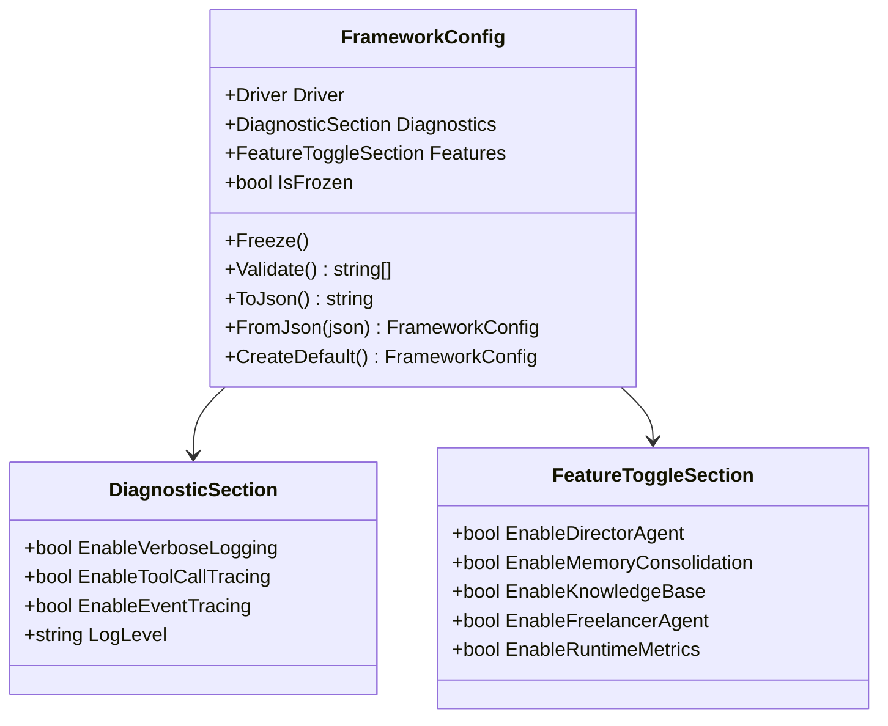
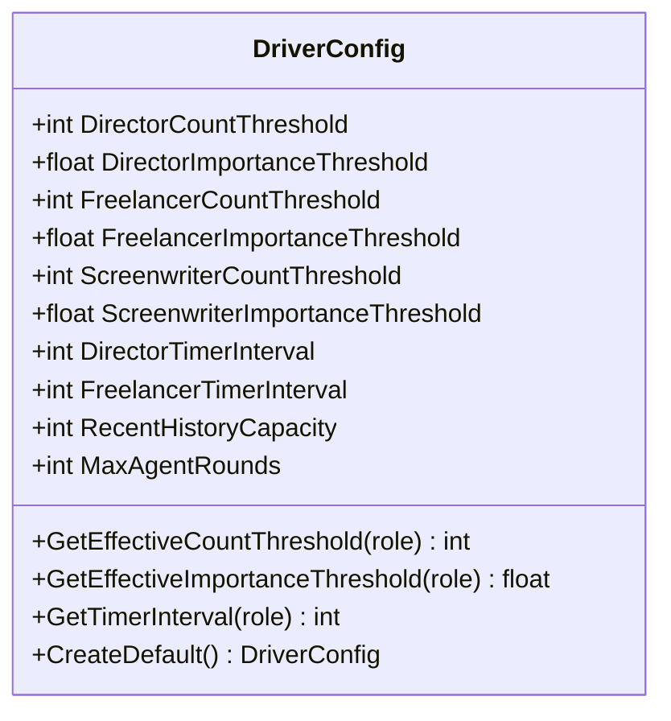
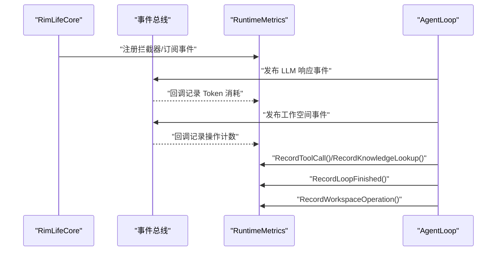
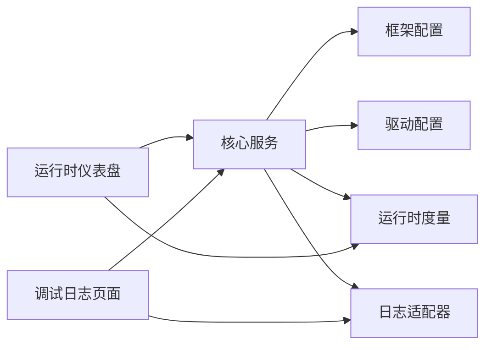

# 高级页面

<cite>
**本文引用的文件**
- [DashboardPage.cs](file://Source/UI/Pages/DashboardPage.cs)
- [DebugPage.cs](file://Source/UI/Pages/DebugPage.cs)
- [FrameworkConfig.cs](file://ext/NPCLife/src/NPCLife/Framework/FrameworkConfig.cs)
- [DriverConfig.cs](file://ext/NPCLife/src/NPCLife/Driver/DriverConfig.cs)
- [RuntimeMetrics.cs](file://ext/NPCLife/src/NPCLife/Framework/RuntimeMetrics.cs)
- [RimLifeCore.cs](file://Source/Infrastructure/RimLifeCore.cs)
- [RimWorldLogger.cs](file://Source/Infrastructure/RimWorldLogger.cs)
- [IConfigPage.cs](file://Source/UI/Pages/IConfigPage.cs)
- [RimLifeMod.cs](file://Source/Settings/RimLifeMod.cs)
</cite>

## 更新摘要
**变更内容**
- 删除了AdvancedPage.cs文件，这是一个简单的页面移除
- 高级功能现在分布在多个专门的页面中：运行时仪表盘和调试日志页面
- UI架构重构，采用模块化的页面设计模式
- 保持核心功能不变，仅调整了用户界面组织方式

## 目录
1. [简介](#简介)
2. [项目结构](#项目结构)
3. [核心组件](#核心组件)
4. [架构概览](#架构概览)
5. [详细组件分析](#详细组件分析)
6. [依赖关系分析](#依赖关系分析)
7. [性能考量](#性能考量)
8. [故障排查指南](#故障排查指南)
9. [结论](#结论)
10. [附录](#附录)

## 简介
"高级页面"是 RimLife 模组中面向高级用户的配置中心，现已重构为模块化设计，提供以下能力：
- **运行时仪表盘**：实时展示 LLM 使用统计、Agent 状态、工具调用和知识库查询
- **调试日志页面**：标准命令行终端风格的日志查看器，支持清空、自动滚动、复制全部、导出日志
- **诊断与调试**：启用详细日志、工具调用追踪、事件总线追踪，并提供运行时度量快照与 Agent 状态查看
- **配置管理**：通过模组设置界面导出/导入当前配置，一键重置为默认值；保存后立即通过核心服务生效
- **性能监控**：内置运行时度量系统，采集 Token 消耗、工具调用频率、知识库命中率、Agent 循环统计与工作空间操作

本页面将系统性梳理高级配置项、调试与监控机制、实验性与兼容性设置、资源监控与瓶颈分析，并给出优化建议与风险评估方法。

## 项目结构
"高级页面"现已重构为模块化架构，位于 UI 层的不同页面中，直接读写框架配置并通过核心服务应用；核心服务负责将配置同步到各子系统并启用相应功能。

**图表来源**
- [DashboardPage.cs:1-207](file://Source/UI/Pages/DashboardPage.cs#L1-L207)
- [DebugPage.cs:1-175](file://Source/UI/Pages/DebugPage.cs#L1-L175)
- [RimLifeCore.cs:1-693](file://Source/Infrastructure/RimLifeCore.cs#L1-L693)
- [FrameworkConfig.cs:1-196](file://ext/NPCLife/src/NPCLife/Framework/FrameworkConfig.cs#L1-L196)
- [DriverConfig.cs:1-109](file://ext/NPCLife/src/NPCLife/Driver/DriverConfig.cs#L1-L109)
- [RuntimeMetrics.cs:1-200](file://ext/NPCLife/src/NPCLife/Framework/RuntimeMetrics.cs#L1-L200)
- [IConfigPage.cs:1-30](file://Source/UI/Pages/IConfigPage.cs#L1-L30)

**章节来源**
- [DashboardPage.cs:1-207](file://Source/UI/Pages/DashboardPage.cs#L1-L207)
- [DebugPage.cs:1-175](file://Source/UI/Pages/DebugPage.cs#L1-L175)
- [RimLifeCore.cs:1-693](file://Source/Infrastructure/RimLifeCore.cs#L1-L693)

## 核心组件
- **运行时仪表盘页面（DashboardPage）**
  - LLM 使用统计：会话数、输入/输出 Token、缓存命中率
  - Agent 状态：导演、即兴编剧的激活状态
  - Agent 循环统计：总激活次数、总轮次、平均轮次、处理事件数、错误数
  - 工具调用：前10个工具的调用次数和错误统计
  - 知识库查询：查询批次、术语访问统计
  - 操作：重置度量、刷新功能
- **调试日志页面（DebugPage）**
  - 终端风格日志查看器：增量追加、无过滤、无重建
  - 功能：清空日志、自动滚动开关、复制全部、导出日志
  - 状态显示：日志条目计数、缓冲区状态
- **配置页面接口（IConfigPage）**
  - 页面标识：唯一ID、显示名称、分组标签、排序权重
  - 绘制接口：统一的绘制方法签名
  - 模块化设计：支持动态页面注册和路由
- **框架配置（FrameworkConfig）**
  - 分区：Driver（驱动）、Diagnostics（诊断）、Features（功能）
  - 冻结机制：应用后冻结，禁止运行时修改
  - 序列化/反序列化：支持从 JSON 读取与写回
- **驱动配置（DriverConfig）**
  - 分角色阈值：导演/剧情编剧/临时编剧的事件数量与重要度阈值
  - 定时器脉冲：导演与 Freelancer 的定时触发间隔（ticks），0 表示禁用
  - 通用配置：最近历史容量、Agent 最大轮数
- **运行时度量（RuntimeMetrics）**
  - 会话管理：开始/结束会话，聚合 Token、工具调用、知识库查询、Agent 循环与工作空间操作
  - 快照查询：提供 JSON 序列化快照，包含按角色分桶的 Token 统计、工具调用频率与错误、知识库术语访问率与 L1 命中率、Agent 激活次数/平均轮数/事件数、工作空间操作计数
- **核心服务（RimLifeCore）**
  - 配置应用：校验、冻结、通知各子系统、注入日志与时间提供者
  - 运行时度量启用：条件注册度量拦截器与拦截器，订阅 LLM 响应事件采集 Token，订阅工作空间事件采集操作计数
  - Agent 生命周期：按角色创建/获取/释放 AgentLoop
- **日志适配器（RimWorldLogger）**
  - 将框架日志桥接到 RimWorld 日志系统

**章节来源**
- [DashboardPage.cs:16-207](file://Source/UI/Pages/DashboardPage.cs#L16-L207)
- [DebugPage.cs:14-175](file://Source/UI/Pages/DebugPage.cs#L14-L175)
- [IConfigPage.cs:10-30](file://Source/UI/Pages/IConfigPage.cs#L10-L30)
- [FrameworkConfig.cs:17-196](file://ext/NPCLife/src/NPCLife/Framework/FrameworkConfig.cs#L17-L196)
- [DriverConfig.cs:9-109](file://ext/NPCLife/src/NPCLife/Driver/DriverConfig.cs#L9-L109)
- [RuntimeMetrics.cs:29-200](file://ext/NPCLife/src/NPCLife/Framework/RuntimeMetrics.cs#L29-L200)
- [RimLifeCore.cs:169-385](file://Source/Infrastructure/RimLifeCore.cs#L169-L385)
- [RimWorldLogger.cs:1-15](file://Source/Infrastructure/RimWorldLogger.cs#L1-L15)

## 架构概览
高级页面通过模块化UI与核心服务交互，核心服务负责：
- 将 UI 的配置变更写入 FrameworkConfig，并调用 Configure 应用
- 根据 Diagnostics 开关启用/禁用运行时度量、事件追踪、日志详细度等
- 注册度量拦截器与拦截器，订阅事件采集指标
- 管理 Agent 生命周期与工作空间事件脉冲

**图表来源**
- [DashboardPage.cs:48-170](file://Source/UI/Pages/DashboardPage.cs#L48-L170)
- [DebugPage.cs:27-79](file://Source/UI/Pages/DebugPage.cs#L27-L79)
- [RimLifeCore.cs:330-385](file://Source/Infrastructure/RimLifeCore.cs#L330-L385)

## 详细组件分析

### 运行时仪表盘页面（DashboardPage）
- **LLM 使用统计**
  - 总会话数：包括活跃会话数
  - Token 统计：输入/输出 Token、缓存命中
  - 角色分桶：按导演、编剧、即兴编剧分别统计调用次数和 Token 消耗
- **Agent 状态**
  - 导演状态：active/idle
  - 即兴编剧状态：active/idle
- **Agent 循环统计**
  - 总激活次数、总轮次、平均轮次、处理事件数、错误数
  - 按角色分桶的激活次数统计
- **工具调用**
  - 前10个最常用的工具及其调用次数和错误统计
  - 支持显示剩余工具数量
- **知识库**
  - 查询批次统计
  - 前5个最常访问的术语及其访问次数和命中情况
- **操作功能**
  - 重置度量：清除所有运行时统计数据
  - 刷新：更新页面显示内容

**图表来源**
- [DashboardPage.cs:27-170](file://Source/UI/Pages/DashboardPage.cs#L27-L170)
- [RimLifeCore.cs:330-385](file://Source/Infrastructure/RimLifeCore.cs#L330-L385)

**章节来源**
- [DashboardPage.cs:16-207](file://Source/UI/Pages/DashboardPage.cs#L16-L207)

### 调试日志页面（DebugPage）
- **终端风格日志查看器**
  - 增量追加：日志直接增量追加到文本缓冲区
  - 无过滤、无重建：纯追加式显示，提高性能
  - 自动滚动：智能检测用户位置，提供自动滚动功能
- **功能控制**
  - 清空日志：清除所有日志条目
  - 自动滚动开关：ON/OFF 切换
  - 复制全部：将纯文本复制到剪贴板
  - 导出日志：格式化导出所有日志条目
- **状态显示**
  - 日志条目计数：当前日志条目数量
  - 缓冲区状态：当前使用量/最大容量

**图表来源**
- [DebugPage.cs:14-175](file://Source/UI/Pages/DebugPage.cs#L14-L175)

**章节来源**
- [DebugPage.cs:14-175](file://Source/UI/Pages/DebugPage.cs#L14-L175)

### 配置页面接口（IConfigPage）
- **页面标识系统**
  - 唯一ID：用于导航路由和页面识别
  - 显示名称：侧栏显示的页面标题
  - 分组标签：页面所属的分组（如"高级"）
  - 排序权重：同组内页面的显示顺序
- **绘制接口**
  - 统一的绘制方法签名，接受绘制区域和布局对象
  - 支持动态布局和响应式设计
- **模块化设计**
  - 支持动态页面注册和路由
  - 便于扩展新的配置页面
  - 统一的页面生命周期管理

**章节来源**
- [IConfigPage.cs:10-30](file://Source/UI/Pages/IConfigPage.cs#L10-L30)

### 框架配置（FrameworkConfig）
- **结构分区**
  - Driver：驱动相关参数（阈值、定时器、历史容量、最大轮数）
  - Diagnostics：诊断开关与日志级别
  - Features：功能开关（Agent 与度量）
- **冻结与校验**
  - 冻结后禁止修改，防止运行时破坏一致性
  - 校验驱动参数范围，不符合要求将阻止应用
- **序列化/反序列化**
  - 支持从 JSON 读取与写回，便于导入导出与持久化

**图表来源**
- [FrameworkConfig.cs:17-196](file://ext/NPCLife/src/NPCLife/Framework/FrameworkConfig.cs#L17-L196)

**章节来源**
- [FrameworkConfig.cs:56-194](file://ext/NPCLife/src/NPCLife/Framework/FrameworkConfig.cs#L56-L194)

### 驱动配置（DriverConfig）
- **分角色阈值**
  - 导演/剧情编剧/临时编剧的事件数量与重要度阈值，决定激活条件
- **定时器脉冲**
  - 导演与 Freelancer 的定时触发间隔（ticks），0 表示禁用
- **通用配置**
  - 最近历史容量：环形缓冲区容量，裁剪最旧事件
  - 最大轮数：防止 Agent 死循环

**图表来源**
- [DriverConfig.cs:9-109](file://ext/NPCLife/src/NPCLife/Driver/DriverConfig.cs#L9-L109)

**章节来源**
- [DriverConfig.cs:54-101](file://ext/NPCLife/src/NPCLife/Driver/DriverConfig.cs#L54-L101)

### 运行时度量（RuntimeMetrics）
- **采集维度**
  - 会话：开始/结束、持续时间、活动会话数
  - Token：输入/输出/缓存命中，按角色分桶与总计
  - 工具：调用次数与错误次数，按工具名聚合
  - 知识库：术语访问总数、命中数、L1 命中数、访问率
  - Agent：激活次数、总轮数、平均轮数、总事件数、错误数
  - 工作空间：创建/关闭/更新等操作计数
- **快照与导出**
  - GetSnapshot 返回只读视图，便于页面显示
- **核心服务集成**
  - 通过 EnsureSkillRegistryInitialized() 注册度量拦截器
  - 订阅 LLM 响应事件和工作空间事件

**图表来源**
- [RimLifeCore.cs:330-385](file://Source/Infrastructure/RimLifeCore.cs#L330-L385)
- [RuntimeMetrics.cs:85-200](file://ext/NPCLife/src/NPCLife/Framework/RuntimeMetrics.cs#L85-L200)

**章节来源**
- [RuntimeMetrics.cs:246-365](file://ext/NPCLife/src/NPCLife/Framework/RuntimeMetrics.cs#L246-L365)

### 核心服务（RimLifeCore）
- **配置应用流程**
  - 校验 -> 冻结 -> 通知子系统 -> 注入日志与时间提供者
- **运行时度量启用**
  - 条件注册度量拦截器与拦截器，订阅 LLM 响应事件采集 Token，订阅工作空间事件采集操作计数
- **Agent 生命周期**
  - 按角色创建/获取/释放 AgentLoop，绑定对应工作空间事件池

**章节来源**
- [RimLifeCore.cs:169-192](file://Source/Infrastructure/RimLifeCore.cs#L169-L192)
- [RimLifeCore.cs:330-385](file://Source/Infrastructure/RimLifeCore.cs#L330-L385)
- [RimLifeCore.cs:545-621](file://Source/Infrastructure/RimLifeCore.cs#L545-L621)

### 日志适配器（RimWorldLogger）
- **日志桥接**
  - 将框架日志桥接到 RimWorld 日志系统
  - 支持不同日志级别的输出

**章节来源**
- [RimWorldLogger.cs:8-14](file://Source/Infrastructure/RimWorldLogger.cs#L8-L14)

## 依赖关系分析
- 高级页面模块依赖核心服务提供的配置与状态查询
- 核心服务依赖框架配置进行功能开关与诊断模式控制
- 运行时度量系统通过事件总线与拦截器被动采集，零侵入
- 日志适配器贯穿各组件，统一错误与日志输出

**图表来源**
- [DashboardPage.cs:1-207](file://Source/UI/Pages/DashboardPage.cs#L1-L207)
- [DebugPage.cs:1-175](file://Source/UI/Pages/DebugPage.cs#L1-L175)
- [RimLifeCore.cs:1-693](file://Source/Infrastructure/RimLifeCore.cs#L1-L693)
- [FrameworkConfig.cs:1-196](file://ext/NPCLife/src/NPCLife/Framework/FrameworkConfig.cs#L1-L196)
- [DriverConfig.cs:1-109](file://ext/NPCLife/src/NPCLife/Driver/DriverConfig.cs#L1-L109)
- [RuntimeMetrics.cs:1-200](file://ext/NPCLife/src/NPCLife/Framework/RuntimeMetrics.cs#L1-L200)
- [RimWorldLogger.cs:1-15](file://Source/Infrastructure/RimWorldLogger.cs#L1-L15)

## 性能考量
- **运行时度量的开销**
  - 关闭"启用运行时度量"可完全移除拦截器与订阅，零开销
  - 开启后，事件总线与拦截器带来少量 CPU 与内存开销，适合性能审计与成本分析
- **日志与追踪**
  - "详细日志"会显著增加 I/O 与字符串处理开销，仅在问题定位时启用
  - "工具调用追踪"与"事件总线追踪"同样会增加日志量与序列化开销
- **Agent 驱动参数**
  - 降低阈值与最大轮数可减少 Agent 活跃时间，但可能错过事件
  - 合理设置定时器间隔，避免过于频繁触发导致 CPU 峰值
- **知识库与记忆巩固**
  - 知识库查询会触发度量统计，高频查询会增加 CPU 与内存压力
  - 记忆巩固涉及跨轮次上下文整合，适度开启以平衡稳定性与性能

## 故障排查指南
- **启用详细日志与事件追踪**
  - 在"高级"分组的"调试(日志)"页面中查看实时日志
  - 使用"清空日志"、"自动滚动"、"复制全部"、"导出日志"等功能
- **使用运行时度量快速定位瓶颈**
  - 在"高级"分组的"消耗统计"页面查看会话数、Token 统计、工具调用统计、知识库查询批次
  - 通过"重置度量"功能清理历史数据，重新观察性能趋势
- **错误上下文与 TraceId**
  - 启用"详细日志"后，错误处理器会在日志中输出 TraceId，便于串联请求链路
  - 使用 ErrorHandler.BeginTrace/EndTrace 包裹关键路径，辅助定位问题根因
- **配置回滚与重置**
  - 使用"高级"分组的"消耗统计"页面的"重置度量"功能
  - 通过模组设置界面导出当前配置作为备份

**章节来源**
- [DebugPage.cs:81-155](file://Source/UI/Pages/DebugPage.cs#L81-L155)
- [DashboardPage.cs:151-170](file://Source/UI/Pages/DashboardPage.cs#L151-L170)

## 结论
"高级页面"经过重构后采用了模块化设计，将功能分布在专门的页面中，提供了更清晰的用户体验。运行时仪表盘专注于性能监控，调试日志页面专注于问题诊断。通过合理的参数调优与监控，可在保证系统稳定性的前提下获得更好的性能表现与可观测性。建议在生产环境中谨慎启用高开销功能，在问题定位阶段再开启详细日志与追踪，并定期导出配置以支持回滚与审计。

## 附录

### 高级配置选项清单与使用场景
- **运行时仪表盘功能**
  - LLM 使用统计：性能审计与成本分析
  - Agent 状态：监控 Agent 激活状态
  - Agent 循环统计：识别 Agent 性能瓶颈
  - 工具调用统计：识别常用工具与潜在热点
  - 知识库查询：衡量知识库使用频率与命中率
- **调试日志功能**
  - 终端风格日志查看器：增量追加、无过滤、无重建
  - 清空日志：清理历史日志
  - 自动滚动：智能滚动到最新日志
  - 复制全部：将纯文本复制到剪贴板
  - 导出日志：格式化导出所有日志条目
- **配置管理**
  - 导出配置：通过模组设置界面导出当前配置
  - 导入配置：从模组设置界面导入配置
  - 重置默认值：恢复到默认配置

**章节来源**
- [DashboardPage.cs:48-170](file://Source/UI/Pages/DashboardPage.cs#L48-L170)
- [DebugPage.cs:81-155](file://Source/UI/Pages/DebugPage.cs#L81-L155)

### 性能监控指标与解读
- **会话数**：反映 Agent 活跃度
- **Token 统计**：输入/输出/缓存命中，评估 LLM 成本与缓存命中率
- **工具调用类型**：识别常用工具与潜在热点
- **知识库查询批次**：衡量知识库使用频率与命中率
- **Agent 循环统计**：激活次数、平均轮数、事件数、错误数
- **工作空间操作**：创建/关闭/更新等操作计数

**章节来源**
- [DashboardPage.cs:50-146](file://Source/UI/Pages/DashboardPage.cs#L50-L146)
- [RuntimeMetrics.cs:246-365](file://ext/NPCLife/src/NPCLife/Framework/RuntimeMetrics.cs#L246-L365)

### 实验性功能与兼容性设置
- **运行时度量（FrameworkConfig.Diagnostics.EnableVerboseLogging）**
  - 开启后注册度量拦截器与 MCP 工具，零开销关闭
  - 适用于性能审计与成本分析，不影响稳定性
- **诊断模式（FrameworkConfig.Diagnostics.EnableVerboseLogging）**
  - 开启后错误处理器输出更详细上下文，适合问题定位
  - 会增加日志量与序列化开销，建议在问题解决后关闭
- **兼容性与回滚**
  - 配置冻结后禁止运行时修改，确保稳定性
  - 支持导出/导入配置与重置默认值，便于回滚

**章节来源**
- [FrameworkConfig.cs:178-196](file://ext/NPCLife/src/NPCLife/Framework/FrameworkConfig.cs#L178-L196)
- [RimLifeCore.cs:169-192](file://Source/Infrastructure/RimLifeCore.cs#L169-L192)

### 系统资源监控与瓶颈分析
- **CPU**：关注工具调用频率与 Agent 循环轮数，避免过度活跃
- **内存**：知识库查询与记忆巩固可能增加内存占用，注意监控峰值
- **I/O**：详细日志与事件追踪会增加磁盘写入，建议在高负载时关闭
- **瓶颈定位**：结合运行时度量快照与调试页面日志，定位热点工具与事件流

**章节来源**
- [RuntimeMetrics.cs:246-365](file://ext/NPCLife/src/NPCLife/Framework/RuntimeMetrics.cs#L246-L365)
- [DebugPage.cs:27-79](file://Source/UI/Pages/DebugPage.cs#L27-L79)

### 高级用户使用指南与风险评估
- **使用指南**
  - 新手建议先使用默认配置，逐步启用功能开关与诊断选项
  - 性能审计阶段查看"消耗统计"页面，问题定位阶段查看"调试(日志)"页面
  - 定期导出配置，形成版本化备份
- **风险评估**
  - 高开销功能（详细日志、工具调用追踪、事件总线追踪）可能影响性能与稳定性
  - 配置冻结后禁止运行时修改，变更需谨慎，建议先在测试存档验证
  - 回滚策略：使用"重置度量"或导入备份配置

**章节来源**
- [DashboardPage.cs:151-170](file://Source/UI/Pages/DashboardPage.cs#L151-L170)
- [RimLifeCore.cs:169-192](file://Source/Infrastructure/RimLifeCore.cs#L169-L192)