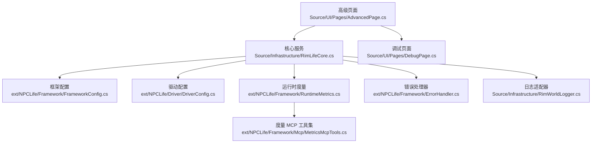
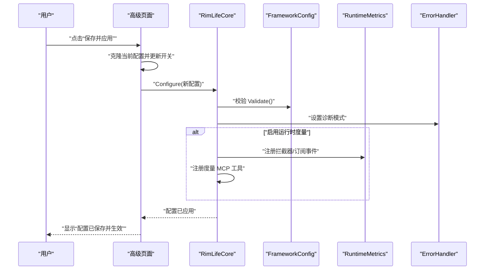
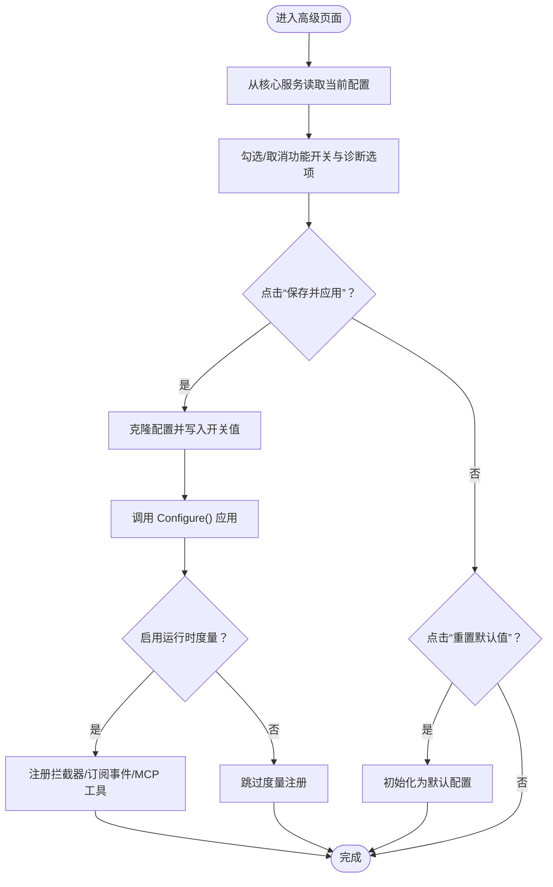
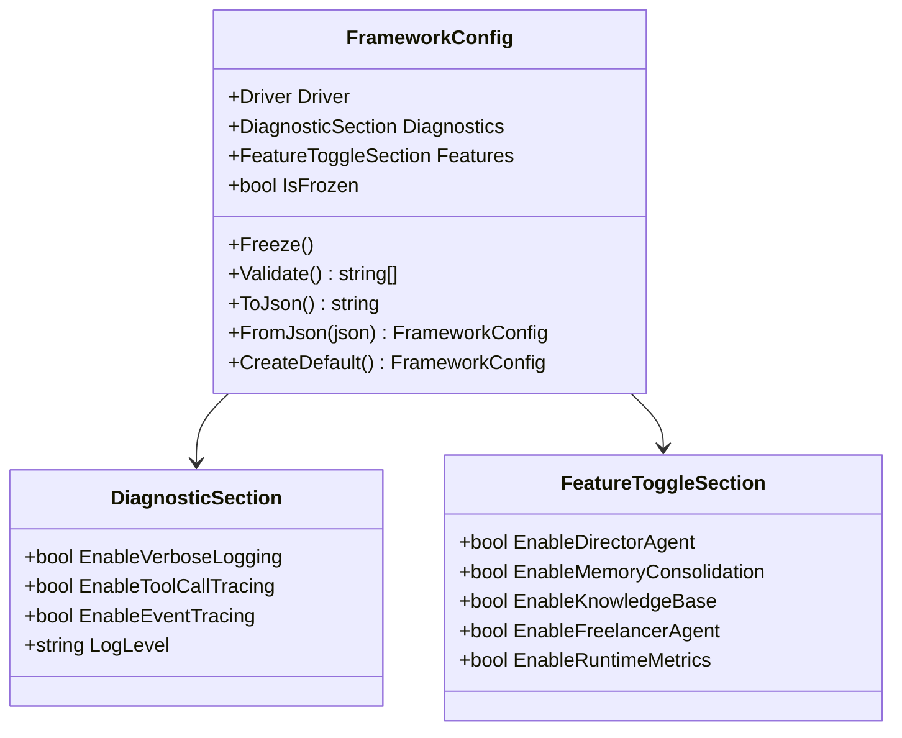
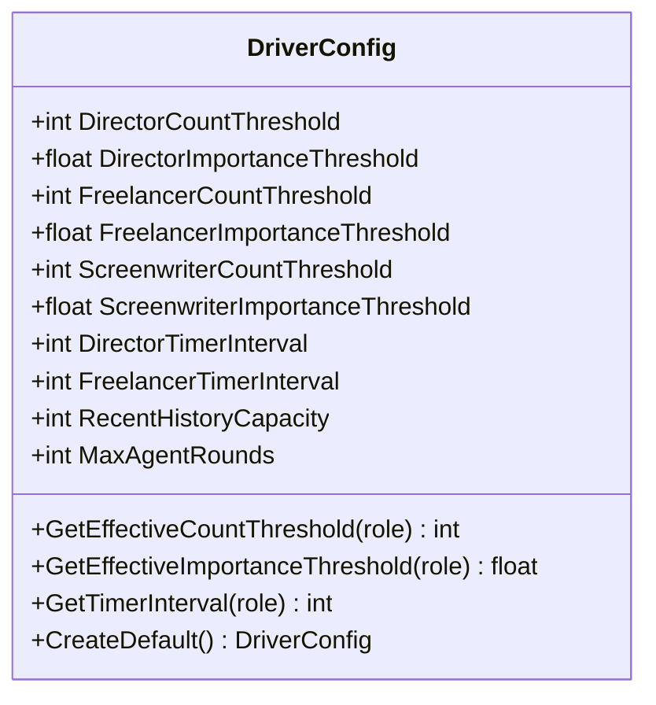
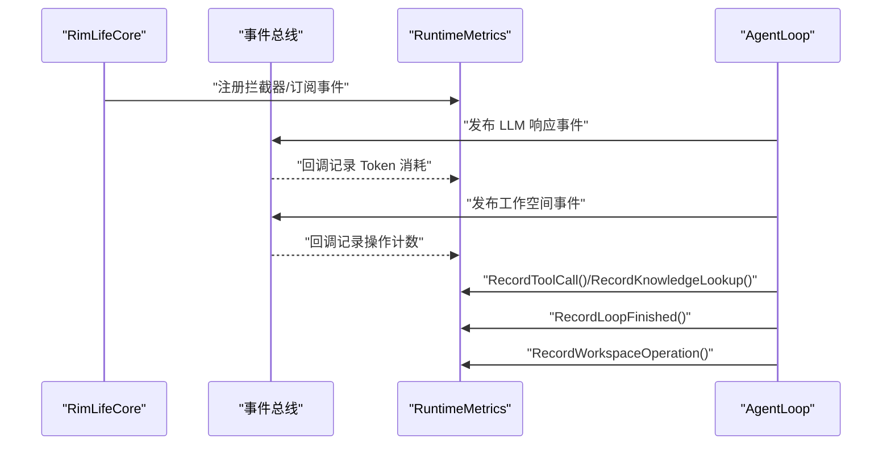
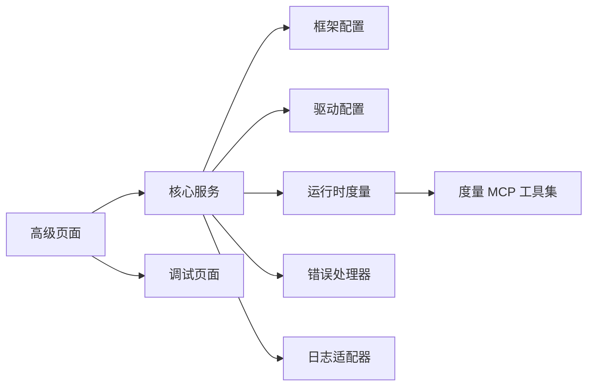

# 高级页面

<cite>
**本文引用的文件**
- [AdvancedPage.cs](file://Source/UI/Pages/AdvancedPage.cs)
- [FrameworkConfig.cs](file://ext/NPCLife/src/NPCLife/Framework/FrameworkConfig.cs)
- [DriverConfig.cs](file://ext/NPCLife/src/NPCLife/Driver/DriverConfig.cs)
- [RuntimeMetrics.cs](file://ext/NPCLife/src/NPCLife/Framework/RuntimeMetrics.cs)
- [MetricsMcpTools.cs](file://ext/NPCLife/src/NPCLife/Framework/Mcp/MetricsMcpTools.cs)
- [ErrorHandler.cs](file://ext/NPCLife/src/NPCLife/Framework/ErrorHandler.cs)
- [RimLifeCore.cs](file://Source/Infrastructure/RimLifeCore.cs)
- [RimWorldLogger.cs](file://Source/Infrastructure/RimWorldLogger.cs)
- [DebugPage.cs](file://Source/UI/Pages/DebugPage.cs)
- [RimLifeMod.cs](file://Source/Settings/RimLifeMod.cs)
</cite>

## 目录
1. [简介](#简介)
2. [项目结构](#项目结构)
3. [核心组件](#核心组件)
4. [架构概览](#架构概览)
5. [详细组件分析](#详细组件分析)
6. [依赖关系分析](#依赖关系分析)
7. [性能考量](#性能考量)
8. [故障排查指南](#故障排查指南)
9. [结论](#结论)
10. [附录](#附录)

## 简介
“高级页面”是 RimLife 模组中面向高级用户的配置中心，提供以下能力：
- 功能开关：控制导演 Agent、编剧 Agent、Freelancer Agent、知识库、记忆巩固、运行时度量等特性。
- 诊断与调试：启用详细日志、工具调用追踪、事件总线追踪，并提供运行时度量快照与 Agent 状态查看。
- 配置管理：导出/导入当前配置，一键重置为默认值；保存后立即通过核心服务生效。
- 性能监控：内置运行时度量系统，采集 Token 消耗、工具调用频率、知识库命中率、Agent 循环统计与工作空间操作。

本页面将系统性梳理高级配置项、调试与监控机制、实验性与兼容性设置、资源监控与瓶颈分析，并给出优化建议与风险评估方法。

## 项目结构
“高级页面”位于 UI 层，直接读写框架配置并通过核心服务应用；核心服务负责将配置同步到各子系统并启用相应功能。

**图表来源**
- [AdvancedPage.cs:1-242](file://Source/UI/Pages/AdvancedPage.cs#L1-L242)
- [RimLifeCore.cs:1-800](file://Source/Infrastructure/RimLifeCore.cs#L1-L800)
- [FrameworkConfig.cs:1-248](file://ext/NPCLife/src/NPCLife/Framework/FrameworkConfig.cs#L1-L248)
- [DriverConfig.cs:1-107](file://ext/NPCLife/src/NPCLife/Driver/DriverConfig.cs#L1-L107)
- [RuntimeMetrics.cs:1-649](file://ext/NPCLife/src/NPCLife/Framework/RuntimeMetrics.cs#L1-L649)
- [MetricsMcpTools.cs:1-56](file://ext/NPCLife/src/NPCLife/Framework/Mcp/MetricsMcpTools.cs#L1-L56)
- [ErrorHandler.cs:1-207](file://ext/NPCLife/src/NPCLife/Framework/ErrorHandler.cs#L1-L207)
- [RimWorldLogger.cs:1-15](file://Source/Infrastructure/RimWorldLogger.cs#L1-L15)
- [DebugPage.cs:1-175](file://Source/UI/Pages/DebugPage.cs#L1-L175)

**章节来源**
- [AdvancedPage.cs:1-242](file://Source/UI/Pages/AdvancedPage.cs#L1-L242)
- [RimLifeCore.cs:1-800](file://Source/Infrastructure/RimLifeCore.cs#L1-L800)

## 核心组件
- 高级页面（AdvancedPage）
  - 功能开关：运行时度量、导演 Agent、记忆巩固、知识库、Freelancer Agent。
  - 诊断开关：详细日志、工具调用追踪、事件总线追踪。
  - Agent 状态与运行时度量展示：会话数、Token 统计、工具调用类型、知识库查询批次。
  - 配置管理：导出/导入 JSON、重置默认值、保存并应用。
- 框架配置（FrameworkConfig）
  - 分区：Driver（驱动）、Diagnostics（诊断）、Features（功能）。
  - 冻结机制：应用后冻结，禁止运行时修改。
  - 序列化/反序列化：支持从 JSON 读取与写回。
- 驱动配置（DriverConfig）
  - 分角色阈值：导演/剧情编剧/临时编剧的事件数量与重要度阈值。
  - 定时器脉冲：导演与 Freelancer 的定时触发间隔（ticks），0 表示禁用。
  - 通用配置：最近历史容量、Agent 最大轮数。
- 运行时度量（RuntimeMetrics）
  - 会话管理：开始/结束会话，聚合 Token、工具调用、知识库查询、Agent 循环与工作空间操作。
  - 快照查询：提供 JSON 序列化快照，包含按角色分桶的 Token 统计、工具调用频率与错误、知识库术语访问率与 L1 命中率、Agent 激活次数/平均轮数/事件数、工作空间操作计数。
  - MCP 工具：metrics_snapshot、metrics_reset。
- 错误处理器（ErrorHandler）
  - 诊断模式：由配置驱动，启用后输出更详细上下文。
  - 请求链路追踪：BeginTrace/EndTrace，自动关联错误上下文。
  - 全局错误钩子：注册多个处理器，逐个调用，互不影响。
- 核心服务（RimLifeCore）
  - 配置应用：校验、冻结、通知各子系统、注入日志与时间提供者。
  - 运行时度量启用：条件注册度量 MCP 工具与拦截器，订阅 LLM 响应事件采集 Token，订阅工作空间事件采集操作计数。
  - Agent 生命周期：按角色创建/获取/释放 AgentLoop。
- 日志适配器（RimWorldLogger）
  - 将框架日志桥接到 RimWorld 日志系统。
- 调试页面（DebugPage）
  - 终端风格日志查看器，支持清空、自动滚动、复制全部、导出日志。

**章节来源**
- [AdvancedPage.cs:39-179](file://Source/UI/Pages/AdvancedPage.cs#L39-L179)
- [FrameworkConfig.cs:17-247](file://ext/NPCLife/src/NPCLife/Framework/FrameworkConfig.cs#L17-L247)
- [DriverConfig.cs:9-107](file://ext/NPCLife/src/NPCLife/Driver/DriverConfig.cs#L9-L107)
- [RuntimeMetrics.cs:29-365](file://ext/NPCLife/src/NPCLife/Framework/RuntimeMetrics.cs#L29-L365)
- [MetricsMcpTools.cs:11-56](file://ext/NPCLife/src/NPCLife/Framework/Mcp/MetricsMcpTools.cs#L11-L56)
- [ErrorHandler.cs:22-181](file://ext/NPCLife/src/NPCLife/Framework/ErrorHandler.cs#L22-L181)
- [RimLifeCore.cs:120-309](file://Source/Infrastructure/RimLifeCore.cs#L120-L309)
- [RimWorldLogger.cs:8-14](file://Source/Infrastructure/RimWorldLogger.cs#L8-L14)
- [DebugPage.cs:27-155](file://Source/UI/Pages/DebugPage.cs#L27-L155)

## 架构概览
高级页面通过 UI 与核心服务交互，核心服务负责：
- 将 UI 的配置变更写入 FrameworkConfig，并调用 Configure 应用。
- 根据 Features 与 Diagnostics 开关启用/禁用运行时度量、事件追踪、日志详细度等。
- 注册度量拦截器与 MCP 工具，订阅事件采集指标。
- 管理 Agent 生命周期与工作空间事件脉冲。

**图表来源**
- [AdvancedPage.cs:65-82](file://Source/UI/Pages/AdvancedPage.cs#L65-L82)
- [RimLifeCore.cs:120-142](file://Source/Infrastructure/RimLifeCore.cs#L120-L142)
- [ErrorHandler.cs:42](file://ext/NPCLife/src/NPCLife/Framework/ErrorHandler.cs#L42)
- [RimLifeCore.cs:248-307](file://Source/Infrastructure/RimLifeCore.cs#L248-L307)

## 详细组件分析

### 高级页面（功能开关与诊断）
- 功能开关
  - 运行时度量：开启后注册度量拦截器与 MCP 工具，零开销关闭。
  - 导演 Agent：启用后按定时器脉冲或阈值触发事件。
  - 记忆巩固：跨轮次上下文整合。
  - 知识库：事件关键词匹配与背景知识注入。
  - Freelancer Agent：处理临时事件。
- 诊断开关
  - 详细日志：输出 LLM 请求/响应到日志。
  - 工具调用追踪：记录每次工具调用参数与结果。
  - 事件总线追踪：记录事件发布/订阅轨迹。
- Agent 状态与运行时度量
  - 会话数、输入/输出 Token、缓存命中、工具调用类型数、知识库查询批次。
- 配置管理
  - 导出：复制当前配置到剪贴板。
  - 导入：从剪贴板 JSON 恢复配置并重新应用。
  - 重置默认值：恢复到默认配置，需再次保存生效。

**图表来源**
- [AdvancedPage.cs:39-179](file://Source/UI/Pages/AdvancedPage.cs#L39-L179)
- [RimLifeCore.cs:120-142](file://Source/Infrastructure/RimLifeCore.cs#L120-L142)

**章节来源**
- [AdvancedPage.cs:39-179](file://Source/UI/Pages/AdvancedPage.cs#L39-L179)

### 框架配置（FrameworkConfig）
- 结构分区
  - Driver：驱动相关参数（阈值、定时器、历史容量、最大轮数）。
  - Diagnostics：诊断开关与日志级别。
  - Features：功能开关（Agent 与度量）。
- 冻结与校验
  - 冻结后禁止修改，防止运行时破坏一致性。
  - 校验驱动参数范围，不符合要求将阻止应用。
- 序列化/反序列化
  - 支持从 JSON 读取与写回，便于导入导出与持久化。

**图表来源**
- [FrameworkConfig.cs:17-247](file://ext/NPCLife/src/NPCLife/Framework/FrameworkConfig.cs#L17-L247)

**章节来源**
- [FrameworkConfig.cs:56-194](file://ext/NPCLife/src/NPCLife/Framework/FrameworkConfig.cs#L56-L194)

### 驱动配置（DriverConfig）
- 分角色阈值
  - 导演/剧情编剧/临时编剧的事件数量与重要度阈值，决定激活条件。
- 定时器脉冲
  - 导演与 Freelancer 的定时触发间隔（ticks），0 表示禁用。
- 通用配置
  - 最近历史容量：环形缓冲区容量，裁剪最旧事件。
  - 最大轮数：防止 Agent 死循环。

**图表来源**
- [DriverConfig.cs:9-107](file://ext/NPCLife/src/NPCLife/Driver/DriverConfig.cs#L9-L107)

**章节来源**
- [DriverConfig.cs:54-101](file://ext/NPCLife/src/NPCLife/Driver/DriverConfig.cs#L54-L101)

### 运行时度量（RuntimeMetrics）
- 采集维度
  - 会话：开始/结束、持续时间、活动会话数。
  - Token：输入/输出/缓存命中，按角色分桶与总计。
  - 工具：调用次数与错误次数，按工具名聚合。
  - 知识库：术语访问总数、命中数、L1 命中数、访问率。
  - Agent：激活次数、总轮数、平均轮数、总事件数、错误数。
  - 工作空间：创建/关闭/更新等操作计数。
- 快照与导出
  - GetSnapshot 返回只读视图，ToJson 便于 MCP 工具查询与导出。
- MCP 工具
  - metrics_snapshot：返回当前快照 JSON。
  - metrics_reset：重置计数器。

**图表来源**
- [RimLifeCore.cs:248-307](file://Source/Infrastructure/RimLifeCore.cs#L248-L307)
- [RuntimeMetrics.cs:85-237](file://ext/NPCLife/src/NPCLife/Framework/RuntimeMetrics.cs#L85-L237)

**章节来源**
- [RuntimeMetrics.cs:246-365](file://ext/NPCLife/src/NPCLife/Framework/RuntimeMetrics.cs#L246-L365)
- [MetricsMcpTools.cs:18-53](file://ext/NPCLife/src/NPCLife/Framework/Mcp/MetricsMcpTools.cs#L18-L53)

### 错误处理器（ErrorHandler）
- 诊断模式
  - 由配置驱动，启用后输出更详细上下文与 TraceId。
- 请求链路追踪
  - BeginTrace/EndTrace 为错误上下文关联 TraceId。
- 全局错误钩子
  - 注册多个处理器，逐个调用，异常隔离，不影响其他处理器。

**章节来源**
- [ErrorHandler.cs:42-163](file://ext/NPCLife/src/NPCLife/Framework/ErrorHandler.cs#L42-L163)

### 核心服务（RimLifeCore）
- 配置应用流程
  - 校验 -> 冻结 -> 通知子系统 -> 注入日志与时间提供者。
- 运行时度量启用
  - 条件注册度量 MCP 工具与拦截器，订阅 LLM 响应事件采集 Token，订阅工作空间事件采集操作计数。
- Agent 生命周期
  - 按角色创建/获取/释放 AgentLoop，绑定对应工作空间事件池。

**章节来源**
- [RimLifeCore.cs:120-142](file://Source/Infrastructure/RimLifeCore.cs#L120-L142)
- [RimLifeCore.cs:248-307](file://Source/Infrastructure/RimLifeCore.cs#L248-L307)
- [RimLifeCore.cs:545-621](file://Source/Infrastructure/RimLifeCore.cs#L545-L621)

### 调试页面（DebugPage）
- 终端风格日志查看器
  - 增量追加、无过滤、无重建，支持清空、自动滚动、复制全部、导出日志。
- 与日志缓冲区配合
  - 从 LogBuffer 读取文本，导出时按类型与时间戳格式化。

**章节来源**
- [DebugPage.cs:27-155](file://Source/UI/Pages/DebugPage.cs#L27-L155)

## 依赖关系分析
- 高级页面依赖核心服务提供的配置与状态查询。
- 核心服务依赖框架配置进行功能开关与诊断模式控制。
- 运行时度量系统通过事件总线与拦截器被动采集，零侵入。
- 错误处理器与日志适配器贯穿各组件，统一错误与日志输出。

**图表来源**
- [AdvancedPage.cs:1-242](file://Source/UI/Pages/AdvancedPage.cs#L1-L242)
- [RimLifeCore.cs:1-800](file://Source/Infrastructure/RimLifeCore.cs#L1-L800)
- [FrameworkConfig.cs:1-248](file://ext/NPCLife/src/NPCLife/Framework/FrameworkConfig.cs#L1-L248)
- [DriverConfig.cs:1-107](file://ext/NPCLife/src/NPCLife/Driver/DriverConfig.cs#L1-L107)
- [RuntimeMetrics.cs:1-649](file://ext/NPCLife/src/NPCLife/Framework/RuntimeMetrics.cs#L1-L649)
- [MetricsMcpTools.cs:1-56](file://ext/NPCLife/src/NPCLife/Framework/Mcp/MetricsMcpTools.cs#L1-L56)
- [ErrorHandler.cs:1-207](file://ext/NPCLife/src/NPCLife/Framework/ErrorHandler.cs#L1-L207)
- [RimWorldLogger.cs:1-15](file://Source/Infrastructure/RimWorldLogger.cs#L1-L15)
- [DebugPage.cs:1-175](file://Source/UI/Pages/DebugPage.cs#L1-L175)

## 性能考量
- 运行时度量的开销
  - 关闭“启用运行时度量”可完全移除拦截器与订阅，零开销。
  - 开启后，事件总线与拦截器带来少量 CPU 与内存开销，适合性能审计与成本分析。
- 日志与追踪
  - “详细日志”会显著增加 I/O 与字符串处理开销，仅在问题定位时启用。
  - “工具调用追踪”与“事件总线追踪”同样会增加日志量与序列化开销。
- Agent 驱动参数
  - 降低阈值与最大轮数可减少 Agent 活跃时间，但可能错过事件。
  - 合理设置定时器间隔，避免过于频繁触发导致 CPU 峰值。
- 知识库与记忆巩固
  - 知识库查询会触发度量统计，高频查询会增加 CPU 与内存压力。
  - 记忆巩固涉及跨轮次上下文整合，适度开启以平衡稳定性与性能。

[本节为通用指导，无需特定文件引用]

## 故障排查指南
- 启用详细日志与事件追踪
  - 在“高级页面”的“诊断”区域勾选“详细日志”、“事件总线追踪”，并保存应用。
  - 使用“调试页面”查看实时日志，必要时导出日志以便分析。
- 使用运行时度量快速定位瓶颈
  - 在“高级页面”的“运行时度量”区域查看会话数、Token 统计、工具调用类型数、知识库查询批次。
  - 通过 MCP 工具调用 metrics_snapshot 获取 JSON 快照，结合 Agent 状态与事件流分析。
- 错误上下文与 TraceId
  - 启用“详细日志”后，错误处理器会在日志中输出 TraceId，便于串联请求链路。
  - 使用 ErrorHandler.BeginTrace/EndTrace 包裹关键路径，辅助定位问题根因。
- 配置回滚与重置
  - 使用“高级页面”的“配置管理”导出当前配置作为备份。
  - 导入失败时，使用“重置默认值”恢复初始配置，再逐步调整。

**章节来源**
- [AdvancedPage.cs:53-58](file://Source/UI/Pages/AdvancedPage.cs#L53-L58)
- [DebugPage.cs:81-155](file://Source/UI/Pages/DebugPage.cs#L81-L155)
- [ErrorHandler.cs:55-71](file://ext/NPCLife/src/NPCLife/Framework/ErrorHandler.cs#L55-L71)

## 结论
“高级页面”提供了全面的高级配置与诊断能力，涵盖功能开关、调试模式、运行时度量与配置管理。通过合理的参数调优与监控，可在保证系统稳定性的前提下获得更好的性能表现与可观测性。建议在生产环境中谨慎启用高开销功能，在问题定位阶段再开启详细日志与追踪，并定期导出配置以支持回滚与审计。

[本节为总结性内容，无需特定文件引用]

## 附录

### 高级配置选项清单与使用场景
- 功能开关
  - 启用运行时度量：性能审计与成本分析。
  - 启用导演 Agent：自动审查事件并分配剧情线。
  - 启用编剧 Agent：记忆巩固（跨轮次上下文）。
  - 启用知识库：事件关键词匹配 → 注入背景知识。
  - 启用 Freelancer Agent：处理独立临时事件。
- 诊断开关
  - 详细日志：输出完整 LLM 请求/响应到日志。
  - 工具调用追踪：记录每次工具调用的参数和结果。
  - 事件总线追踪：记录所有事件发布/订阅轨迹。
- 配置管理
  - 导出配置：复制当前配置到剪贴板。
  - 导入配置：从剪贴板 JSON 恢复配置并重新应用。
  - 重置默认值：恢复到默认配置，需再次保存生效。

**章节来源**
- [AdvancedPage.cs:44-95](file://Source/UI/Pages/AdvancedPage.cs#L44-L95)
- [AdvancedPage.cs:134-173](file://Source/UI/Pages/AdvancedPage.cs#L134-L173)

### 性能监控指标与解读
- 会话数：反映 Agent 活跃度。
- Token 统计：输入/输出/缓存命中，评估 LLM 成本与缓存命中率。
- 工具调用类型：识别常用工具与潜在热点。
- 知识库查询批次：衡量知识库使用频率与命中率。
- Agent 循环统计：激活次数、平均轮数、事件数、错误数。
- 工作空间操作：创建/关闭/更新等操作计数。

**章节来源**
- [AdvancedPage.cs:109-131](file://Source/UI/Pages/AdvancedPage.cs#L109-L131)
- [RuntimeMetrics.cs:246-365](file://ext/NPCLife/src/NPCLife/Framework/RuntimeMetrics.cs#L246-L365)

### 实验性功能与兼容性设置
- 运行时度量（FeatureToggleSection.EnableRuntimeMetrics）
  - 开启后注册度量拦截器与 MCP 工具，零开销关闭。
  - 适用于性能审计与成本分析，不影响稳定性。
- 诊断模式（DiagnosticSection.EnableVerboseLogging）
  - 开启后错误处理器输出更详细上下文，适合问题定位。
  - 会增加日志量与序列化开销，建议在问题解决后关闭。
- 兼容性与回滚
  - 配置冻结后禁止运行时修改，确保稳定性。
  - 支持导出/导入配置与重置默认值，便于回滚。

**章节来源**
- [FrameworkConfig.cs:229-246](file://ext/NPCLife/src/NPCLife/Framework/FrameworkConfig.cs#L229-L246)
- [RimLifeCore.cs:137](file://Source/Infrastructure/RimLifeCore.cs#L137)

### 系统资源监控与瓶颈分析
- CPU：关注工具调用频率与 Agent 循环轮数，避免过度活跃。
- 内存：知识库查询与记忆巩固可能增加内存占用，注意监控峰值。
- I/O：详细日志与事件追踪会增加磁盘写入，建议在高负载时关闭。
- 瓶颈定位：结合运行时度量快照与调试页面日志，定位热点工具与事件流。

**章节来源**
- [RuntimeMetrics.cs:246-365](file://ext/NPCLife/src/NPCLife/Framework/RuntimeMetrics.cs#L246-L365)
- [DebugPage.cs:27-79](file://Source/UI/Pages/DebugPage.cs#L27-L79)

### 高级用户使用指南与风险评估
- 使用指南
  - 新手建议先使用默认配置，逐步启用功能开关与诊断选项。
  - 性能审计阶段开启“启用运行时度量”，问题定位阶段开启“详细日志”。
  - 定期导出配置，形成版本化备份。
- 风险评估
  - 高开销功能（详细日志、工具调用追踪、事件总线追踪）可能影响性能与稳定性。
  - 配置冻结后禁止运行时修改，变更需谨慎，建议先在测试存档验证。
  - 回滚策略：使用“重置默认值”或导入备份配置。

**章节来源**
- [AdvancedPage.cs:65-95](file://Source/UI/Pages/AdvancedPage.cs#L65-L95)
- [RimLifeCore.cs:137](file://Source/Infrastructure/RimLifeCore.cs#L137)