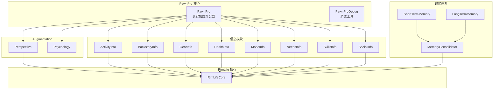
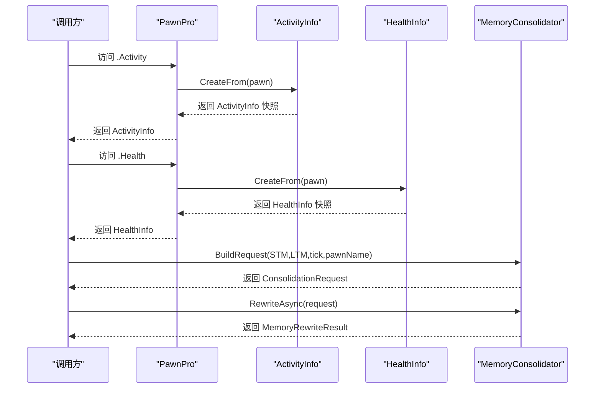
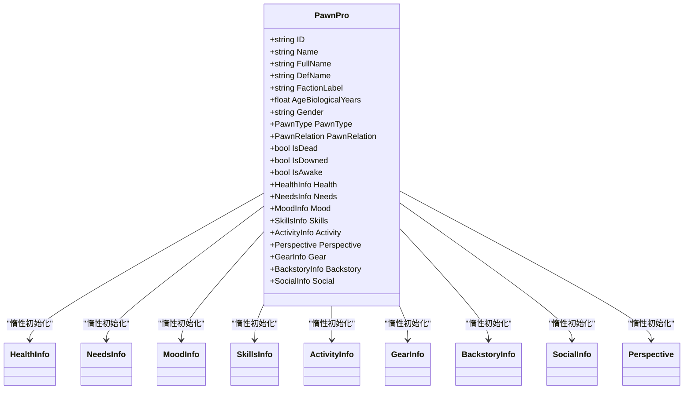
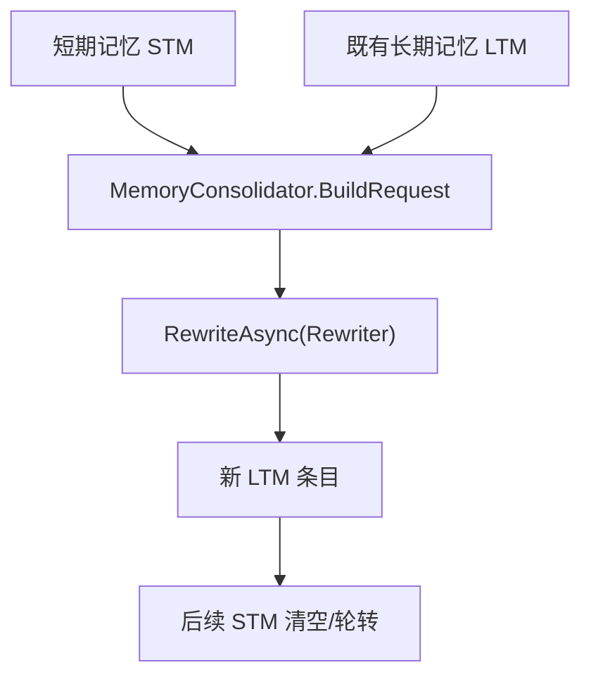
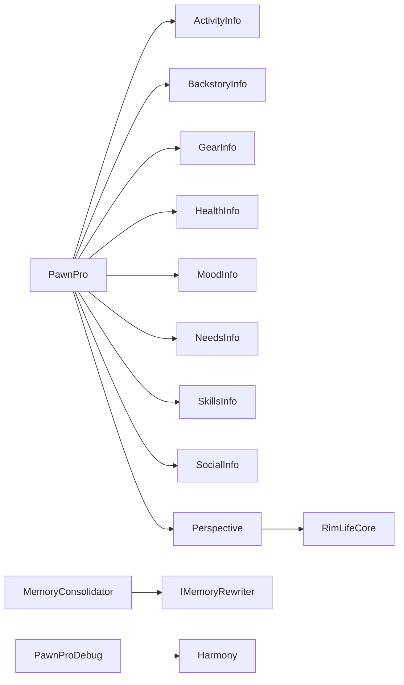

# 人物代理系统

<cite>
**本文引用的文件**
- [PawnPro.cs](file://Source/Data/PawnPro/PawnPro.cs)
- [PawnProDebug.cs](file://Source/Data/PawnPro/PawnProDebug.cs)
- [ActivityInfo.cs](file://Source/Data/PawnPro/Info/ActivityInfo.cs)
- [BackstoryInfo.cs](file://Source/Data/PawnPro/Info/BackstoryInfo.cs)
- [GearInfo.cs](file://Source/Data/PawnPro/Info/GearInfo.cs)
- [HealthInfo.cs](file://Source/Data/PawnPro/Info/HealthInfo.cs)
- [MoodInfo.cs](file://Source/Data/PawnPro/Info/MoodInfo.cs)
- [NeedsInfo.cs](file://Source/Data/PawnPro/Info/NeedsInfo.cs)
- [SkillsInfo.cs](file://Source/Data/PawnPro/Info/SkillsInfo.cs)
- [SocialInfo.cs](file://Source/Data/PawnPro/Info/SocialInfo.cs)
- [Perspective.cs](file://Source/Data/PawnPro/Augmentation/Perspective.cs)
- [Psychology.cs](file://Source/Data/PawnPro/Augmentation/Psychology.cs)
- [LongTermMemory.cs](file://Source/Data/PawnPro/Memory/LongTermMemory.cs)
- [ShortTermMemory.cs](file://Source/Data/PawnPro/Memory/ShortTermMemory.cs)
- [MemoryConsolidator.cs](file://Source/Data/PawnPro/Memory/MemoryConsolidator.cs)
- [RimLifeCore.cs](file://Source/Infrastructure/RimLifeCore.cs)
</cite>

## 目录
1. [简介](#简介)
2. [项目结构](#项目结构)
3. [核心组件](#核心组件)
4. [架构总览](#架构总览)
5. [详细组件分析](#详细组件分析)
6. [依赖分析](#依赖分析)
7. [性能考量](#性能考量)
8. [故障排查指南](#故障排查指南)
9. [结论](#结论)
10. [附录](#附录)

## 简介
本文件系统化阐述人物代理系统 PawnPro 的设计理念、实现架构与使用方法。PawnPro 为 RimWorld 中的 Pawn 提供轻量级代理，采用延迟加载与快照语义，将昂贵的数据采集推迟到首次访问时执行，从而显著降低主线程压力与内存占用。系统围绕多个信息模块（ActivityInfo、BackstoryInfo、GearInfo、HealthInfo、MoodInfo、NeedsInfo、SkillsInfo、SocialInfo）组织数据，并通过 Perspective（视角）与 Psychology（心理）扩展模块增强叙事表达。PawnProDebug 提供开发调试工具，便于快速导出角色卡片快照。系统与 RimLife 核心框架（RimLifeCore）深度集成，支持 MCP 工具链、工作空间与智能体驱动。

## 项目结构
PawnPro 位于 Source/Data/PawnPro 目录，包含以下子模块：
- 代理核心：PawnPro（延迟加载聚合器）
- 信息模块：ActivityInfo、BackstoryInfo、GearInfo、HealthInfo、MoodInfo、NeedsInfo、SkillsInfo、SocialInfo
- 视角与心理：Perspective、Psychology
- 记忆体系：LongTermMemory、ShortTermMemory、MemoryConsolidator
- 调试工具：PawnProDebug（Harmony 注入 gizmo）

图表来源
- [PawnPro.cs:44-136](file://Source/Data/PawnPro/PawnPro.cs#L44-L136)
- [PawnProDebug.cs:18-101](file://Source/Data/PawnPro/PawnProDebug.cs#L18-L101)
- [ActivityInfo.cs:18-108](file://Source/Data/PawnPro/Info/ActivityInfo.cs#L18-L108)
- [BackstoryInfo.cs:15-53](file://Source/Data/PawnPro/Info/BackstoryInfo.cs#L15-L53)
- [GearInfo.cs:16-96](file://Source/Data/PawnPro/Info/GearInfo.cs#L16-L96)
- [HealthInfo.cs:17-173](file://Source/Data/PawnPro/Info/HealthInfo.cs#L17-L173)
- [MoodInfo.cs:17-103](file://Source/Data/PawnPro/Info/MoodInfo.cs#L17-L103)
- [NeedsInfo.cs:16-72](file://Source/Data/PawnPro/Info/NeedsInfo.cs#L16-L72)
- [SkillsInfo.cs:13-66](file://Source/Data/PawnPro/Info/SkillsInfo.cs#L13-L66)
- [SocialInfo.cs:15-74](file://Source/Data/PawnPro/Info/SocialInfo.cs#L15-L74)
- [Perspective.cs:15-81](file://Source/Data/PawnPro/Augmentation/Perspective.cs#L15-L81)
- [Psychology.cs:11-35](file://Source/Data/PawnPro/Augmentation/Psychology.cs#L11-L35)
- [LongTermMemory.cs:10-51](file://Source/Data/PawnPro/Memory/LongTermMemory.cs#L10-L51)
- [ShortTermMemory.cs:9-46](file://Source/Data/PawnPro/Memory/ShortTermMemory.cs#L9-L46)
- [MemoryConsolidator.cs:12-59](file://Source/Data/PawnPro/Memory/MemoryConsolidator.cs#L12-L59)
- [RimLifeCore.cs:24-42](file://Source/Infrastructure/RimLifeCore.cs#L24-L42)

章节来源
- [PawnPro.cs:44-136](file://Source/Data/PawnPro/PawnPro.cs#L44-L136)
- [RimLifeCore.cs:24-42](file://Source/Infrastructure/RimLifeCore.cs#L24-L42)

## 核心组件
- PawnPro：轻量级代理，聚合基础元数据与八大信息模块，采用惰性初始化与缓存，避免重复计算。
- 信息模块：每个模块封装特定领域的快照数据与格式化输出，支持同步与异步构建。
- Perspective：基于视野与距离的可见 Pawn 快照，提供可识别/不可识别统计接口。
- Psychology：TraitDef 扩展的人格维度数据容器，用于叙事层面的个性建模。
- 记忆体系：短期记忆（事件流水）与长期记忆（叙述性摘要）配合巩固器进行融合与重写。
- 调试工具：PawnProDebug 在开发模式下向 Pawn gizmo 注入命令，导出 CharacterCard 快照。

章节来源
- [PawnPro.cs:44-136](file://Source/Data/PawnPro/PawnPro.cs#L44-L136)
- [PawnProDebug.cs:18-101](file://Source/Data/PawnPro/PawnProDebug.cs#L18-L101)
- [Perspective.cs:15-81](file://Source/Data/PawnPro/Augmentation/Perspective.cs#L15-L81)
- [Psychology.cs:11-35](file://Source/Data/PawnPro/Augmentation/Psychology.cs#L11-L35)
- [LongTermMemory.cs:10-51](file://Source/Data/PawnPro/Memory/LongTermMemory.cs#L10-L51)
- [ShortTermMemory.cs:9-46](file://Source/Data/PawnPro/Memory/ShortTermMemory.cs#L9-L46)
- [MemoryConsolidator.cs:12-59](file://Source/Data/PawnPro/Memory/MemoryConsolidator.cs#L12-L59)

## 架构总览
PawnPro 的设计遵循“快照+延迟加载”的原则：PawnPro 在构造时仅填充基础元数据，随后各信息模块在首次访问时才执行昂贵的采集逻辑。Perspective 与 RimLifeCore 协作，确保在主线程安全环境下完成数据采集。调试工具通过 Harmony 注入 gizmo，仅在开发模式启用，避免影响游戏性能。

图表来源
- [PawnPro.cs:84-112](file://Source/Data/PawnPro/PawnPro.cs#L84-L112)
- [ActivityInfo.cs:34-78](file://Source/Data/PawnPro/Info/ActivityInfo.cs#L34-L78)
- [HealthInfo.cs:92-173](file://Source/Data/PawnPro/Info/HealthInfo.cs#L92-L173)
- [MemoryConsolidator.cs:28-58](file://Source/Data/PawnPro/Memory/MemoryConsolidator.cs#L28-L58)

## 详细组件分析

### PawnPro 代理与延迟加载
- 设计要点
  - 基础元数据在构造时即时填充，避免重复 IO。
  - 八大信息模块采用“空值合并赋值”惰性初始化，首次访问时才创建快照并缓存。
  - 对非人类 Pawn（动物、机械体、昆虫）进行分支处理，避免无效计算。
- 性能优势
  - 减少主线程压力：仅在需要时执行昂贵的 RimWorld API 调用。
  - 降低内存占用：未访问的模块不分配对象。
  - 可扩展性：新增模块只需在 PawnPro 中添加属性与工厂方法。

图表来源
- [PawnPro.cs:44-136](file://Source/Data/PawnPro/PawnPro.cs#L44-L136)
- [HealthInfo.cs:17-173](file://Source/Data/PawnPro/Info/HealthInfo.cs#L17-L173)
- [NeedsInfo.cs:16-72](file://Source/Data/PawnPro/Info/NeedsInfo.cs#L16-L72)
- [MoodInfo.cs:17-103](file://Source/Data/PawnPro/Info/MoodInfo.cs#L17-L103)
- [SkillsInfo.cs:13-66](file://Source/Data/PawnPro/Info/SkillsInfo.cs#L13-L66)
- [ActivityInfo.cs:18-78](file://Source/Data/PawnPro/Info/ActivityInfo.cs#L18-L78)
- [GearInfo.cs:16-45](file://Source/Data/PawnPro/Info/GearInfo.cs#L16-L45)
- [BackstoryInfo.cs:15-53](file://Source/Data/PawnPro/Info/BackstoryInfo.cs#L15-L53)
- [SocialInfo.cs:15-74](file://Source/Data/PawnPro/Info/SocialInfo.cs#L15-L74)
- [Perspective.cs:15-81](file://Source/Data/PawnPro/Augmentation/Perspective.cs#L15-L81)

章节来源
- [PawnPro.cs:44-136](file://Source/Data/PawnPro/PawnPro.cs#L44-L136)

### ActivityInfo（活动快照）
- 功能：采集 Pawn 的姿态与工作队列，形成“当前任务 + 队列”快照。
- 数据来源：Pawn.GetPosture、jobs.jobQueue、CurJob。
- 输出：ToPrompt 将姿态与任务序列格式化为可读字符串。
- 异步：提供 CreateFromAsync，通过主线程调度器安全执行。

章节来源
- [ActivityInfo.cs:18-108](file://Source/Data/PawnPro/Info/ActivityInfo.cs#L18-L108)

### BackstoryInfo（背景故事）
- 功能：提取童年与成年背景故事标题与描述。
- 数据来源：Pawn.story.Childhood/Adulthood。
- 输出：ToPrompt 串联童年与成年描述，便于叙事拼接。

章节来源
- [BackstoryInfo.cs:15-53](file://Source/Data/PawnPro/Info/BackstoryInfo.cs#L15-L53)

### GearInfo（装备与库存）
- 功能：汇总穿戴与背包物品，包含品质、耐久度与堆叠数量。
- 数据来源：apparel.WornApparel、inventory.innerContainer。
- 输出：ToPrompt 将“穿着”与“背包”分组格式化，便于展示。

章节来源
- [GearInfo.cs:16-96](file://Source/Data/PawnPro/Info/GearInfo.cs#L16-L96)

### HealthInfo（健康快照）
- 功能：汇总疼痛、失血率、关键能力与可见伤害列表。
- 数据来源：hediffSet、capacities、hediffSet.hediffs。
- 语义映射：使用语义标签（PainTier、BleedTier、CapacityTiers）提升可读性。
- 输出：ToPrompt 汇总疼痛、流血、能力与受伤情况。

章节来源
- [HealthInfo.cs:17-173](file://Source/Data/PawnPro/Info/HealthInfo.cs#L17-L173)

### MoodInfo（心情与想法）
- 功能：采集心情等级、精神状态、特质与活跃想法。
- 数据来源：needs.mood、story.traits、thoughts.GetAllMoodThoughts。
- 输出：ToPrompt 汇总心情、特性与前几个活跃想法。

章节来源
- [MoodInfo.cs:17-103](file://Source/Data/PawnPro/Info/MoodInfo.cs#L17-L103)

### NeedsInfo（需求快照）
- 功能：统一列出各类需求，标注紧急度与临界状态。
- 数据来源：needs.AllNeeds，基于 baseLevel 与阈值判断。
- 输出：ToPrompt 仅输出非正常需求，便于聚焦关键信息。

章节来源
- [NeedsInfo.cs:16-72](file://Source/Data/PawnPro/Info/NeedsInfo.cs#L16-L72)

### SkillsInfo（技能快照）
- 功能：列出技能等级、热情与禁用状态。
- 数据来源：skills.skills。
- 输出：ToPrompt 将技能、等级与热情符号化展示。

章节来源
- [SkillsInfo.cs:13-66](file://Source/Data/PawnPro/Info/SkillsInfo.cs#L13-L66)

### SocialInfo（社交关系）
- 功能：采集直接关系、互惠性与殖民地平均好感度。
- 数据来源：relations.DirectRelations、OpinionOf、PawnsFinder.AllMaps_FreeColonistsSpawned。
- 输出：ToPrompt 汇总关系与平均意见。

章节来源
- [SocialInfo.cs:15-74](file://Source/Data/PawnPro/Info/SocialInfo.cs#L15-L74)

### Perspective（视角）
- 功能：在可视范围内捕获其他 Pawn 的基础快照，区分可识别与不可识别个体。
- 数据来源：Map.allPawnsSpawned、LineOfSight、DistanceTo。
- 输出：ToPrompt 仅展示前若干个最近个体，便于快速浏览。

章节来源
- [Perspective.cs:15-81](file://Source/Data/PawnPro/Augmentation/Perspective.cs#L15-L81)

### Psychology（心理）
- 功能：承载 TraitDef 的人格维度扩展数据，用于叙事层面的个性建模。
- 用途：通过 PersonalityExtension 与 PersonalityEntry 提供多维贡献值。

章节来源
- [Psychology.cs:11-35](file://Source/Data/PawnPro/Augmentation/Psychology.cs#L11-L35)

### 记忆体系（短期/长期与巩固）
- ShortTermMemory：记录近期内发生的事件，带类型与关联角色。
- LongTermMemory：叙述性摘要，用于 LLM 重写后的稳定存储。
- MemoryConsolidator：两阶段巩固流程（构建请求与异步重写），默认使用模板重写器。

图表来源
- [ShortTermMemory.cs:9-46](file://Source/Data/PawnPro/Memory/ShortTermMemory.cs#L9-L46)
- [LongTermMemory.cs:10-51](file://Source/Data/PawnPro/Memory/LongTermMemory.cs#L10-L51)
- [MemoryConsolidator.cs:28-58](file://Source/Data/PawnPro/Memory/MemoryConsolidator.cs#L28-L58)

章节来源
- [ShortTermMemory.cs:9-46](file://Source/Data/PawnPro/Memory/ShortTermMemory.cs#L9-L46)
- [LongTermMemory.cs:10-51](file://Source/Data/PawnPro/Memory/LongTermMemory.cs#L10-L51)
- [MemoryConsolidator.cs:12-59](file://Source/Data/PawnPro/Memory/MemoryConsolidator.cs#L12-L59)

### 调试工具（PawnProDebug）
- 功能：在开发模式下为选中的 Pawn 注入“PawnPro Dump”命令，打印 CharacterCard 快照与各内容提供者的片段。
- 实现：通过 Harmony 注入 Pawn.GetGizmos，仅在 DevMode 且选中目标时生效。
- 输出：结构化日志，包含基本信息、类型、派系、性别、死亡/清醒状态以及各 Section 的前 500 字。

章节来源
- [PawnProDebug.cs:18-101](file://Source/Data/PawnPro/PawnProDebug.cs#L18-L101)

## 依赖分析
- 组件耦合
  - PawnPro 与各信息模块松耦合：通过工厂方法 CreateFrom 创建快照，避免直接依赖具体实现。
  - Perspective 与 RimLifeCore：Perspective 依赖主线程调度与地图数据，RimLifeCore 提供全局服务与日志。
  - MemoryConsolidator 与 IMemoryRewriter：可插拔重写器，默认模板实现，便于替换为 LLM 重写器。
- 外部依赖
  - Harmony：用于注入调试 gizmo。
  - NPCLife.*：框架层组件（MCP、工作空间、智能体等）为系统提供扩展能力。

图表来源
- [PawnPro.cs:84-112](file://Source/Data/PawnPro/PawnPro.cs#L84-L112)
- [Perspective.cs:51-81](file://Source/Data/PawnPro/Augmentation/Perspective.cs#L51-L81)
- [MemoryConsolidator.cs:17-17](file://Source/Data/PawnPro/Memory/MemoryConsolidator.cs#L17-L17)
- [PawnProDebug.cs:81-101](file://Source/Data/PawnPro/PawnProDebug.cs#L81-L101)
- [RimLifeCore.cs:24-42](file://Source/Infrastructure/RimLifeCore.cs#L24-L42)

章节来源
- [PawnPro.cs:84-112](file://Source/Data/PawnPro/PawnPro.cs#L84-L112)
- [MemoryConsolidator.cs:17-17](file://Source/Data/PawnPro/Memory/MemoryConsolidator.cs#L17-L17)
- [PawnProDebug.cs:81-101](file://Source/Data/PawnPro/PawnProDebug.cs#L81-L101)
- [RimLifeCore.cs:24-42](file://Source/Infrastructure/RimLifeCore.cs#L24-L42)

## 性能考量
- 延迟加载与快照
  - 仅在首次访问时执行昂贵的 RimWorld API 调用，避免主线程阻塞。
  - 快照语义：一次采集，多次复用，减少重复 IO。
- 主线程安全
  - 各模块提供 CreateFromAsync，通过主线程调度器将采集工作移交主线程，保障 API 安全性。
- 内存管理
  - 模块缓存：PawnPro 内部缓存已创建的快照，避免重复分配。
  - 记忆窗口：短期记忆自然上限与时间窗口限制，防止无限膨胀。
- I/O 与日志
  - 调试输出使用 StringBuilder 控制大小，避免频繁分配。
  - 日志级别与开关（如 DevMode）仅在开发时启用，生产环境保持最小开销。

章节来源
- [ActivityInfo.cs:102-107](file://Source/Data/PawnPro/Info/ActivityInfo.cs#L102-L107)
- [HealthInfo.cs:179-184](file://Source/Data/PawnPro/Info/HealthInfo.cs#L179-L184)
- [MoodInfo.cs:135-140](file://Source/Data/PawnPro/Info/MoodInfo.cs#L135-L140)
- [NeedsInfo.cs:90-95](file://Source/Data/PawnPro/Info/NeedsInfo.cs#L90-L95)
- [SkillsInfo.cs:94-98](file://Source/Data/PawnPro/Info/SkillsInfo.cs#L94-L98)
- [SocialInfo.cs:89-94](file://Source/Data/PawnPro/Info/SocialInfo.cs#L89-L94)
- [ShortTermMemory.cs:36-45](file://Source/Data/PawnPro/Memory/ShortTermMemory.cs#L36-L45)

## 故障排查指南
- 调试 gizmo 不出现
  - 确认处于开发模式（DevMode）且选中了目标 Pawn。
  - Harmony 注入失败时会记录警告日志，检查日志输出。
- 快照为空或字段缺失
  - 某些模块对非人类 Pawn 或缺失组件（如 story、inventory）进行空安全处理，返回空集合或默认值。
  - 检查 RimWorld API 的可用性与权限（需在主线程）。
- 记忆巩固未生效
  - 确认短期记忆列表非空，且 MemoryConsolidator.Rewriter 已正确设置。
  - 检查重写器实现与 LLM 配置（如使用模板重写器则无需 LLM）。
- 性能问题
  - 避免在热路径中频繁创建 PawnPro 实例；尽量复用并利用内部缓存。
  - 对于批量处理，优先使用 CreateFromAsync 并合并请求。

章节来源
- [PawnProDebug.cs:86-100](file://Source/Data/PawnPro/PawnProDebug.cs#L86-L100)
- [ActivityInfo.cs:34-78](file://Source/Data/PawnPro/Info/ActivityInfo.cs#L34-L78)
- [MemoryConsolidator.cs:28-58](file://Source/Data/PawnPro/Memory/MemoryConsolidator.cs#L28-L58)

## 结论
PawnPro 通过“快照+延迟加载”实现了对 RimWorld Pawn 的高效、可扩展代理抽象。八个信息模块覆盖活动、背景、装备、健康、心情、需求、技能与社交等关键领域，Perspective 与 Psychology 为叙事增强提供基础。配合 MemoryConsolidator 的两阶段巩固流程与 PawnProDebug 的开发工具，系统在保证性能的同时提供了良好的可维护性与扩展性。与 RimLifeCore 的集成使系统具备 MCP 工具链、工作空间与智能体驱动的能力，便于构建更复杂的叙事与交互场景。

## 附录

### 使用与扩展示例（步骤说明）
- 基本使用
  - 从 Pawn 构造 PawnPro 实例，仅填充基础元数据。
  - 首次访问任一信息模块（如 .Health/.Mood/.Skills）触发快照采集。
  - 如需异步采集，调用对应模块的 CreateFromAsync 并在主线程调度器中执行。
- 扩展新模块
  - 新建数据结构与工厂方法（CreateFrom），在 PawnPro 中添加属性并采用惰性初始化。
  - 如涉及复杂 UI 或日志，参考 PawnProDebug 的 Harmony 注入模式与日志输出规范。
- 记忆扩展
  - 通过 MemoryConsolidator.BuildRequest 组织 STM/LTM，自定义 IMemoryRewriter 实现以接入 LLM 或模板引擎。
- 与 RimLifeCore 集成
  - 注册内容提供者（ICharacterContentProvider）以参与 CharacterCard 拼装。
  - 使用全局服务（如日志、工作空间、智能体）提升模块能力。

章节来源
- [PawnPro.cs:66-81](file://Source/Data/PawnPro/PawnPro.cs#L66-L81)
- [ActivityInfo.cs:34-78](file://Source/Data/PawnPro/Info/ActivityInfo.cs#L34-L78)
- [MemoryConsolidator.cs:28-58](file://Source/Data/PawnPro/Memory/MemoryConsolidator.cs#L28-L58)
- [RimLifeCore.cs:56-63](file://Source/Infrastructure/RimLifeCore.cs#L56-L63)