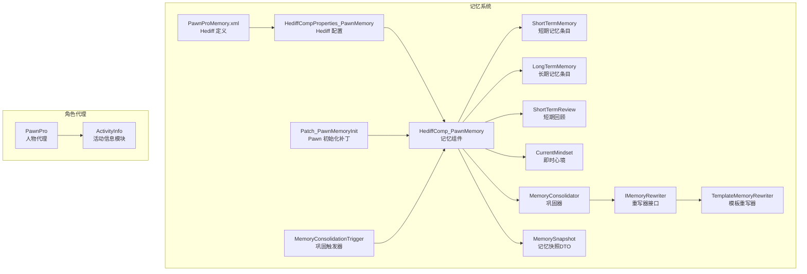
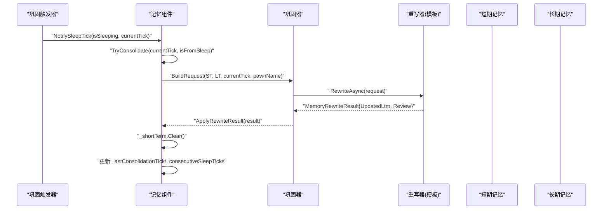
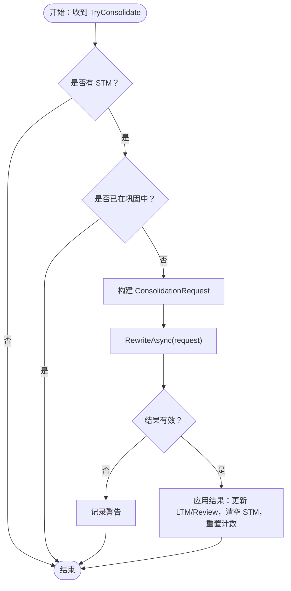
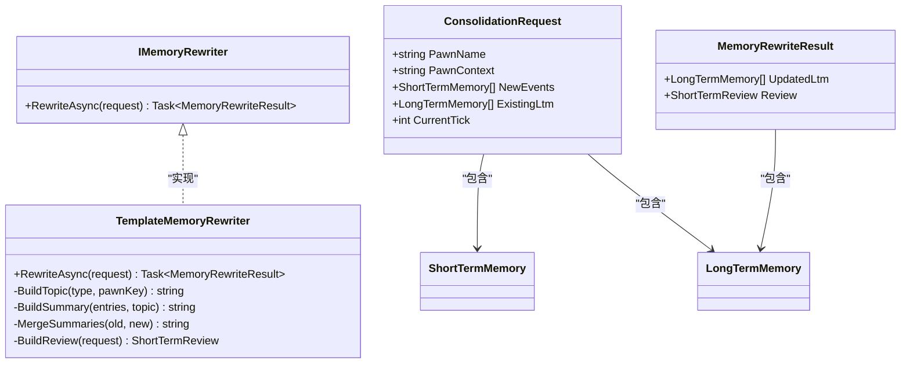
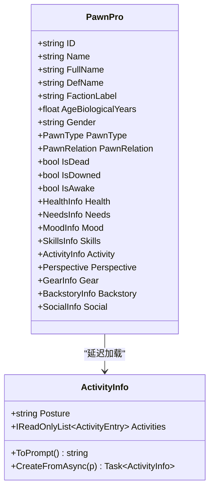
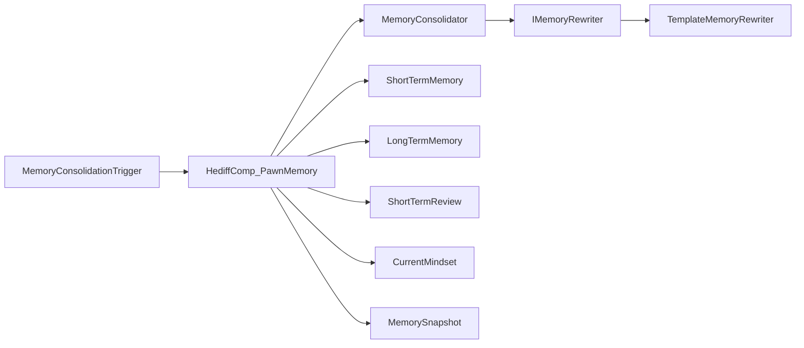

# 角色记忆系统

<cite>
**本文引用的文件**
- [ShortTermMemory.cs](file://Source/Data/PawnPro/Memory/ShortTermMemory.cs)
- [LongTermMemory.cs](file://Source/Data/PawnPro/Memory/LongTermMemory.cs)
- [ShortTermReview.cs](file://Source/Data/PawnPro/Memory/ShortTermReview.cs)
- [CurrentMindset.cs](file://Source/Data/PawnPro/Memory/CurrentMindset.cs)
- [IMemoryRewriter.cs](file://Source/Data/PawnPro/Memory/IMemoryRewriter.cs)
- [TemplateMemoryRewriter.cs](file://Source/Data/PawnPro/Memory/TemplateMemoryRewriter.cs)
- [MemoryConsolidator.cs](file://Source/Data/PawnPro/Memory/MemoryConsolidator.cs)
- [MemoryConsolidationTrigger.cs](file://Source/Data/PawnPro/Memory/MemoryConsolidationTrigger.cs)
- [HediffComp_PawnMemory.cs](file://Source/Data/PawnPro/Memory/HediffComp_PawnMemory.cs)
- [HediffCompProperties_PawnMemory.cs](file://Source/Data/PawnPro/Memory/HediffCompProperties_PawnMemory.cs)
- [Patch_PawnMemoryInit.cs](file://Source/Data/PawnPro/Memory/Patch_PawnMemoryInit.cs)
- [PawnPro.cs](file://Source/Data/PawnPro/PawnPro.cs)
- [PawnProMemory.xml](file://Defs/Core/PawnProMemory.xml)
- [MemorySnapshot.cs](file://Source/Data/PawnPro/Memory/MemorySnapshot.cs)
- [ActivityInfo.cs](file://Source/Data/PawnPro/Info/ActivityInfo.cs)
</cite>

## 目录
1. [简介](#简介)
2. [项目结构](#项目结构)
3. [核心组件](#核心组件)
4. [架构总览](#架构总览)
5. [详细组件分析](#详细组件分析)
6. [依赖关系分析](#依赖关系分析)
7. [性能考量](#性能考量)
8. [故障排查指南](#故障排查指南)
9. [结论](#结论)
10. [附录](#附录)

## 简介
本文件系统性阐述角色记忆系统的设计与实现，覆盖短期记忆与长期记忆的数据结构、记忆巩固算法（STM→LTM 转换）、记忆重写系统与模板重写器、PawnPro 人物代理的延迟加载机制与角色信息模块、记忆数据模型与存储格式、访问模式、与 RimWorld 事件系统的集成方式，并给出性能优化建议与常见问题的排查思路。文档面向初学者与有经验的开发者，既提供高层概览，又深入到代码级细节。

## 项目结构
记忆系统位于 Source/Data/PawnPro/Memory 下，围绕“隐藏的 Hediff”PawnProMemory 组织，辅以触发器与补丁确保生命周期与持久化。PawnPro 人物代理位于 Source/Data/PawnPro，提供延迟加载的角色信息模块，支撑记忆快照与提示注入。

图表来源
- [HediffComp_PawnMemory.cs:1-408](file://Source/Data/PawnPro/Memory/HediffComp_PawnMemory.cs#L1-L408)
- [MemoryConsolidator.cs:1-61](file://Source/Data/PawnPro/Memory/MemoryConsolidator.cs#L1-L61)
- [IMemoryRewriter.cs:1-54](file://Source/Data/PawnPro/Memory/IMemoryRewriter.cs#L1-L54)
- [TemplateMemoryRewriter.cs:1-152](file://Source/Data/PawnPro/Memory/TemplateMemoryRewriter.cs#L1-L152)
- [MemoryConsolidationTrigger.cs:1-79](file://Source/Data/PawnPro/Memory/MemoryConsolidationTrigger.cs#L1-L79)
- [Patch_PawnMemoryInit.cs:1-38](file://Source/Data/PawnPro/Memory/Patch_PawnMemoryInit.cs#L1-L38)
- [HediffCompProperties_PawnMemory.cs:1-18](file://Source/Data/PawnPro/Memory/HediffCompProperties_PawnMemory.cs#L1-L18)
- [PawnProMemory.xml:1-23](file://Defs/Core/PawnProMemory.xml#L1-L23)
- [MemorySnapshot.cs:1-36](file://Source/Data/PawnPro/Memory/MemorySnapshot.cs#L1-L36)
- [PawnPro.cs:1-138](file://Source/Data/PawnPro/PawnPro.cs#L1-L138)
- [ActivityInfo.cs:1-116](file://Source/Data/PawnPro/Info/ActivityInfo.cs#L1-L116)

章节来源
- [PawnProMemory.xml:1-23](file://Defs/Core/PawnProMemory.xml#L1-L23)
- [HediffCompProperties_PawnMemory.cs:1-18](file://Source/Data/PawnPro/Memory/HediffCompProperties_PawnMemory.cs#L1-L18)
- [Patch_PawnMemoryInit.cs:1-38](file://Source/Data/PawnPro/Memory/Patch_PawnMemoryInit.cs#L1-L38)
- [HediffComp_PawnMemory.cs:1-408](file://Source/Data/PawnPro/Memory/HediffComp_PawnMemory.cs#L1-L408)
- [MemoryConsolidationTrigger.cs:1-79](file://Source/Data/PawnPro/Memory/MemoryConsolidationTrigger.cs#L1-L79)
- [IMemoryRewriter.cs:1-54](file://Source/Data/PawnPro/Memory/IMemoryRewriter.cs#L1-L54)
- [TemplateMemoryRewriter.cs:1-152](file://Source/Data/PawnPro/Memory/TemplateMemoryRewriter.cs#L1-L152)
- [MemoryConsolidator.cs:1-61](file://Source/Data/PawnPro/Memory/MemoryConsolidator.cs#L1-L61)
- [ShortTermMemory.cs:1-48](file://Source/Data/PawnPro/Memory/ShortTermMemory.cs#L1-L48)
- [LongTermMemory.cs:1-53](file://Source/Data/PawnPro/Memory/LongTermMemory.cs#L1-L53)
- [ShortTermReview.cs:1-32](file://Source/Data/PawnPro/Memory/ShortTermReview.cs#L1-L32)
- [CurrentMindset.cs:1-34](file://Source/Data/PawnPro/Memory/CurrentMindset.cs#L1-L34)
- [MemorySnapshot.cs:1-36](file://Source/Data/PawnPro/Memory/MemorySnapshot.cs#L1-L36)
- [PawnPro.cs:1-138](file://Source/Data/PawnPro/PawnPro.cs#L1-L138)
- [ActivityInfo.cs:1-116](file://Source/Data/PawnPro/Info/ActivityInfo.cs#L1-L116)

## 核心组件
- 数据模型与 DTO
  - 短期记忆：记录近期内发生的事件流水，包含时间戳、类型、摘要与关联角色标识，支持摘要截断，纯 DTO，零外部依赖。
  - 长期记忆：叙述性记忆，包含主题标签、摘要、关联角色集合、最后重写时间，支持摘要截断，纯 DTO。
  - 短期回顾：客观摘要，限制字数，用于注入提示词。
  - 即时心境：第一人称心理状态，优先级最高，由 LLM 通过 MCP 主动写入。
  - 记忆快照：面向消费者（如角色卡）的只读视图，按层级优先读取。
- 记忆组件与触发器
  - 记忆组件：承载 STM/LTM/Review/Mindset 四区，负责序列化、添加 STM、更新 Mindset、触发巩固、查询与快照生成。
  - 巩固触发器：周期性遍历地图上的 Pawn，检查睡眠状态与时间阈值，驱动记忆组件执行巩固。
- 重写系统
  - 重写器接口：定义统一的异步重写契约。
  - 模板重写器：无 LLM 降级方案，按事件类型与关联角色分组，合并旧 LTM 与新 STM，生成新的 LTM 与短期回顾。
  - 巩固器：协调 Phase1（构建请求）与 Phase2（调用重写器）。
- PawnPro 人物代理
  - 轻量代理，提供基本元数据与延迟加载的信息模块（健康、需求、心情、技能、活动、视角、装备、背景、社交等），便于在主游戏线程上按需提取数据。

章节来源
- [ShortTermMemory.cs:1-48](file://Source/Data/PawnPro/Memory/ShortTermMemory.cs#L1-L48)
- [LongTermMemory.cs:1-53](file://Source/Data/PawnPro/Memory/LongTermMemory.cs#L1-L53)
- [ShortTermReview.cs:1-32](file://Source/Data/PawnPro/Memory/ShortTermReview.cs#L1-L32)
- [CurrentMindset.cs:1-34](file://Source/Data/PawnPro/Memory/CurrentMindset.cs#L1-L34)
- [MemorySnapshot.cs:1-36](file://Source/Data/PawnPro/Memory/MemorySnapshot.cs#L1-L36)
- [HediffComp_PawnMemory.cs:1-408](file://Source/Data/PawnPro/Memory/HediffComp_PawnMemory.cs#L1-L408)
- [MemoryConsolidationTrigger.cs:1-79](file://Source/Data/PawnPro/Memory/MemoryConsolidationTrigger.cs#L1-L79)
- [IMemoryRewriter.cs:1-54](file://Source/Data/PawnPro/Memory/IMemoryRewriter.cs#L1-L54)
- [TemplateMemoryRewriter.cs:1-152](file://Source/Data/PawnPro/Memory/TemplateMemoryRewriter.cs#L1-L152)
- [MemoryConsolidator.cs:1-61](file://Source/Data/PawnPro/Memory/MemoryConsolidator.cs#L1-L61)
- [PawnPro.cs:1-138](file://Source/Data/PawnPro/PawnPro.cs#L1-L138)

## 架构总览
记忆系统围绕“隐藏 Hediff + 组件 + 触发器 + 重写器”的分层设计展开。Pawn spawn 时自动附加记忆 Hediff；触发器周期性检查睡眠与时间阈值；组件在合适时机发起巩固，模板重写器将 STM 流水与现有 LTM 融合，生成新的 LTM 与短期回顾；消费者通过快照读取当前最优先的心境，其次为短期回顾，必要时再深入短期/长期记忆。

图表来源
- [MemoryConsolidationTrigger.cs:1-79](file://Source/Data/PawnPro/Memory/MemoryConsolidationTrigger.cs#L1-L79)
- [HediffComp_PawnMemory.cs:232-328](file://Source/Data/PawnPro/Memory/HediffComp_PawnMemory.cs#L232-L328)
- [MemoryConsolidator.cs:28-58](file://Source/Data/PawnPro/Memory/MemoryConsolidator.cs#L28-L58)
- [TemplateMemoryRewriter.cs:15-70](file://Source/Data/PawnPro/Memory/TemplateMemoryRewriter.cs#L15-L70)

## 详细组件分析

### 数据模型与存储格式
- 短期记忆（ShortTermMemory）
  - 字段：时间戳、类型、摘要、关联角色标识。
  - 截断策略：摘要支持按最大长度截断，避免提示词 token 消耗过大。
  - 序列化：由记忆组件负责逐项保存/加载。
- 长期记忆（LongTermMemory）
  - 字段：最后重写时间、主题标签、摘要、关联角色集合。
  - 截断策略：摘要支持按最大长度截断。
  - 序列化：列表计数 + 每项字段保存；关联角色集合采用分隔符拼接/拆分。
- 短期回顾（ShortTermReview）
  - 字段：最后更新时间、内容。
  - 字段：内容长度限制，确保注入提示词时的稳定性。
- 即时心境（CurrentMindset）
  - 字段：最后更新时间、内容。
  - 写入入口：仅允许通过 MCP 工具写入，内容经 LLM 消化后进入。
- 记忆快照（MemorySnapshot）
  - 字段：当前心境、短期回顾、近期短期记忆摘要、关键长期记忆摘要、数量与最后巩固 tick。
  - 读取优先级：先心境，次回顾，再 STM/LTM 摘要。

章节来源
- [ShortTermMemory.cs:1-48](file://Source/Data/PawnPro/Memory/ShortTermMemory.cs#L1-L48)
- [LongTermMemory.cs:1-53](file://Source/Data/PawnPro/Memory/LongTermMemory.cs#L1-L53)
- [ShortTermReview.cs:1-32](file://Source/Data/PawnPro/Memory/ShortTermReview.cs#L1-L32)
- [CurrentMindset.cs:1-34](file://Source/Data/PawnPro/Memory/CurrentMindset.cs#L1-L34)
- [MemorySnapshot.cs:1-36](file://Source/Data/PawnPro/Memory/MemorySnapshot.cs#L1-L36)
- [HediffComp_PawnMemory.cs:50-176](file://Source/Data/PawnPro/Memory/HediffComp_PawnMemory.cs#L50-L176)

### 记忆巩固算法与流程
- 触发条件
  - 睡眠触发：连续深度睡眠达到阈值（约 3 小时）。
  - 时间触发：距离上次巩固 ≥ 24 小时。
- 两阶段巩固
  - Phase1（同步）：构建 ConsolidationRequest，打包当前 STM 与既有 LTM。
  - Phase2（异步）：调用 IMemoryRewriter.RewriteAsync，得到 MemoryRewriteResult。
- 结果应用
  - 替换 LTM 列表，更新 Review，清空 STM，重置睡眠累计与最后巩固 tick。
- 模板重写器策略
  - 按 (Type, RelatedPawnId) 分组 STM，尝试与匹配 Topic 的旧 LTM 合并。
  - 生成新的摘要与关联角色集合；若无匹配 Topic，则新增 LTM 条目。
  - 生成短期回顾：对近期事件做客观摘要，限制长度。

图表来源
- [HediffComp_PawnMemory.cs:232-301](file://Source/Data/PawnPro/Memory/HediffComp_PawnMemory.cs#L232-L301)
- [MemoryConsolidator.cs:28-58](file://Source/Data/PawnPro/Memory/MemoryConsolidator.cs#L28-L58)
- [TemplateMemoryRewriter.cs:15-70](file://Source/Data/PawnPro/Memory/TemplateMemoryRewriter.cs#L15-L70)

章节来源
- [MemoryConsolidationTrigger.cs:1-79](file://Source/Data/PawnPro/Memory/MemoryConsolidationTrigger.cs#L1-L79)
- [HediffComp_PawnMemory.cs:232-328](file://Source/Data/PawnPro/Memory/HediffComp_PawnMemory.cs#L232-L328)
- [MemoryConsolidator.cs:1-61](file://Source/Data/PawnPro/Memory/MemoryConsolidator.cs#L1-L61)
- [TemplateMemoryRewriter.cs:1-152](file://Source/Data/PawnPro/Memory/TemplateMemoryRewriter.cs#L1-L152)

### 记忆重写系统与模板重写器
- 接口职责
  - IMemoryRewriter：定义 RewriteAsync(request) 的异步重写契约。
  - ConsolidationRequest：包含 Pawn 名称/上下文、新 STM、既有 LTM、当前 tick。
  - MemoryRewriteResult：包含更新后的 LTM 列表与短期回顾。
- 模板重写器实现要点
  - 分组策略：按事件类型与关联角色键聚合 STM。
  - 主题标签：根据类型或关系生成 Topic，用于匹配旧 LTM。
  - 合并策略：旧摘要与新摘要拼接并截断；关联角色集合取并集去重。
  - 新增策略：当无匹配 Topic 时创建新 LTM 条目。
  - 回顾生成：对近期事件做客观摘要，限制长度。

图表来源
- [IMemoryRewriter.cs:1-54](file://Source/Data/PawnPro/Memory/IMemoryRewriter.cs#L1-L54)
- [TemplateMemoryRewriter.cs:1-152](file://Source/Data/PawnPro/Memory/TemplateMemoryRewriter.cs#L1-L152)

章节来源
- [IMemoryRewriter.cs:1-54](file://Source/Data/PawnPro/Memory/IMemoryRewriter.cs#L1-L54)
- [TemplateMemoryRewriter.cs:1-152](file://Source/Data/PawnPro/Memory/TemplateMemoryRewriter.cs#L1-L152)

### PawnPro 人物代理与延迟加载
- 设计目标
  - 为 Pawn 提供轻量级代理，避免一次性加载昂贵信息。
  - 通过延迟加载与缓存，仅在访问属性时执行昂贵计算。
- 关键点
  - 基本元数据：ID、姓名、全名、种族、派系、年龄、性别、类型、关系。
  - 延迟加载模块：健康、需求、心情、技能、活动、视角、装备、背景、社交。
  - 空安全与类型分支：对非人类角色（动物/机械体/昆虫）进行降级处理。
- 与记忆系统的结合
  - PawnPro 可用于生成角色卡或提示注入，配合 MemorySnapshot 提供上下文。

图表来源
- [PawnPro.cs:1-138](file://Source/Data/PawnPro/PawnPro.cs#L1-L138)
- [ActivityInfo.cs:1-116](file://Source/Data/PawnPro/Info/ActivityInfo.cs#L1-L116)

章节来源
- [PawnPro.cs:1-138](file://Source/Data/PawnPro/PawnPro.cs#L1-L138)
- [ActivityInfo.cs:1-116](file://Source/Data/PawnPro/Info/ActivityInfo.cs#L1-L116)

### 与 RimWorld 事件系统的集成
- 自动附加
  - 通过 Harmony 补丁在 Pawn Spawn 时自动附加记忆 Hediff，确保每个 Pawn 都具备记忆系统。
- 触发巩固
  - 触发器每约 1 游戏小时检查一次，统计连续睡眠 tick 并判断是否达到阈值；同时检查时间阈值（24 小时）。
- 事件采集
  - 系统通过事件钩子与游戏事件流收集短期记忆条目，交由记忆组件管理与后续巩固。

章节来源
- [Patch_PawnMemoryInit.cs:1-38](file://Source/Data/PawnPro/Memory/Patch_PawnMemoryInit.cs#L1-L38)
- [MemoryConsolidationTrigger.cs:1-79](file://Source/Data/PawnPro/Memory/MemoryConsolidationTrigger.cs#L1-L79)

## 依赖关系分析
- 组件耦合
  - 记忆组件依赖巩固器与重写器接口，实现解耦；默认使用模板重写器，可替换为 LLM 重写器。
  - 触发器与组件松耦合：通过 HediffDef 查找与组件通知交互。
- 外部依赖
  - 序列化依赖 RimWorld 的 Scribe 框架。
  - 异步回调通过主线程调度器回写，避免 UI/游戏线程冲突。
- 循环依赖
  - 未见直接循环依赖；接口与实现方向清晰。

图表来源
- [MemoryConsolidationTrigger.cs:1-79](file://Source/Data/PawnPro/Memory/MemoryConsolidationTrigger.cs#L1-L79)
- [HediffComp_PawnMemory.cs:1-408](file://Source/Data/PawnPro/Memory/HediffComp_PawnMemory.cs#L1-L408)
- [MemoryConsolidator.cs:1-61](file://Source/Data/PawnPro/Memory/MemoryConsolidator.cs#L1-L61)
- [IMemoryRewriter.cs:1-54](file://Source/Data/PawnPro/Memory/IMemoryRewriter.cs#L1-L54)
- [TemplateMemoryRewriter.cs:1-152](file://Source/Data/PawnPro/Memory/TemplateMemoryRewriter.cs#L1-L152)
- [MemorySnapshot.cs:1-36](file://Source/Data/PawnPro/Memory/MemorySnapshot.cs#L1-L36)

章节来源
- [HediffComp_PawnMemory.cs:1-408](file://Source/Data/PawnPro/Memory/HediffComp_PawnMemory.cs#L1-L408)
- [MemoryConsolidator.cs:1-61](file://Source/Data/PawnPro/Memory/MemoryConsolidator.cs#L1-L61)
- [IMemoryRewriter.cs:1-54](file://Source/Data/PawnPro/Memory/IMemoryRewriter.cs#L1-L54)
- [TemplateMemoryRewriter.cs:1-152](file://Source/Data/PawnPro/Memory/TemplateMemoryRewriter.cs#L1-L152)
- [MemoryConsolidationTrigger.cs:1-79](file://Source/Data/PawnPro/Memory/MemoryConsolidationTrigger.cs#L1-L79)
- [MemorySnapshot.cs:1-36](file://Source/Data/PawnPro/Memory/MemorySnapshot.cs#L1-L36)

## 性能考量
- 内存管理
  - 短期记忆在巩固后清空，天然上限控制，避免无限膨胀。
  - 长期记忆摘要与关联角色集合均有限制长度，减少序列化与传输开销。
  - 关联角色集合采用分隔符拼接/拆分，降低复杂对象序列化成本。
- 异步与线程
  - 巩固过程分为同步构建请求与异步重写，最终在主线程回写，避免并发访问。
  - 触发器检查频率折中（约 1 游戏小时），兼顾及时性与性能。
- I/O 与序列化
  - 使用 Scribe 的值序列化，逐字段保存/加载，减少反射开销。
  - 列表计数 + 固定键名保存，提升可读性与兼容性。
- 查询与访问
  - 提供按主题与关联角色的筛选接口，支持按需查询。
  - 快照按层级优先读取，减少不必要的深层数据访问。

[本节为通用性能讨论，不直接分析具体文件]

## 故障排查指南
- 巩固未触发
  - 检查是否存在短期记忆；确认是否处于睡眠阈值或时间阈值内。
  - 查看日志输出与防重入标志位，确认是否已在巩固中。
- 巩固失败
  - 检查重写器返回结果与异常；查看日志警告信息。
  - 确认主线程回写是否成功，以及 STM 是否被正确清空。
- 序列化异常
  - 检查 Scribe 的保存/加载分支逻辑，确认字段顺序与键名一致。
  - 关联角色集合的分隔符拼接/拆分是否正确。
- 角色代理数据为空
  - 检查延迟加载模块的空安全与类型分支，确认非人类角色的降级路径。
  - 确认在主游戏线程上创建与访问 PawnPro。

章节来源
- [HediffComp_PawnMemory.cs:255-301](file://Source/Data/PawnPro/Memory/HediffComp_PawnMemory.cs#L255-L301)
- [HediffComp_PawnMemory.cs:100-176](file://Source/Data/PawnPro/Memory/HediffComp_PawnMemory.cs#L100-L176)
- [PawnPro.cs:85-112](file://Source/Data/PawnPro/PawnPro.cs#L85-L112)

## 结论
该记忆系统以“隐藏 Hediff + 组件 + 触发器 + 重写器”为核心，实现了短期记忆到长期记忆的稳定转换，提供了模板降级与可扩展的重写器接口。PawnPro 代理与延迟加载模块提升了数据访问效率与可维护性。通过严格的序列化策略、异步与主线程回写、以及触发器的节流设计，系统在 RimWorld 环境中具备良好的性能与可靠性。建议在生产环境中优先使用模板重写器进行快速落地，后续再引入 LLM 重写器以获得更高质量的叙述。

[本节为总结性内容，不直接分析具体文件]

## 附录

### 使用场景与示例（基于文件路径）
- 触发巩固
  - 路径参考：[HediffComp_PawnMemory.cs:232-328](file://Source/Data/PawnPro/Memory/HediffComp_PawnMemory.cs#L232-L328)
  - 场景：Pawn 连续睡眠达到阈值或超过 24 小时未巩固时，组件发起巩固。
- 生成短期回顾
  - 路径参考：[TemplateMemoryRewriter.cs:125-149](file://Source/Data/PawnPro/Memory/TemplateMemoryRewriter.cs#L125-L149)
  - 场景：模板重写器对近期事件做客观摘要，限制长度。
- 查询长期记忆
  - 路径参考：[HediffComp_PawnMemory.cs:337-375](file://Source/Data/PawnPro/Memory/HediffComp_PawnMemory.cs#L337-L375)
  - 场景：按主题或关联角色筛选，用于提示注入或角色卡展示。
- 生成记忆快照
  - 路径参考：[HediffComp_PawnMemory.cs:382-398](file://Source/Data/PawnPro/Memory/HediffComp_PawnMemory.cs#L382-L398)
  - 场景：消费者优先读取心境，其次回顾，再深入短期/长期记忆摘要。
- 自动附加记忆 Hediff
  - 路径参考：[Patch_PawnMemoryInit.cs:15-35](file://Source/Data/PawnPro/Memory/Patch_PawnMemoryInit.cs#L15-L35)
  - 场景：Pawn Spawn 后自动附加，确保可用性。
- 角色代理延迟加载
  - 路径参考：[PawnPro.cs:85-112](file://Source/Data/PawnPro/PawnPro.cs#L85-L112)
  - 场景：按需加载健康、需求、技能、活动等模块，避免一次性开销。

章节来源
- [HediffComp_PawnMemory.cs:232-398](file://Source/Data/PawnPro/Memory/HediffComp_PawnMemory.cs#L232-L398)
- [TemplateMemoryRewriter.cs:125-149](file://Source/Data/PawnPro/Memory/TemplateMemoryRewriter.cs#L125-L149)
- [Patch_PawnMemoryInit.cs:15-35](file://Source/Data/PawnPro/Memory/Patch_PawnMemoryInit.cs#L15-L35)
- [PawnPro.cs:85-112](file://Source/Data/PawnPro/PawnPro.cs#L85-L112)