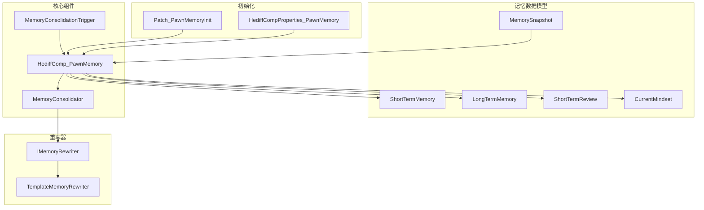
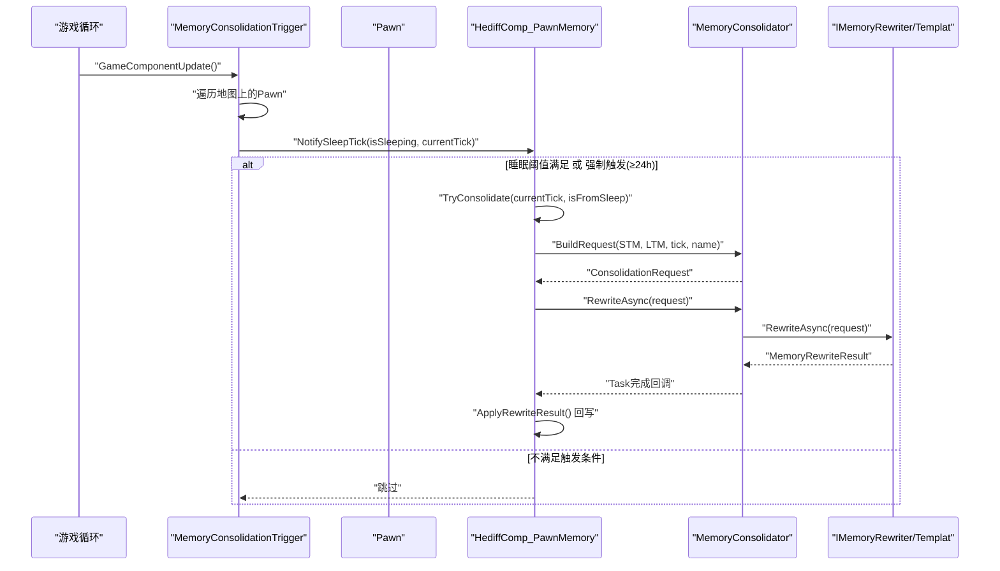
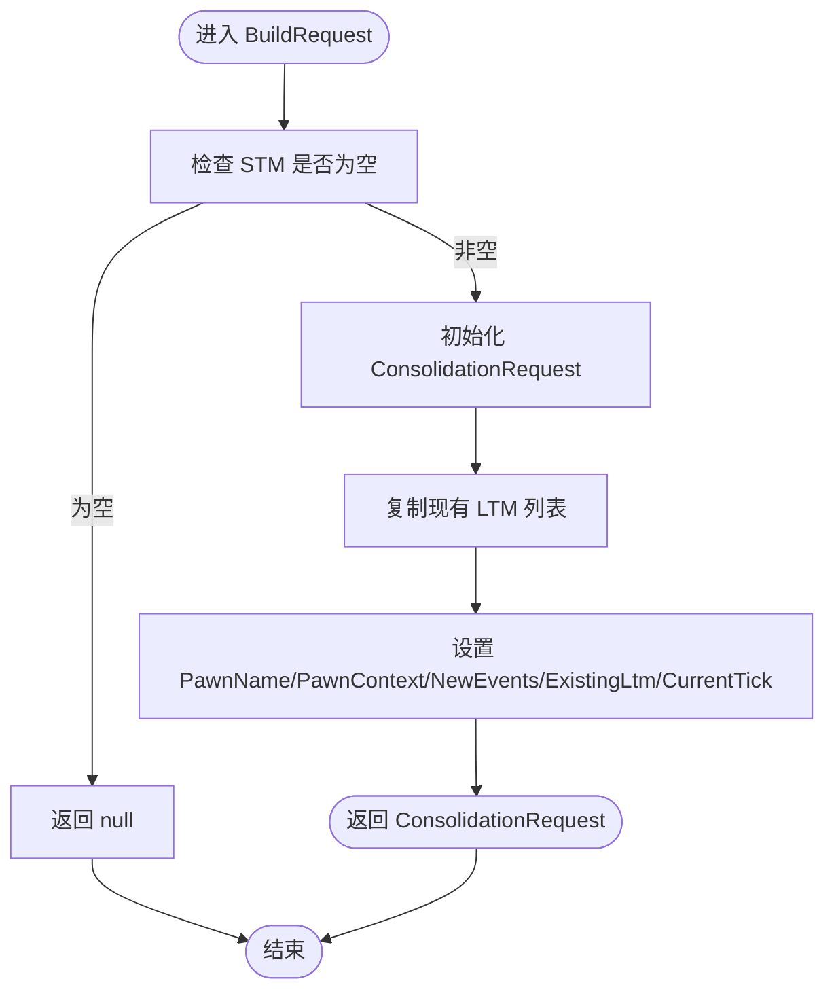
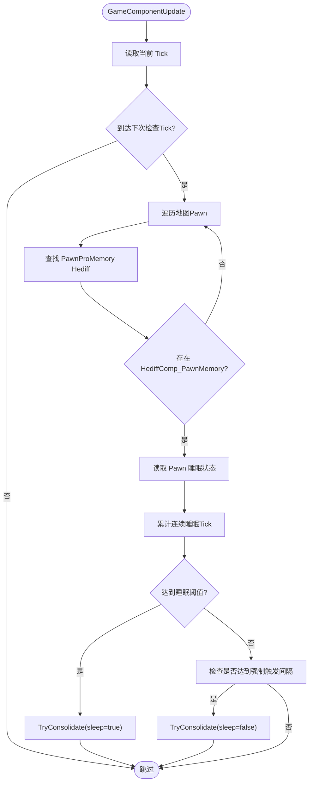
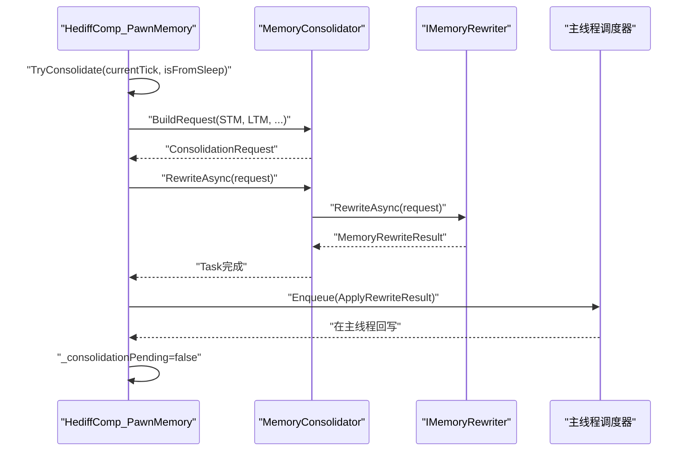
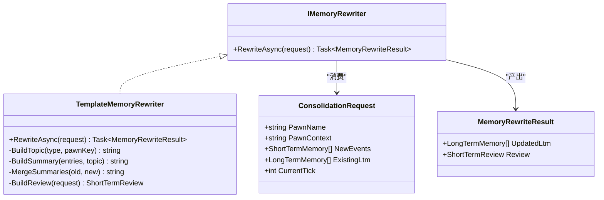
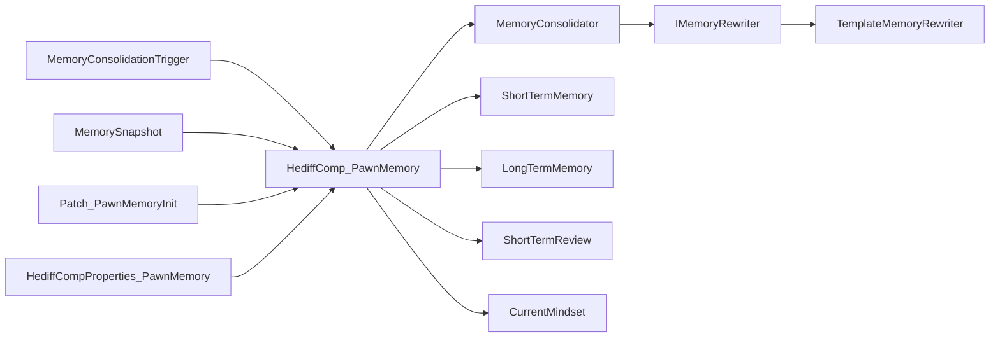

# 记忆巩固机制

<cite>
**本文引用的文件**
- [MemoryConsolidator.cs](file://Source/Data/PawnPro/Memory/MemoryConsolidator.cs)
- [MemoryConsolidationTrigger.cs](file://Source/Data/PawnPro/Memory/MemoryConsolidationTrigger.cs)
- [IMemoryRewriter.cs](file://Source/Data/PawnPro/Memory/IMemoryRewriter.cs)
- [HediffComp_PawnMemory.cs](file://Source/Data/PawnPro/Memory/HediffComp_PawnMemory.cs)
- [TemplateMemoryRewriter.cs](file://Source/Data/PawnPro/Memory/TemplateMemoryRewriter.cs)
- [ShortTermMemory.cs](file://Source/Data/PawnPro/Memory/ShortTermMemory.cs)
- [LongTermMemory.cs](file://Source/Data/PawnPro/Memory/LongTermMemory.cs)
- [MemorySnapshot.cs](file://Source/Data/PawnPro/Memory/MemorySnapshot.cs)
- [CurrentMindset.cs](file://Source/Data/PawnPro/Memory/CurrentMindset.cs)
- [ShortTermReview.cs](file://Source/Data/PawnPro/Memory/ShortTermReview.cs)
- [HediffCompProperties_PawnMemory.cs](file://Source/Data/PawnPro/Memory/HediffCompProperties_PawnMemory.cs)
- [Patch_PawnMemoryInit.cs](file://Source/Data/PawnPro/Memory/Patch_PawnMemoryInit.cs)
- [MemoryConsolidatorTests.cs](file://RimLife.Tests/Memory/MemoryConsolidatorTests.cs)
- [PawnMemoryDataStructureTests.cs](file://RimLife.Tests/Memory/PawnMemoryDataStructureTests.cs)
</cite>

## 目录
1. [简介](#简介)
2. [项目结构](#项目结构)
3. [核心组件](#核心组件)
4. [架构总览](#架构总览)
5. [详细组件分析](#详细组件分析)
6. [依赖关系分析](#依赖关系分析)
7. [性能考量](#性能考量)
8. [故障排查指南](#故障排查指南)
9. [结论](#结论)
10. [附录](#附录)

## 简介
本文件系统性阐述 RimLife 记忆巩固机制，围绕 MemoryConsolidator 的两阶段巩固流程、触发机制、重写器接口设计与实现、以及与 RimWorld 事件系统的交互展开。重点覆盖：
- 短期记忆到长期记忆的转换过程与质量控制
- MemoryConsolidationTrigger 的触发时机与策略
- IMemoryRewriter 接口与 TemplateMemoryRewriter 的实现策略
- HediffComp_PawnMemory 在记忆巩固中的职责与集成方式
- 性能优化建议、最佳实践与常见问题排查

## 项目结构
记忆相关模块位于 Source/Data/PawnPro/Memory 下，采用“数据模型 + 组件 + 触发器 + 重写器”的分层组织：
- 数据模型：ShortTermMemory、LongTermMemory、ShortTermReview、CurrentMindset、MemorySnapshot
- 核心组件：HediffComp_PawnMemory（Pawn 记忆容器）、MemoryConsolidator（两阶段巩固协调器）
- 触发器：MemoryConsolidationTrigger（周期性检查睡眠与强制触发）
- 重写器：IMemoryRewriter 接口及 TemplateMemoryRewriter 实现
- 初始化与挂载：HediffCompProperties_PawnMemory、Patch_PawnMemoryInit

图表来源
- [HediffComp_PawnMemory.cs:1-408](file://Source/Data/PawnPro/Memory/HediffComp_PawnMemory.cs#L1-L408)
- [MemoryConsolidator.cs:1-61](file://Source/Data/PawnPro/Memory/MemoryConsolidator.cs#L1-L61)
- [MemoryConsolidationTrigger.cs:1-79](file://Source/Data/PawnPro/Memory/MemoryConsolidationTrigger.cs#L1-L79)
- [IMemoryRewriter.cs:1-54](file://Source/Data/PawnPro/Memory/IMemoryRewriter.cs#L1-L54)
- [TemplateMemoryRewriter.cs:1-152](file://Source/Data/PawnPro/Memory/TemplateMemoryRewriter.cs#L1-L152)
- [HediffCompProperties_PawnMemory.cs:1-18](file://Source/Data/PawnPro/Memory/HediffCompProperties_PawnMemory.cs#L1-L18)
- [Patch_PawnMemoryInit.cs:1-38](file://Source/Data/PawnPro/Memory/Patch_PawnMemoryInit.cs#L1-L38)

章节来源
- [HediffComp_PawnMemory.cs:1-408](file://Source/Data/PawnPro/Memory/HediffComp_PawnMemory.cs#L1-L408)
- [MemoryConsolidator.cs:1-61](file://Source/Data/PawnPro/Memory/MemoryConsolidator.cs#L1-L61)
- [MemoryConsolidationTrigger.cs:1-79](file://Source/Data/PawnPro/Memory/MemoryConsolidationTrigger.cs#L1-L79)
- [IMemoryRewriter.cs:1-54](file://Source/Data/PawnPro/Memory/IMemoryRewriter.cs#L1-L54)
- [TemplateMemoryRewriter.cs:1-152](file://Source/Data/PawnPro/Memory/TemplateMemoryRewriter.cs#L1-L152)
- [HediffCompProperties_PawnMemory.cs:1-18](file://Source/Data/PawnPro/Memory/HediffCompProperties_PawnMemory.cs#L1-L18)
- [Patch_PawnMemoryInit.cs:1-38](file://Source/Data/PawnPro/Memory/Patch_PawnMemoryInit.cs#L1-L38)

## 核心组件
- MemoryConsolidator：静态协调器，负责两阶段巩固（Phase 1 构建 ConsolidationRequest；Phase 2 异步调用 IMemoryRewriter 生成 MemoryRewriteResult）
- MemoryConsolidationTrigger：GameComponent，周期性扫描地图上所有 Pawn，基于睡眠状态与时间阈值触发 TryConsolidate
- HediffComp_PawnMemory：Pawn 记忆容器，维护 STM/LTM/Review/Mindset 四区，负责触发与回写结果
- IMemoryRewriter：重写器接口，定义 RewriteAsync 签名；TemplateMemoryRewriter 为无 LLM 降级实现
- 数据模型：ShortTermMemory、LongTermMemory、ShortTermReview、CurrentMindset、MemorySnapshot

章节来源
- [MemoryConsolidator.cs:12-59](file://Source/Data/PawnPro/Memory/MemoryConsolidator.cs#L12-L59)
- [MemoryConsolidationTrigger.cs:15-78](file://Source/Data/PawnPro/Memory/MemoryConsolidationTrigger.cs#L15-L78)
- [HediffComp_PawnMemory.cs:20-407](file://Source/Data/PawnPro/Memory/HediffComp_PawnMemory.cs#L20-L407)
- [IMemoryRewriter.cs:11-53](file://Source/Data/PawnPro/Memory/IMemoryRewriter.cs#L11-L53)
- [TemplateMemoryRewriter.cs:13-151](file://Source/Data/PawnPro/Memory/TemplateMemoryRewriter.cs#L13-L151)

## 架构总览
记忆巩固以“事件驱动 + 周期性检查”为核心，结合“模板重写器”的降级路径，形成稳定可靠的短期到长期记忆转换闭环。

图表来源
- [MemoryConsolidationTrigger.cs:28-70](file://Source/Data/PawnPro/Memory/MemoryConsolidationTrigger.cs#L28-L70)
- [HediffComp_PawnMemory.cs:232-328](file://Source/Data/PawnPro/Memory/HediffComp_PawnMemory.cs#L232-L328)
- [MemoryConsolidator.cs:28-58](file://Source/Data/PawnPro/Memory/MemoryConsolidator.cs#L28-L58)
- [IMemoryRewriter.cs:11-18](file://Source/Data/PawnPro/Memory/IMemoryRewriter.cs#L11-L18)
- [TemplateMemoryRewriter.cs:15-70](file://Source/Data/PawnPro/Memory/TemplateMemoryRewriter.cs#L15-L70)

## 详细组件分析

### MemoryConsolidator：两阶段巩固协调器
- 职责
  - Phase 1：根据当前 STM 与既有 LTM 构建 ConsolidationRequest
  - Phase 2：异步委托 IMemoryRewriter 执行重写，返回 MemoryRewriteResult
- 关键点
  - 默认重写器为 TemplateMemoryRewriter，支持运行时替换（如注册 LLM 重写器）
  - 返回 null 表示无需巩固（例如 STM 为空）

图表来源
- [MemoryConsolidator.cs:28-48](file://Source/Data/PawnPro/Memory/MemoryConsolidator.cs#L28-L48)

章节来源
- [MemoryConsolidator.cs:12-59](file://Source/Data/PawnPro/Memory/MemoryConsolidator.cs#L12-L59)

### MemoryConsolidationTrigger：触发机制与时机选择
- 周期性检查：每 ~1 小时（250 tick）检查一次
- 触发条件
  - 睡眠触发：连续深度睡眠 ≥ 7500 tick（≈3 小时）
  - 强制触发：距上次巩固 ≥ 60000 tick（≈24 小时）
- 执行流程
  - 遍历地图上所有 Pawn，查找 PawnProMemory 隐形 Hediff
  - 调用 comp.NotifySleepTick(isSleeping, currentTick)，内部决定是否发起 TryConsolidate

图表来源
- [MemoryConsolidationTrigger.cs:28-70](file://Source/Data/PawnPro/Memory/MemoryConsolidationTrigger.cs#L28-L70)
- [HediffComp_PawnMemory.cs:307-328](file://Source/Data/PawnPro/Memory/HediffComp_PawnMemory.cs#L307-L328)

章节来源
- [MemoryConsolidationTrigger.cs:15-78](file://Source/Data/PawnPro/Memory/MemoryConsolidationTrigger.cs#L15-L78)
- [HediffComp_PawnMemory.cs:22-44](file://Source/Data/PawnPro/Memory/HediffComp_PawnMemory.cs#L22-L44)

### HediffComp_PawnMemory：记忆容器与巩固执行
- 责任边界
  - 维护 STM/LTM/Review/Mindset 四区，支持序列化与查询
  - 触发与回写：TryConsolidate → BuildRequest → RewriteAsync → ApplyRewriteResult
  - 防重复：_consolidationPending 避免并发重入
- 触发判定
  - 若 STM 为空直接返回
  - 非睡眠触发需满足 ≥ 60000 tick 的强制间隔
  - 防止重复：正在巩固中直接返回
- 结果回写
  - 替换 LTM 列表（若提供）
  - 更新 Review（若提供）
  - 清空 STM，重置连续睡眠计数，更新最后巩固 Tick

图表来源
- [HediffComp_PawnMemory.cs:232-301](file://Source/Data/PawnPro/Memory/HediffComp_PawnMemory.cs#L232-L301)
- [MemoryConsolidator.cs:55-58](file://Source/Data/PawnPro/Memory/MemoryConsolidator.cs#L55-L58)

章节来源
- [HediffComp_PawnMemory.cs:20-407](file://Source/Data/PawnPro/Memory/HediffComp_PawnMemory.cs#L20-L407)

### IMemoryRewriter 接口与 TemplateMemoryRewriter 实现
- 接口职责
  - 定义 RewriteAsync(ConsolidationRequest) → MemoryRewriteResult
- TemplateMemoryRewriter 策略
  - 按 (Type, RelatedPawnId) 分组 STM，生成 Topic
  - 匹配现有 LTM 合并或新增
  - 构建短期回顾（最多 8 条 STM 的客观摘要）
  - 截断策略：LTM 最大 500 字，Review 最大 300 字，STM/LTM ToString 预览最大 60/80 字

图表来源
- [IMemoryRewriter.cs:11-53](file://Source/Data/PawnPro/Memory/IMemoryRewriter.cs#L11-L53)
- [TemplateMemoryRewriter.cs:13-151](file://Source/Data/PawnPro/Memory/TemplateMemoryRewriter.cs#L13-L151)

章节来源
- [IMemoryRewriter.cs:11-53](file://Source/Data/PawnPro/Memory/IMemoryRewriter.cs#L11-L53)
- [TemplateMemoryRewriter.cs:13-151](file://Source/Data/PawnPro/Memory/TemplateMemoryRewriter.cs#L13-L151)

### 数据模型与快照
- ShortTermMemory：事件流水，含 Tick、Type、Summary、RelatedPawnId
- LongTermMemory：叙述性记忆，含 ConsolidatedTick、Topic、Summary、RelatedPawnIds
- ShortTermReview：客观回顾，含 LastUpdateTick、Content
- CurrentMindset：第一人称心理状态，含 LastUpdateTick、Content
- MemorySnapshot：对外只读视图，用于 CharacterCard 注入与 Prompt

章节来源
- [ShortTermMemory.cs:9-47](file://Source/Data/PawnPro/Memory/ShortTermMemory.cs#L9-L47)
- [LongTermMemory.cs:10-52](file://Source/Data/PawnPro/Memory/LongTermMemory.cs#L10-L52)
- [ShortTermReview.cs:8-31](file://Source/Data/PawnPro/Memory/ShortTermReview.cs#L8-L31)
- [CurrentMindset.cs:10-33](file://Source/Data/PawnPro/Memory/CurrentMindset.cs#L10-L33)
- [MemorySnapshot.cs:12-35](file://Source/Data/PawnPro/Memory/MemorySnapshot.cs#L12-L35)

### 初始化与挂载
- Patch_PawnMemoryInit：Pawn.SpawnSetup 后自动附加 PawnProMemory 隐形 Hediff
- HediffCompProperties_PawnMemory：声明 compClass 为 HediffComp_PawnMemory

章节来源
- [Patch_PawnMemoryInit.cs:12-36](file://Source/Data/PawnPro/Memory/Patch_PawnMemoryInit.cs#L12-L36)
- [HediffCompProperties_PawnMemory.cs:10-16](file://Source/Data/PawnPro/Memory/HediffCompProperties_PawnMemory.cs#L10-L16)

## 依赖关系分析
- 组件耦合
  - MemoryConsolidationTrigger 依赖 RimWorld 地图与 Pawn 作业系统，耦合外部框架但保持低侵入
  - HediffComp_PawnMemory 依赖 Scribe 序列化与主线程调度器，确保持久化与 UI 安全
  - MemoryConsolidator 仅依赖 IMemoryRewriter，通过接口解耦具体实现
- 外部依赖
  - NPCLife 与 RimLife.Cards 用于 MCP 工具链与卡片系统（在 Mindset 更新与快照中使用）
- 循环依赖
  - 未见循环依赖；各模块职责清晰，接口边界明确

图表来源
- [MemoryConsolidationTrigger.cs:15-78](file://Source/Data/PawnPro/Memory/MemoryConsolidationTrigger.cs#L15-L78)
- [HediffComp_PawnMemory.cs:20-407](file://Source/Data/PawnPro/Memory/HediffComp_PawnMemory.cs#L20-L407)
- [MemoryConsolidator.cs:12-59](file://Source/Data/PawnPro/Memory/MemoryConsolidator.cs#L12-L59)
- [IMemoryRewriter.cs:11-53](file://Source/Data/PawnPro/Memory/IMemoryRewriter.cs#L11-L53)
- [TemplateMemoryRewriter.cs:13-151](file://Source/Data/PawnPro/Memory/TemplateMemoryRewriter.cs#L13-L151)
- [Patch_PawnMemoryInit.cs:12-36](file://Source/Data/PawnPro/Memory/Patch_PawnMemoryInit.cs#L12-L36)
- [HediffCompProperties_PawnMemory.cs:10-16](file://Source/Data/PawnPro/Memory/HediffCompProperties_PawnMemory.cs#L10-L16)
- [MemorySnapshot.cs:12-35](file://Source/Data/PawnPro/Memory/MemorySnapshot.cs#L12-L35)

章节来源
- [MemoryConsolidationTrigger.cs:15-78](file://Source/Data/PawnPro/Memory/MemoryConsolidationTrigger.cs#L15-L78)
- [HediffComp_PawnMemory.cs:20-407](file://Source/Data/PawnPro/Memory/HediffComp_PawnMemory.cs#L20-L407)
- [MemoryConsolidator.cs:12-59](file://Source/Data/PawnPro/Memory/MemoryConsolidator.cs#L12-L59)
- [IMemoryRewriter.cs:11-53](file://Source/Data/PawnPro/Memory/IMemoryRewriter.cs#L11-L53)
- [TemplateMemoryRewriter.cs:13-151](file://Source/Data/PawnPro/Memory/TemplateMemoryRewriter.cs#L13-L151)
- [Patch_PawnMemoryInit.cs:12-36](file://Source/Data/PawnPro/Memory/Patch_PawnMemoryInit.cs#L12-L36)
- [HediffCompProperties_PawnMemory.cs:10-16](file://Source/Data/PawnPro/Memory/HediffCompProperties_PawnMemory.cs#L10-L16)
- [MemorySnapshot.cs:12-35](file://Source/Data/PawnPro/Memory/MemorySnapshot.cs#L12-L35)

## 性能考量
- 触发频率与粒度
  - 触发器检查间隔为 250 tick（约 1 游戏小时），兼顾及时性与性能
  - 睡眠阈值 7500 tick（≈3 小时）避免频繁触发
  - 强制触发间隔 60000 tick（≈24 小时）保证最坏情况下的数据更新
- 异步与回写
  - 重写在 Task 中执行，完成后通过主线程调度器回写，避免 UI 线程阻塞
  - 防重复标志位减少并发开销
- 文本截断与上限
  - LTM/Review/STM/快照均有限定长度，降低 Token 消耗与序列化体积
- 建议
  - 在高密度地图场景中，可考虑按地图或区域分片检查，降低全局遍历成本
  - 对长文本摘要进行缓存（如 Topic→摘要映射），减少重复计算
  - 将 Review 生成与 LTM 合并拆分为更细粒度的任务，便于限时限量子任务

## 故障排查指南
- 常见问题与定位
  - 巩固未触发
    - 检查 Pawn 是否拥有 PawnProMemory Hediff（初始化补丁是否生效）
    - 检查睡眠状态是否持续达到阈值
    - 检查是否处于强制触发间隔内
  - 巩固发起但结果未回写
    - 查看 Task 是否异常（IsFaulted），确认 ApplyRewriteResult 是否执行
    - 检查主线程调度器是否正常
  - LTM 未更新
    - 确认重写器返回的 UpdatedLtm 是否为空
    - 检查合并逻辑是否正确（相同 Topic 的合并与去重）
- 日志与调试
  - 记忆组件提供调试字符串，可用于快速核验 STM/LTM/Review/Mindset 状态
  - 触发与回写处均有消息日志，便于追踪流程

章节来源
- [Patch_PawnMemoryInit.cs:15-36](file://Source/Data/PawnPro/Memory/Patch_PawnMemoryInit.cs#L15-L36)
- [HediffComp_PawnMemory.cs:232-301](file://Source/Data/PawnPro/Memory/HediffComp_PawnMemory.cs#L232-L301)
- [MemoryConsolidator.cs:55-58](file://Source/Data/PawnPro/Memory/MemoryConsolidator.cs#L55-L58)
- [IMemoryRewriter.cs:45-52](file://Source/Data/PawnPro/Memory/IMemoryRewriter.cs#L45-L52)

## 结论
该记忆巩固机制通过“周期性触发 + 事件驱动 + 模板重写器”的组合，实现了稳定、可扩展且可降级的记忆转换流程。HediffComp_PawnMemory 作为核心容器，承担了触发、协调与回写的职责；MemoryConsolidator 以接口抽象屏蔽具体实现差异；TemplateMemoryRewriter 提供无 LLM 的可靠降级路径。配合严格的文本截断与异步回写策略，系统在 RimWorld 的复杂事件流中仍能保持良好性能与一致性。

## 附录

### 代码示例（调用与配置路径）
- 构建巩固请求
  - [MemoryConsolidator.BuildRequest(...):28-48](file://Source/Data/PawnPro/Memory/MemoryConsolidator.cs#L28-L48)
- 发起巩固（模板重写器）
  - [HediffComp_PawnMemory.TryConsolidate(...):232-282](file://Source/Data/PawnPro/Memory/HediffComp_PawnMemory.cs#L232-L282)
  - [TemplateMemoryRewriter.RewriteAsync(...):15-70](file://Source/Data/PawnPro/Memory/TemplateMemoryRewriter.cs#L15-L70)
- 触发器检查与睡眠通知
  - [MemoryConsolidationTrigger.GameComponentUpdate():28-37](file://Source/Data/PawnPro/Memory/MemoryConsolidationTrigger.cs#L28-L37)
  - [HediffComp_PawnMemory.NotifySleepTick(...):307-328](file://Source/Data/PawnPro/Memory/HediffComp_PawnMemory.cs#L307-L328)
- 初始化与挂载
  - [Patch_PawnMemoryInit.Postfix(...):15-36](file://Source/Data/PawnPro/Memory/Patch_PawnMemoryInit.cs#L15-L36)
  - [HediffCompProperties_PawnMemory.compClass:14-15](file://Source/Data/PawnPro/Memory/HediffCompProperties_PawnMemory.cs#L14-L15)

### 测试参考
- 巩固流程与模板重写器行为验证
  - [MemoryConsolidatorTests.*:14-186](file://RimLife.Tests/Memory/MemoryConsolidatorTests.cs#L14-L186)
- 数据结构行为验证
  - [PawnMemoryDataStructureTests.*:17-190](file://RimLife.Tests/Memory/PawnMemoryDataStructureTests.cs#L17-L190)