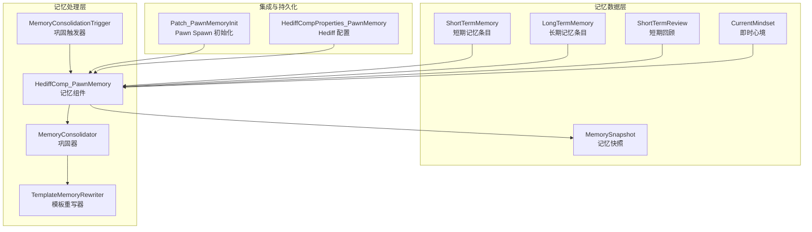
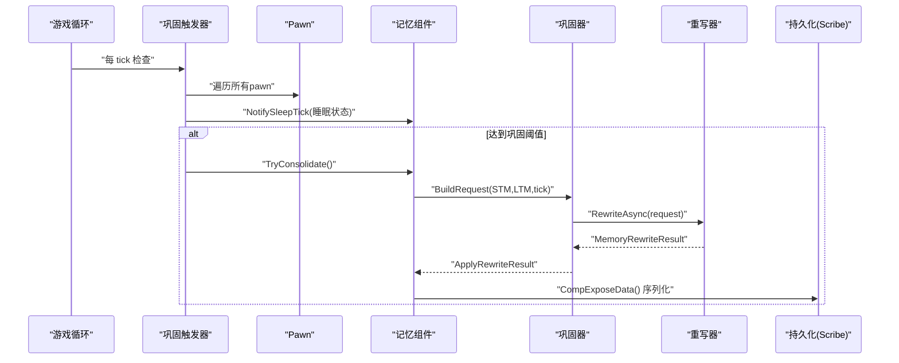
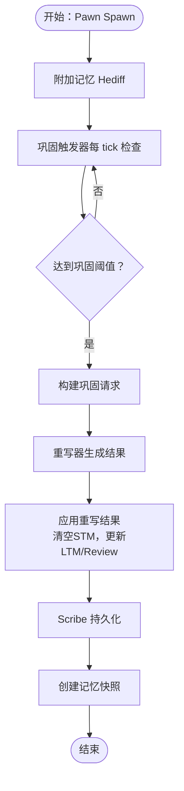
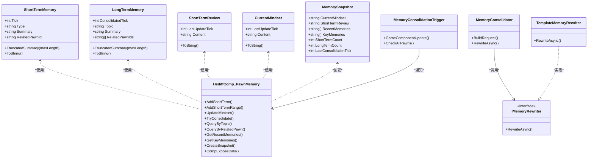

# 记忆数据结构

<cite>
**本文引用的文件**
- [ShortTermMemory.cs](file://Source/Data/PawnPro/Memory/ShortTermMemory.cs)
- [LongTermMemory.cs](file://Source/Data/PawnPro/Memory/LongTermMemory.cs)
- [MemorySnapshot.cs](file://Source/Data/PawnPro/Memory/MemorySnapshot.cs)
- [CurrentMindset.cs](file://Source/Data/PawnPro/Memory/CurrentMindset.cs)
- [HediffComp_PawnMemory.cs](file://Source/Data/PawnPro/Memory/HediffComp_PawnMemory.cs)
- [MemoryConsolidator.cs](file://Source/Data/PawnPro/Memory/MemoryConsolidator.cs)
- [IMemoryRewriter.cs](file://Source/Data/PawnPro/Memory/IMemoryRewriter.cs)
- [ShortTermReview.cs](file://Source/Data/PawnPro/Memory/ShortTermReview.cs)
- [MemoryConsolidationTrigger.cs](file://Source/Data/PawnPro/Memory/MemoryConsolidationTrigger.cs)
- [TemplateMemoryRewriter.cs](file://Source/Data/PawnPro/Memory/TemplateMemoryRewriter.cs)
- [Patch_PawnMemoryInit.cs](file://Source/Data/PawnPro/Memory/Patch_PawnMemoryInit.cs)
- [HediffCompProperties_PawnMemory.cs](file://Source/Data/PawnPro/Memory/HediffCompProperties_PawnMemory.cs)
- [PawnMemoryDataStructureTests.cs](file://RimLife.Tests/Memory/PawnMemoryDataStructureTests.cs)
- [MemoryConsolidatorTests.cs](file://RimLife.Tests/Memory/MemoryConsolidatorTests.cs)
</cite>

## 目录
1. [简介](#简介)
2. [项目结构](#项目结构)
3. [核心组件](#核心组件)
4. [架构总览](#架构总览)
5. [详细组件分析](#详细组件分析)
6. [依赖关系分析](#依赖关系分析)
7. [性能考量](#性能考量)
8. [故障排查指南](#故障排查指南)
9. [结论](#结论)
10. [附录](#附录)

## 简介
本文件系统性地文档化 RimLife 记忆数据结构，重点覆盖短期记忆（ShortTermMemory）、长期记忆（LongTermMemory）、短期回顾（ShortTermReview）、即时心境（CurrentMindset）以及记忆快照（MemorySnapshot）的数据模型与实现。文档解释各数据结构的字段定义、用途、序列化与反序列化机制、与外部组件的集成方式、数据流转过程，并提供基于测试用例的使用示例路径，帮助开发者快速理解与正确使用这些数据结构。

## 项目结构
记忆相关的核心代码位于 Source/Data/PawnPro/Memory 目录，围绕一个隐藏的 Hediff 组件（PawnProMemory）组织，该组件在每个 Pawn 上挂载，负责短期记忆收集、长期记忆巩固、短期回顾生成与即时心境写入，并通过 RimWorld 的 Scribe 框架进行持久化。

图表来源
- [HediffComp_PawnMemory.cs:1-408](file://Source/Data/PawnPro/Memory/HediffComp_PawnMemory.cs#L1-L408)
- [MemoryConsolidator.cs:1-61](file://Source/Data/PawnPro/Memory/MemoryConsolidator.cs#L1-L61)
- [TemplateMemoryRewriter.cs:1-152](file://Source/Data/PawnPro/Memory/TemplateMemoryRewriter.cs#L1-L152)
- [MemoryConsolidationTrigger.cs:1-79](file://Source/Data/PawnPro/Memory/MemoryConsolidationTrigger.cs#L1-L79)
- [Patch_PawnMemoryInit.cs:1-38](file://Source/Data/PawnPro/Memory/Patch_PawnMemoryInit.cs#L1-L38)
- [HediffCompProperties_PawnMemory.cs:1-18](file://Source/Data/PawnPro/Memory/HediffCompProperties_PawnMemory.cs#L1-L18)

章节来源
- [HediffComp_PawnMemory.cs:1-408](file://Source/Data/PawnPro/Memory/HediffComp_PawnMemory.cs#L1-L408)
- [MemoryConsolidator.cs:1-61](file://Source/Data/PawnPro/Memory/MemoryConsolidator.cs#L1-L61)
- [TemplateMemoryRewriter.cs:1-152](file://Source/Data/PawnPro/Memory/TemplateMemoryRewriter.cs#L1-L152)
- [MemoryConsolidationTrigger.cs:1-79](file://Source/Data/PawnPro/Memory/MemoryConsolidationTrigger.cs#L1-L79)
- [Patch_PawnMemoryInit.cs:1-38](file://Source/Data/PawnPro/Memory/Patch_PawnMemoryInit.cs#L1-L38)
- [HediffCompProperties_PawnMemory.cs:1-18](file://Source/Data/PawnPro/Memory/HediffCompProperties_PawnMemory.cs#L1-L18)

## 核心组件
- ShortTermMemory：记录 Pawn 近期发生的原始事件，纯 DTO，零外部依赖，由记忆组件负责序列化。
- LongTermMemory：由 LLM 或模板重写器生成的叙述性记忆，包含主题标签、关联角色集合与摘要，纯 DTO，零外部依赖。
- ShortTermReview：对近期短期记忆的客观摘要，用于提示注入与卡片展示。
- CurrentMindset：第一人称心理状态描述，由 LLM 通过 MCP 工具主动写入，优先级最高。
- MemorySnapshot：从记忆组件提取的只读视图，用于 CharacterCard 与 AI prompt 注入，包含 CurrentMindset、ShortTermReview、RecentMemories、KeyMemories 等。
- HediffComp_PawnMemory：记忆组件，承载四区记忆并提供 CRUD、查询、快照与巩固能力，通过 Scribe 自动持久化。
- MemoryConsolidator：两阶段巩固协调器，构建请求并调用重写器。
- IMemoryRewriter：重写器接口，支持模板与 LLM 实现。
- MemoryConsolidationTrigger：周期性检查睡眠状态并触发巩固。
- TemplateMemoryRewriter：无 LLM 时的降级重写器，按类型与关联角色分组合并。
- Patch_PawnMemoryInit：Pawn Spawn 时自动附加记忆 Hediff。
- HediffCompProperties_PawnMemory：Hediff 配置，绑定运行时组件。

章节来源
- [ShortTermMemory.cs:1-48](file://Source/Data/PawnPro/Memory/ShortTermMemory.cs#L1-L48)
- [LongTermMemory.cs:1-53](file://Source/Data/PawnPro/Memory/LongTermMemory.cs#L1-L53)
- [ShortTermReview.cs:1-32](file://Source/Data/PawnPro/Memory/ShortTermReview.cs#L1-L32)
- [CurrentMindset.cs:1-34](file://Source/Data/PawnPro/Memory/CurrentMindset.cs#L1-L34)
- [MemorySnapshot.cs:1-36](file://Source/Data/PawnPro/Memory/MemorySnapshot.cs#L1-L36)
- [HediffComp_PawnMemory.cs:1-408](file://Source/Data/PawnPro/Memory/HediffComp_PawnMemory.cs#L1-L408)
- [MemoryConsolidator.cs:1-61](file://Source/Data/PawnPro/Memory/MemoryConsolidator.cs#L1-L61)
- [IMemoryRewriter.cs:1-54](file://Source/Data/PawnPro/Memory/IMemoryRewriter.cs#L1-L54)
- [MemoryConsolidationTrigger.cs:1-79](file://Source/Data/PawnPro/Memory/MemoryConsolidationTrigger.cs#L1-L79)
- [TemplateMemoryRewriter.cs:1-152](file://Source/Data/PawnPro/Memory/TemplateMemoryRewriter.cs#L1-L152)
- [Patch_PawnMemoryInit.cs:1-38](file://Source/Data/PawnPro/Memory/Patch_PawnMemoryInit.cs#L1-L38)
- [HediffCompProperties_PawnMemory.cs:1-18](file://Source/Data/PawnPro/Memory/HediffCompProperties_PawnMemory.cs#L1-L18)

## 架构总览
记忆系统围绕“短期记忆流 + 长期记忆叙述”的双层结构设计，短期记忆以事件流水形式积累，定期通过巩固器与重写器生成长期记忆与短期回顾，并由即时心境提供最高优先级的心理状态描述。所有数据均通过 Scribe 自动持久化，确保保存/加载一致性。

图表来源
- [MemoryConsolidationTrigger.cs:1-79](file://Source/Data/PawnPro/Memory/MemoryConsolidationTrigger.cs#L1-L79)
- [HediffComp_PawnMemory.cs:1-408](file://Source/Data/PawnPro/Memory/HediffComp_PawnMemory.cs#L1-L408)
- [MemoryConsolidator.cs:1-61](file://Source/Data/PawnPro/Memory/MemoryConsolidator.cs#L1-L61)
- [TemplateMemoryRewriter.cs:1-152](file://Source/Data/PawnPro/Memory/TemplateMemoryRewriter.cs#L1-L152)

## 详细组件分析

### ShortTermMemory 数据模型
- 字段定义与含义
  - Tick：事件发生时刻（游戏 tick）。
  - Type：事件类型标签，如 Interaction、Event、Combat、Observation、Milestone，默认值为 "Observation"。
  - Summary：事件简短摘要（≤200 字），用于 prompt 控制 token 消耗。
  - RelatedPawnId：关联角色 ThingID（可选，无关联时为 null）。
- 设计原则与约束
  - 纯 DTO，零外部依赖，便于序列化与跨模块传输。
  - 自然上限：通过巩固后清空短期记忆，时间窗口 ≤ 24h，避免无限膨胀。
  - 截断策略：提供 TruncatedSummary(maxLength=200)，用于注入 prompt 时控制长度。
- 使用场景
  - 记录原始事件流水，作为长期记忆巩固的输入。
  - 通过记忆组件的查询方法获取最近短期记忆用于 prompt 注入。
- 示例（测试用例路径）
  - 构造函数设置属性：[PawnMemoryDataStructureTests.cs:18-26](file://RimLife.Tests/Memory/PawnMemoryDataStructureTests.cs#L18-L26)
  - 截断行为验证：[PawnMemoryDataStructureTests.cs:48-56](file://RimLife.Tests/Memory/PawnMemoryDataStructureTests.cs#L48-L56)
  - ToString 包含关键信息：[PawnMemoryDataStructureTests.cs:59-67](file://RimLife.Tests/Memory/PawnMemoryDataStructureTests.cs#L59-L67)

章节来源
- [ShortTermMemory.cs:1-48](file://Source/Data/PawnPro/Memory/ShortTermMemory.cs#L1-L48)
- [PawnMemoryDataStructureTests.cs:1-192](file://RimLife.Tests/Memory/PawnMemoryDataStructureTests.cs#L1-L192)

### LongTermMemory 数据模型
- 字段定义与含义
  - ConsolidatedTick：最后重写时刻（游戏 tick）。
  - Topic：主题标签，如 "relationship:Alice"、"combat"、"colony_life"，用于分组与查询。
  - Summary：叙述正文（≤500 字），由 LLM 或模板重写器生成。
  - RelatedPawnIds：所有关联角色 ThingID 列表（可能多个，从多条 STM 合并而来）。
- 设计原则与约束
  - 纯 DTO，零外部依赖，便于序列化与跨模块传输。
  - 重要度通过篇幅自然体现，无需显式打分字段。
  - 截断策略：提供 TruncatedSummary(maxLength=500)，用于 prompt 控制长度。
- 使用场景
  - 作为叙述性记忆存档，支持按主题与角色查询。
  - 与短期回顾共同构成记忆快照，用于 CharacterCard 与 AI prompt。
- 示例（测试用例路径）
  - 构造函数设置属性：[PawnMemoryDataStructureTests.cs:81-92](file://RimLife.Tests/Memory/PawnMemoryDataStructureTests.cs#L81-L92)
  - 截断行为验证：[PawnMemoryDataStructureTests.cs:104-116](file://RimLife.Tests/Memory/PawnMemoryDataStructureTests.cs#L104-L116)
  - ToString 包含关键信息：[PawnMemoryDataStructureTests.cs:119-127](file://RimLife.Tests/Memory/PawnMemoryDataStructureTests.cs#L119-L127)

章节来源
- [LongTermMemory.cs:1-53](file://Source/Data/PawnPro/Memory/LongTermMemory.cs#L1-L53)
- [PawnMemoryDataStructureTests.cs:1-192](file://RimLife.Tests/Memory/PawnMemoryDataStructureTests.cs#L1-L192)

### ShortTermReview 数据模型
- 字段定义与含义
  - LastUpdateTick：最后更新时刻（游戏 tick）。
  - Content：LLM 生成的客观摘要（≤300 字）。
- 设计原则与约束
  - 纯 DTO，零外部依赖，便于序列化与跨模块传输。
  - 严格限制字数，确保 prompt 注入效率。
- 使用场景
  - 巩固阶段生成，作为近期事件的客观摘要，优先于短期记忆列表注入。
- 示例（测试用例路径）
  - 构造函数设置属性：[PawnMemoryDataStructureTests.cs:134-140](file://RimLife.Tests/Memory/PawnMemoryDataStructureTests.cs#L134-L140)
  - ToString 包含预览：[PawnMemoryDataStructureTests.cs:152-158](file://RimLife.Tests/Memory/PawnMemoryDataStructureTests.cs#L152-L158)

章节来源
- [ShortTermReview.cs:1-32](file://Source/Data/PawnPro/Memory/ShortTermReview.cs#L1-L32)
- [PawnMemoryDataStructureTests.cs:1-192](file://RimLife.Tests/Memory/PawnMemoryDataStructureTests.cs#L1-L192)

### CurrentMindset 数据模型
- 字段定义与含义
  - LastUpdateTick：最后更新时刻（游戏 tick）。
  - Content：LLM 第一人称心理描述（≤200 字）。
- 设计原则与约束
  - 纯 DTO，零外部依赖，便于序列化与跨模块传输。
  - 由 LLM 通过独立 MCP 工具主动写入，不依赖自动触发。
  - 优先级最高，消费者应优先读取心境，仅在需要细节时向下钻取到 STM/LTM/Review。
- 使用场景
  - 作为 CharacterCard 与 prompt 的最高优先级心理状态描述。
- 示例（测试用例路径）
  - 构造函数设置属性：[PawnMemoryDataStructureTests.cs:165-171](file://RimLife.Tests/Memory/PawnMemoryDataStructureTests.cs#L165-L171)
  - ToString 包含预览：[PawnMemoryDataStructureTests.cs:183-189](file://RimLife.Tests/Memory/PawnMemoryDataStructureTests.cs#L183-L189)

章节来源
- [CurrentMindset.cs:1-34](file://Source/Data/PawnPro/Memory/CurrentMindset.cs#L1-L34)
- [PawnMemoryDataStructureTests.cs:1-192](file://RimLife.Tests/Memory/PawnMemoryDataStructureTests.cs#L1-L192)

### MemorySnapshot 数据模型
- 字段定义与含义
  - CurrentMindset：即时心境内容。
  - ShortTermReview：短期回顾内容。
  - RecentMemories：近期短期记忆摘要列表（截断至 120 字）。
  - KeyMemories：关键长期记忆摘要列表（截断至 300 字）。
  - ShortTermCount、LongTermCount：当前短期/长期记忆总数。
  - LastConsolidationTick：最后一次巩固的游戏 tick。
- 设计原则与约束
  - 纯 DTO，零 RimWorld 依赖，便于跨模块传输。
  - 层级优先：消费者优先读 CurrentMindset，再读 ShortTermReview，仅在需要细节时才向下钻取。
- 使用场景
  - 注入 CharacterCard 与 AI prompt，提供简洁而全面的记忆概览。
- 示例（测试用例路径）
  - 快照创建与字段填充：[HediffComp_PawnMemory.cs:382-398](file://Source/Data/PawnPro/Memory/HediffComp_PawnMemory.cs#L382-L398)

章节来源
- [MemorySnapshot.cs:1-36](file://Source/Data/PawnPro/Memory/MemorySnapshot.cs#L1-L36)
- [HediffComp_PawnMemory.cs:382-398](file://Source/Data/PawnPro/Memory/HediffComp_PawnMemory.cs#L382-L398)

### 序列化与反序列化实现
- 序列化机制
  - 记忆组件通过 Scribe 自动持久化四区记忆：短期记忆列表、长期记忆列表、短期回顾、即时心境。
  - 短期记忆列表：保存数量与逐项的 Tick、Type、Summary、RelatedPawnId。
  - 长期记忆列表：保存数量与逐项的 ConsolidatedTick、Topic、Summary，RelatedPawnIds 以分隔符连接为字符串保存。
  - 短期回顾与即时心境：分别保存 LastUpdateTick 与 Content。
- 反序列化机制
  - 加载时根据保存的键名恢复对象字段，重建短期/长期记忆列表与当前对象。
- 示例（实现路径）
  - 序列化与反序列化实现：[HediffComp_PawnMemory.cs:50-176](file://Source/Data/PawnPro/Memory/HediffComp_PawnMemory.cs#L50-L176)

章节来源
- [HediffComp_PawnMemory.cs:50-176](file://Source/Data/PawnPro/Memory/HediffComp_PawnMemory.cs#L50-L176)

### 数据模型设计原则与约束
- 设计原则
  - 纯 DTO：所有记忆数据结构均为轻量数据容器，零外部依赖，便于跨模块传输与持久化。
  - 层次清晰：短期记忆（事件流水）→ 长期记忆（叙述）→ 短期回顾（摘要）→ 即时心境（优先级最高）。
  - 字数限制：短期回顾（≤300）、短期记忆摘要（≤200）、长期记忆摘要（≤500）、即时心境（≤200），控制 token 消耗。
  - 自然上限：短期记忆在巩固后清空，时间窗口 ≤ 24h，避免无限膨胀。
- 约束条件
  - Type 缺省默认为 "Observation"。
  - RelatedPawnId 可为空，表示无关联角色。
  - ConsolidatedTick 与 LastUpdateTick 用于排序与查询。
  - 主题标签 Topic 用于分组与检索。

章节来源
- [ShortTermMemory.cs:1-48](file://Source/Data/PawnPro/Memory/ShortTermMemory.cs#L1-L48)
- [LongTermMemory.cs:1-53](file://Source/Data/PawnPro/Memory/LongTermMemory.cs#L1-L53)
- [ShortTermReview.cs:1-32](file://Source/Data/PawnPro/Memory/ShortTermReview.cs#L1-L32)
- [CurrentMindset.cs:1-34](file://Source/Data/PawnPro/Memory/CurrentMindset.cs#L1-L34)

### 与其他组件的集成与数据流转
- 初始化集成
  - Pawn Spawn 时自动附加记忆 Hediff（若不存在），确保每个 Pawn 都有记忆系统。
- 巩固触发
  - 巩固触发器周期性检查所有 Pawn 的睡眠状态，达到阈值（连续睡眠 ≥ 3h 或 24h 强制）时触发巩固。
- 巩固流程
  - 记忆组件构建巩固请求，交由重写器（模板或 LLM）生成重写结果，应用后清空短期记忆并更新最后巩固 tick。
- 快照与查询
  - 记忆组件提供按主题与角色查询、获取最近短期记忆与关键长期记忆，以及创建记忆快照供外部使用。

图表来源
- [Patch_PawnMemoryInit.cs:1-38](file://Source/Data/PawnPro/Memory/Patch_PawnMemoryInit.cs#L1-L38)
- [MemoryConsolidationTrigger.cs:1-79](file://Source/Data/PawnPro/Memory/MemoryConsolidationTrigger.cs#L1-L79)
- [HediffComp_PawnMemory.cs:232-301](file://Source/Data/PawnPro/Memory/HediffComp_PawnMemory.cs#L232-L301)
- [MemoryConsolidator.cs:28-58](file://Source/Data/PawnPro/Memory/MemoryConsolidator.cs#L28-L58)
- [TemplateMemoryRewriter.cs:15-70](file://Source/Data/PawnPro/Memory/TemplateMemoryRewriter.cs#L15-L70)

章节来源
- [Patch_PawnMemoryInit.cs:1-38](file://Source/Data/PawnPro/Memory/Patch_PawnMemoryInit.cs#L1-L38)
- [MemoryConsolidationTrigger.cs:1-79](file://Source/Data/PawnPro/Memory/MemoryConsolidationTrigger.cs#L1-L79)
- [HediffComp_PawnMemory.cs:232-301](file://Source/Data/PawnPro/Memory/HediffComp_PawnMemory.cs#L232-L301)
- [MemoryConsolidator.cs:28-58](file://Source/Data/PawnPro/Memory/MemoryConsolidator.cs#L28-L58)
- [TemplateMemoryRewriter.cs:15-70](file://Source/Data/PawnPro/Memory/TemplateMemoryRewriter.cs#L15-L70)

## 依赖关系分析
- 组件耦合与内聚
  - 记忆组件（HediffComp_PawnMemory）聚合短期/长期记忆、短期回顾与即时心境，内聚度高。
  - 重写器接口解耦模板与 LLM 实现，便于替换与扩展。
  - 触发器与组件松耦合，通过遍历与查询接口交互。
- 直接与间接依赖
  - 记忆组件直接依赖 Scribe 进行持久化。
  - 重写器依赖 ConsolidationRequest 与 MemoryRewriteResult。
  - 触发器依赖 GameComponent 生命周期与地图 Pawn 集合。
- 外部依赖与集成点
  - RimWorld Scribe：统一的序列化框架。
  - Harmony：Pawn Spawn 初始化补丁。
  - NPCLife：外部知识服务与卡片系统（用于 prompt 注入）。

图表来源
- [ShortTermMemory.cs:1-48](file://Source/Data/PawnPro/Memory/ShortTermMemory.cs#L1-L48)
- [LongTermMemory.cs:1-53](file://Source/Data/PawnPro/Memory/LongTermMemory.cs#L1-L53)
- [ShortTermReview.cs:1-32](file://Source/Data/PawnPro/Memory/ShortTermReview.cs#L1-L32)
- [CurrentMindset.cs:1-34](file://Source/Data/PawnPro/Memory/CurrentMindset.cs#L1-L34)
- [MemorySnapshot.cs:1-36](file://Source/Data/PawnPro/Memory/MemorySnapshot.cs#L1-L36)
- [HediffComp_PawnMemory.cs:1-408](file://Source/Data/PawnPro/Memory/HediffComp_PawnMemory.cs#L1-L408)
- [MemoryConsolidator.cs:1-61](file://Source/Data/PawnPro/Memory/MemoryConsolidator.cs#L1-L61)
- [IMemoryRewriter.cs:1-54](file://Source/Data/PawnPro/Memory/IMemoryRewriter.cs#L1-L54)
- [TemplateMemoryRewriter.cs:1-152](file://Source/Data/PawnPro/Memory/TemplateMemoryRewriter.cs#L1-L152)
- [MemoryConsolidationTrigger.cs:1-79](file://Source/Data/PawnPro/Memory/MemoryConsolidationTrigger.cs#L1-L79)

章节来源
- [HediffComp_PawnMemory.cs:1-408](file://Source/Data/PawnPro/Memory/HediffComp_PawnMemory.cs#L1-L408)
- [MemoryConsolidator.cs:1-61](file://Source/Data/PawnPro/Memory/MemoryConsolidator.cs#L1-L61)
- [IMemoryRewriter.cs:1-54](file://Source/Data/PawnPro/Memory/IMemoryRewriter.cs#L1-L54)
- [TemplateMemoryRewriter.cs:1-152](file://Source/Data/PawnPro/Memory/TemplateMemoryRewriter.cs#L1-L152)
- [MemoryConsolidationTrigger.cs:1-79](file://Source/Data/PawnPro/Memory/MemoryConsolidationTrigger.cs#L1-L79)

## 性能考量
- 序列化开销
  - 短期/长期记忆列表采用 Scribe Values 逐项保存，键名包含索引，保存/加载复杂度与条目数线性相关。
  - RelatedPawnIds 以分隔符连接为字符串保存，减少嵌套结构的序列化成本。
- 巩固频率与阈值
  - 巩固触发器每约 1 游戏小时检查一次，平衡性能与及时性。
  - 连续睡眠阈值（3h）与强制 24h 触发，避免频繁重写。
- 字数限制
  - 通过摘要截断控制 token 消耗，降低 prompt 注入成本。
- 查询优化
  - 提供按主题与角色的筛选方法，支持 LINQ 查询，注意在大数据量时的性能影响。

[本节为通用性能讨论，不直接分析具体文件]

## 故障排查指南
- 序列化异常
  - 现象：保存/加载失败或数据丢失。
  - 排查：确认 CompExposeData 的键名与类型一致，检查 RelatedPawnIds 的分隔符处理。
  - 参考实现：[HediffComp_PawnMemory.cs:50-176](file://Source/Data/PawnPro/Memory/HediffComp_PawnMemory.cs#L50-L176)
- 巩固未触发
  - 现象：短期记忆未清空且长期记忆未更新。
  - 排查：检查巩固触发器的检查间隔与阈值，确认 Pawn 是否处于睡眠状态或达到 24h 强制触发。
  - 参考实现：[MemoryConsolidationTrigger.cs:15-79](file://Source/Data/PawnPro/Memory/MemoryConsolidationTrigger.cs#L15-L79)
- 重写器未生效
  - 现象：短期回顾未生成或长期记忆未更新。
  - 排查：确认 MemoryConsolidator 的重写器实例是否正确设置，模板重写器是否正常工作。
  - 参考实现：[MemoryConsolidator.cs:12-58](file://Source/Data/PawnPro/Memory/MemoryConsolidator.cs#L12-L58)
- 心境未写入
  - 现象：CurrentMindset 为空。
  - 排查：确认 MCP 工具是否调用 UpdateMindset，内容长度是否超过限制。
  - 参考实现：[HediffComp_PawnMemory.cs:211-218](file://Source/Data/PawnPro/Memory/HediffComp_PawnMemory.cs#L211-L218)

章节来源
- [HediffComp_PawnMemory.cs:50-176](file://Source/Data/PawnPro/Memory/HediffComp_PawnMemory.cs#L50-L176)
- [MemoryConsolidationTrigger.cs:15-79](file://Source/Data/PawnPro/Memory/MemoryConsolidationTrigger.cs#L15-L79)
- [MemoryConsolidator.cs:12-58](file://Source/Data/PawnPro/Memory/MemoryConsolidator.cs#L12-L58)

## 结论
记忆数据结构以“短期事件流水 + 长期叙述 + 回顾摘要 + 心境优先”的层次化设计，结合 Scribe 自动持久化与模板/LLM 重写器，实现了高效、可控且可扩展的记忆系统。通过严格的字数限制与自然上限策略，有效控制了 token 消耗与存储膨胀。测试用例覆盖了数据结构的基本行为与边界条件，为正确使用提供了可靠参考。

[本节为总结性内容，不直接分析具体文件]

## 附录

### 具体使用示例（基于测试用例路径）
- 创建与访问 ShortTermMemory
  - 构造函数设置属性：[PawnMemoryDataStructureTests.cs:18-26](file://RimLife.Tests/Memory/PawnMemoryDataStructureTests.cs#L18-L26)
  - 截断行为验证：[PawnMemoryDataStructureTests.cs:48-56](file://RimLife.Tests/Memory/PawnMemoryDataStructureTests.cs#L48-L56)
- 创建与访问 LongTermMemory
  - 构造函数设置属性：[PawnMemoryDataStructureTests.cs:81-92](file://RimLife.Tests/Memory/PawnMemoryDataStructureTests.cs#L81-L92)
  - 截断行为验证：[PawnMemoryDataStructureTests.cs:104-116](file://RimLife.Tests/Memory/PawnMemoryDataStructureTests.cs#L104-L116)
- 创建与访问 ShortTermReview
  - 构造函数设置属性：[PawnMemoryDataStructureTests.cs:134-140](file://RimLife.Tests/Memory/PawnMemoryDataStructureTests.cs#L134-L140)
- 创建与访问 CurrentMindset
  - 构造函数设置属性：[PawnMemoryDataStructureTests.cs:165-171](file://RimLife.Tests/Memory/PawnMemoryDataStructureTests.cs#L165-L171)
- 巩固流程与模板重写
  - 构建请求与重写结果：[MemoryConsolidatorTests.cs:30-73](file://RimLife.Tests/Memory/MemoryConsolidatorTests.cs#L30-L73)
  - 同类型与同角色合并：[MemoryConsolidatorTests.cs:76-99](file://RimLife.Tests/Memory/MemoryConsolidatorTests.cs#L76-L99)
  - 不同类型产生多条 LTM：[MemoryConsolidatorTests.cs:102-128](file://RimLife.Tests/Memory/MemoryConsolidatorTests.cs#L102-L128)
  - 与现有 LTM 合并：[MemoryConsolidatorTests.cs:131-159](file://RimLife.Tests/Memory/MemoryConsolidatorTests.cs#L131-L159)
  - 生成短期回顾：[MemoryConsolidatorTests.cs:162-185](file://RimLife.Tests/Memory/MemoryConsolidatorTests.cs#L162-L185)

章节来源
- [PawnMemoryDataStructureTests.cs:1-192](file://RimLife.Tests/Memory/PawnMemoryDataStructureTests.cs#L1-L192)
- [MemoryConsolidatorTests.cs:1-188](file://RimLife.Tests/Memory/MemoryConsolidatorTests.cs#L1-L188)