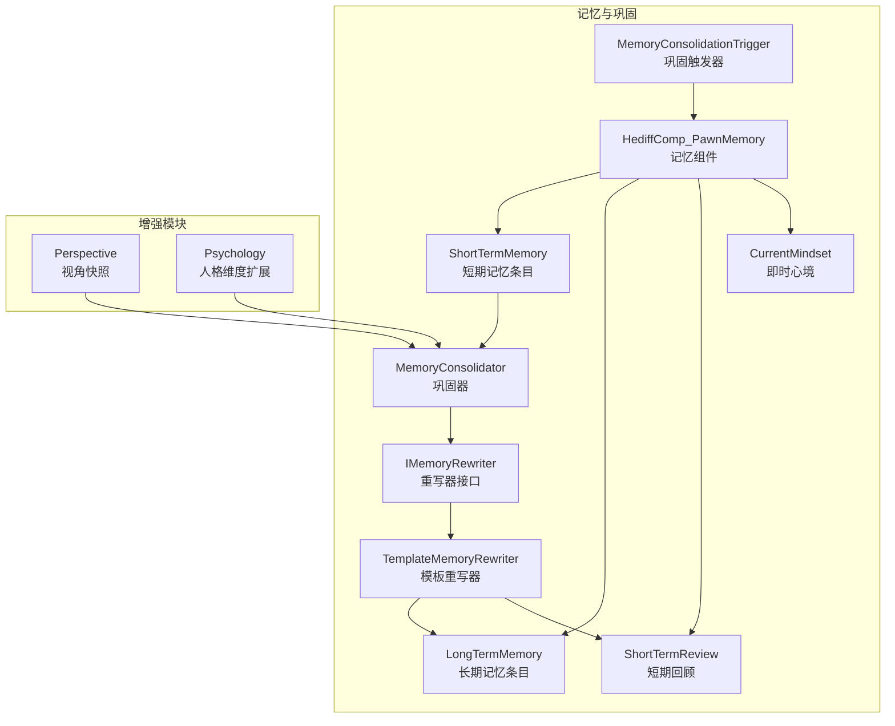
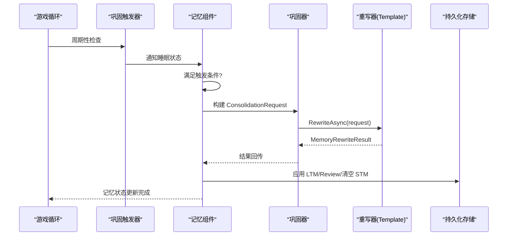
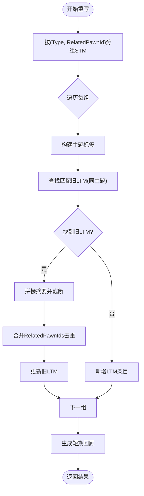
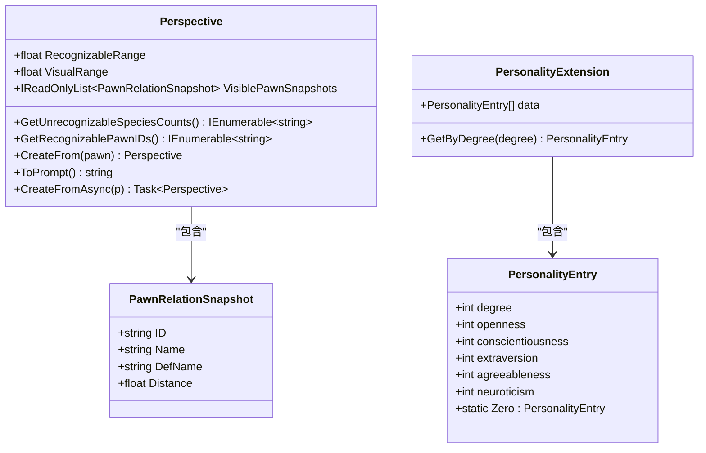
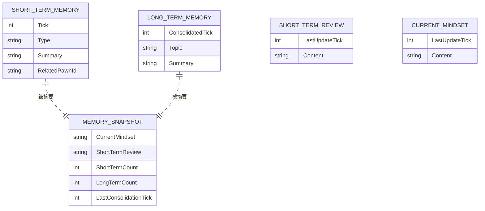
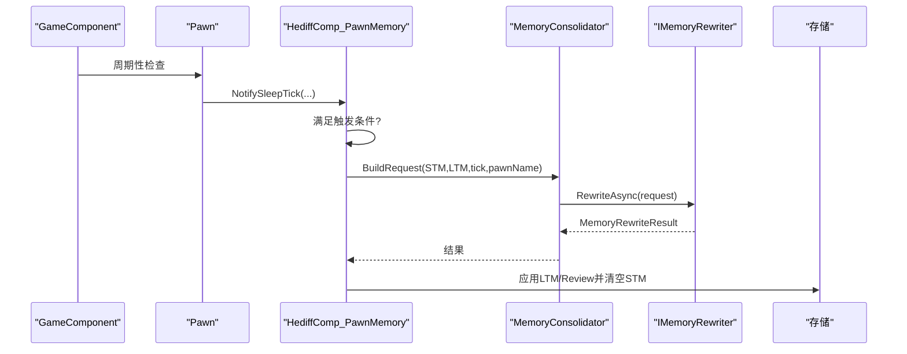
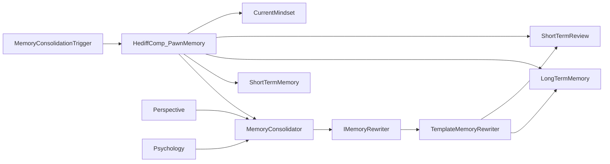

# 记忆重写系统

<cite>
**本文引用的文件**
- [TemplateMemoryRewriter.cs](file://Source/Data/PawnPro/Memory/TemplateMemoryRewriter.cs)
- [ShortTermReview.cs](file://Source/Data/PawnPro/Memory/ShortTermReview.cs)
- [Perspective.cs](file://Source/Data/PawnPro/Augmentation/Perspective.cs)
- [Psychology.cs](file://Source/Data/PawnPro/Augmentation/Psychology.cs)
- [IMemoryRewriter.cs](file://Source/Data/PawnPro/Memory/IMemoryRewriter.cs)
- [LongTermMemory.cs](file://Source/Data/PawnPro/Memory/LongTermMemory.cs)
- [ShortTermMemory.cs](file://Source/Data/PawnPro/Memory/ShortTermMemory.cs)
- [MemoryConsolidator.cs](file://Source/Data/PawnPro/Memory/MemoryConsolidator.cs)
- [MemoryConsolidationTrigger.cs](file://Source/Data/PawnPro/Memory/MemoryConsolidationTrigger.cs)
- [HediffComp_PawnMemory.cs](file://Source/Data/PawnPro/Memory/HediffComp_PawnMemory.cs)
- [HediffCompProperties_PawnMemory.cs](file://Source/Data/PawnPro/Memory/HediffCompProperties_PawnMemory.cs)
- [CurrentMindset.cs](file://Source/Data/PawnPro/Memory/CurrentMindset.cs)
- [MemorySnapshot.cs](file://Source/Data/PawnPro/Memory/MemorySnapshot.cs)
- [Patch_PawnMemoryInit.cs](file://Source/Data/PawnPro/Memory/Patch_PawnMemoryInit.cs)
- [MemoryConsolidatorTests.cs](file://RimLife.Tests/Memory/MemoryConsolidatorTests.cs)
</cite>

## 目录
1. [简介](#简介)
2. [项目结构](#项目结构)
3. [核心组件](#核心组件)
4. [架构总览](#架构总览)
5. [详细组件分析](#详细组件分析)
6. [依赖关系分析](#依赖关系分析)
7. [性能考量](#性能考量)
8. [故障排查指南](#故障排查指南)
9. [结论](#结论)
10. [附录](#附录)

## 简介
本文件系统性阐述记忆重写系统的设计与实现，重点覆盖：
- TemplateMemoryRewriter 的模板匹配与重写算法
- ShortTermReview 的回顾与评估机制
- Perspective 与 Psychology 增强模块如何影响记忆重写过程
- 不同类型记忆重写的策略与优先级
- 重写规则配置与应用示例路径
- 重写过程中的上下文理解与语义增强技术
- 自定义重写器的开发指南与扩展点
- 重写质量评估与效果监控机制
- 重写过程中的歧义处理与一致性保证

## 项目结构
记忆重写系统围绕“短期记忆 STM → 长期记忆 LTM”的两阶段巩固流程展开，核心位于 Source/Data/PawnPro/Memory，并辅以增强模块与触发器。

图表来源
- [MemoryConsolidator.cs:12-58](file://Source/Data/PawnPro/Memory/MemoryConsolidator.cs#L12-L58)
- [TemplateMemoryRewriter.cs:13-70](file://Source/Data/PawnPro/Memory/TemplateMemoryRewriter.cs#L13-L70)
- [HediffComp_PawnMemory.cs:232-301](file://Source/Data/PawnPro/Memory/HediffComp_PawnMemory.cs#L232-L301)
- [MemoryConsolidationTrigger.cs:15-70](file://Source/Data/PawnPro/Memory/MemoryConsolidationTrigger.cs#L15-L70)
- [Perspective.cs:15-119](file://Source/Data/PawnPro/Augmentation/Perspective.cs#L15-L119)
- [Psychology.cs:11-34](file://Source/Data/PawnPro/Augmentation/Psychology.cs#L11-L34)

章节来源
- [MemoryConsolidator.cs:12-58](file://Source/Data/PawnPro/Memory/MemoryConsolidator.cs#L12-L58)
- [HediffComp_PawnMemory.cs:232-301](file://Source/Data/PawnPro/Memory/HediffComp_PawnMemory.cs#L232-L301)
- [MemoryConsolidationTrigger.cs:15-70](file://Source/Data/PawnPro/Memory/MemoryConsolidationTrigger.cs#L15-L70)

## 核心组件
- IMemoryRewriter：定义记忆重写器接口，负责将 STM 与现有 LTM 融合为新的 LTM 列表与短期回顾。
- TemplateMemoryRewriter：默认模板重写器，按 (Type, RelatedPawnId) 分组 STM，匹配旧 LTM 主题并合并摘要。
- MemoryConsolidator：两阶段巩固协调器，Phase 1 构建 ConsolidationRequest，Phase 2 调用重写器。
- HediffComp_PawnMemory：承载 STM/LTM/Review/Mindset 的记忆组件，负责触发巩固、序列化与结果回写。
- MemoryConsolidationTrigger：周期性检查 Pawn 状态，满足条件时触发巩固。
- ShortTermReview/LongTermMemory/ShortTermMemory：短期/长期记忆与回顾的数据结构。
- Perspective/Psychology：视角与人格维度增强模块，为重写提供上下文与语义增强。

章节来源
- [IMemoryRewriter.cs:11-52](file://Source/Data/PawnPro/Memory/IMemoryRewriter.cs#L11-L52)
- [TemplateMemoryRewriter.cs:13-149](file://Source/Data/PawnPro/Memory/TemplateMemoryRewriter.cs#L13-L149)
- [MemoryConsolidator.cs:12-58](file://Source/Data/PawnPro/Memory/MemoryConsolidator.cs#L12-L58)
- [HediffComp_PawnMemory.cs:232-301](file://Source/Data/PawnPro/Memory/HediffComp_PawnMemory.cs#L232-L301)
- [MemoryConsolidationTrigger.cs:15-70](file://Source/Data/PawnPro/Memory/MemoryConsolidationTrigger.cs#L15-L70)
- [ShortTermReview.cs:8-30](file://Source/Data/PawnPro/Memory/ShortTermReview.cs#L8-L30)
- [LongTermMemory.cs:10-51](file://Source/Data/PawnPro/Memory/LongTermMemory.cs#L10-L51)
- [ShortTermMemory.cs:9-45](file://Source/Data/PawnPro/Memory/ShortTermMemory.cs#L9-L45)
- [Perspective.cs:15-119](file://Source/Data/PawnPro/Augmentation/Perspective.cs#L15-L119)
- [Psychology.cs:11-34](file://Source/Data/PawnPro/Augmentation/Psychology.cs#L11-L34)

## 架构总览
记忆巩固的端到端流程如下：

图表来源
- [MemoryConsolidationTrigger.cs:28-70](file://Source/Data/PawnPro/Memory/MemoryConsolidationTrigger.cs#L28-L70)
- [HediffComp_PawnMemory.cs:232-301](file://Source/Data/PawnPro/Memory/HediffComp_PawnMemory.cs#L232-L301)
- [MemoryConsolidator.cs:28-58](file://Source/Data/PawnPro/Memory/MemoryConsolidator.cs#L28-L58)
- [TemplateMemoryRewriter.cs:15-70](file://Source/Data/PawnPro/Memory/TemplateMemoryRewriter.cs#L15-L70)

## 详细组件分析

### TemplateMemoryRewriter：模板匹配与重写算法
- 分组策略：按 (Type, RelatedPawnId) 分组 STM，其中 RelatedPawnId 为空时使用占位键，确保“独处事件”单独成组。
- 主题构建：根据 Type 与 RelatedPawnId 生成主题标签，如 relationship:ID、combat、colony_events、milestones、social、observations。
- 合并逻辑：若存在相同主题的旧 LTM，则将新摘要与旧摘要拼接并截断至上限；否则新增一条 LTM。
- 关联角色去重：合并时对 RelatedPawnIds 去重并保留。
- 回顾生成：对近期最多 8 条 STM 按时间倒序摘要，总长度截断至上限，形成 ShortTermReview。

图表来源
- [TemplateMemoryRewriter.cs:23-149](file://Source/Data/PawnPro/Memory/TemplateMemoryRewriter.cs#L23-L149)

章节来源
- [TemplateMemoryRewriter.cs:13-149](file://Source/Data/PawnPro/Memory/TemplateMemoryRewriter.cs#L13-L149)

### ShortTermReview：回顾与评估机制
- 结构：包含最后更新 tick 与内容字符串，内容长度严格限制，确保下游提示词稳定。
- 生成：由 TemplateMemoryRewriter 在重写阶段生成，最多包含近期 8 条事件摘要，超出部分以计数补充。
- 使用：作为客观视角的短期摘要，供上层消费与卡片注入使用。

章节来源
- [ShortTermReview.cs:8-30](file://Source/Data/PawnPro/Memory/ShortTermReview.cs#L8-L30)
- [TemplateMemoryRewriter.cs:125-149](file://Source/Data/PawnPro/Memory/TemplateMemoryRewriter.cs#L125-L149)

### Perspective 与 Psychology 增强模块
- Perspective：基于 Pawn 的视野范围与视线，收集可见 Pawn 的快照（ID、名称、种族、距离），提供“可识别 Pawn ID”和“不可识别物种统计”，并支持转为提示词片段。
- Psychology：从 TraitDef 的 ModExtension 中读取人格维度条目，提供按等级映射的五维人格贡献，为重写提供语义增强与角色倾向建模的基础。

图表来源
- [Perspective.cs:15-119](file://Source/Data/PawnPro/Augmentation/Perspective.cs#L15-L119)
- [Psychology.cs:11-34](file://Source/Data/PawnPro/Augmentation/Psychology.cs#L11-L34)

章节来源
- [Perspective.cs:15-119](file://Source/Data/PawnPro/Augmentation/Perspective.cs#L15-L119)
- [Psychology.cs:11-34](file://Source/Data/PawnPro/Augmentation/Psychology.cs#L11-L34)

### 记忆数据模型与持久化
- ShortTermMemory：事件时间戳、类型、摘要、关联 Pawn ID。
- LongTermMemory：最后重写时间、主题、摘要、关联角色列表。
- ShortTermReview：回顾时间与内容。
- CurrentMindset：第一人称心理状态，独立于 LTM 写入。
- MemorySnapshot：面向卡片与提示词的只读视图，优先级为 CurrentMindset > ShortTermReview > STM/LTM 摘要。

图表来源
- [ShortTermMemory.cs:9-45](file://Source/Data/PawnPro/Memory/ShortTermMemory.cs#L9-L45)
- [LongTermMemory.cs:10-51](file://Source/Data/PawnPro/Memory/LongTermMemory.cs#L10-L51)
- [ShortTermReview.cs:8-30](file://Source/Data/PawnPro/Memory/ShortTermReview.cs#L8-L30)
- [CurrentMindset.cs:10-32](file://Source/Data/PawnPro/Memory/CurrentMindset.cs#L10-L32)
- [MemorySnapshot.cs:12-35](file://Source/Data/PawnPro/Memory/MemorySnapshot.cs#L12-L35)

章节来源
- [ShortTermMemory.cs:9-45](file://Source/Data/PawnPro/Memory/ShortTermMemory.cs#L9-L45)
- [LongTermMemory.cs:10-51](file://Source/Data/PawnPro/Memory/LongTermMemory.cs#L10-L51)
- [ShortTermReview.cs:8-30](file://Source/Data/PawnPro/Memory/ShortTermReview.cs#L8-L30)
- [CurrentMindset.cs:10-32](file://Source/Data/PawnPro/Memory/CurrentMindset.cs#L10-L32)
- [MemorySnapshot.cs:12-35](file://Source/Data/PawnPro/Memory/MemorySnapshot.cs#L12-L35)

### 巩固触发与执行流程
- 触发条件：睡眠连续阈值或强制间隔（24 小时）。
- 执行步骤：构建 ConsolidationRequest → 异步调用重写器 → 主线程回写结果 → 清空 STM。

图表来源
- [MemoryConsolidationTrigger.cs:28-70](file://Source/Data/PawnPro/Memory/MemoryConsolidationTrigger.cs#L28-L70)
- [HediffComp_PawnMemory.cs:232-301](file://Source/Data/PawnPro/Memory/HediffComp_PawnMemory.cs#L232-L301)
- [MemoryConsolidator.cs:28-58](file://Source/Data/PawnPro/Memory/MemoryConsolidator.cs#L28-L58)

章节来源
- [MemoryConsolidationTrigger.cs:15-70](file://Source/Data/PawnPro/Memory/MemoryConsolidationTrigger.cs#L15-L70)
- [HediffComp_PawnMemory.cs:232-301](file://Source/Data/PawnPro/Memory/HediffComp_PawnMemory.cs#L232-L301)
- [MemoryConsolidator.cs:12-58](file://Source/Data/PawnPro/Memory/MemoryConsolidator.cs#L12-L58)

### 类型策略与优先级
- 主题优先级：由 BuildTopic 决定，关系事件（含 RelatedPawnId）优先归类为 relationship:*，其次按事件类型映射到 combat/colony_events/milestones/social/observations。
- 合并优先级：相同主题的 LTM 优先合并，避免重复碎片化；RelatedPawnIds 去重提升聚合效率。
- 截断策略：LTM 摘要与 Review 内容均设置长度上限，保障提示词稳定性与性能可控。

章节来源
- [TemplateMemoryRewriter.cs:75-120](file://Source/Data/PawnPro/Memory/TemplateMemoryRewriter.cs#L75-L120)

### 重写规则配置与应用示例
- 主题映射规则：参见 [BuildTopic:75-88](file://Source/Data/PawnPro/Memory/TemplateMemoryRewriter.cs#L75-L88)。
- 摘要截断规则：参见 [BuildSummary:93-108](file://Source/Data/PawnPro/Memory/TemplateMemoryRewriter.cs#L93-L108) 与 [MergeSummaries:113-120](file://Source/Data/PawnPro/Memory/TemplateMemoryRewriter.cs#L113-L120)。
- 回顾生成规则：参见 [BuildReview:125-149](file://Source/Data/PawnPro/Memory/TemplateMemoryRewriter.cs#L125-L149)。
- 测试用例路径（验证行为）：参见 [MemoryConsolidatorTests.cs:48-179](file://RimLife.Tests/Memory/MemoryConsolidatorTests.cs#L48-L179)。

章节来源
- [TemplateMemoryRewriter.cs:75-149](file://Source/Data/PawnPro/Memory/TemplateMemoryRewriter.cs#L75-L149)
- [MemoryConsolidatorTests.cs:48-179](file://RimLife.Tests/Memory/MemoryConsolidatorTests.cs#L48-L179)

### 上下文理解与语义增强
- 上下文来源：Pawn 名称、类型标签、关联角色 ID、环境快照（Perspective）、人格维度（Psychology）。
- 增强方式：Perspective 提供“可识别 Pawn ID”与“不可识别物种统计”，Psychology 提供人格维度映射，二者均可注入提示词或作为主题构建依据，提升重写语义一致性。

章节来源
- [Perspective.cs:33-95](file://Source/Data/PawnPro/Augmentation/Perspective.cs#L33-L95)
- [Psychology.cs:11-34](file://Source/Data/PawnPro/Augmentation/Psychology.cs#L11-L34)

### 自定义重写器开发指南与扩展点
- 接口实现：实现 IMemoryRewriter.RewriteAsync，接收 ConsolidationRequest，返回 MemoryRewriteResult。
- 扩展点：
  - 替换默认重写器：通过 MemoryConsolidator.Rewriter 注册自定义实现。
  - 输入增强：在重写前读取 Perspective 与 Psychology 数据，注入提示词或主题构建。
  - 输出增强：在生成 LTM/Review 前进行语义校验与一致性检查。
- 注意事项：保持摘要长度与关联角色列表的约束，确保下游消费稳定。

章节来源
- [IMemoryRewriter.cs:11-18](file://Source/Data/PawnPro/Memory/IMemoryRewriter.cs#L11-L18)
- [MemoryConsolidator.cs:14-17](file://Source/Data/PawnPro/Memory/MemoryConsolidator.cs#L14-L17)

### 重写质量评估与效果监控
- 可观测性：日志记录巩固发起与应用状态，便于追踪失败与异常。
- 行为验证：通过单元测试覆盖典型场景（单条、合并、不同主题、已有 LTM 合并、回顾生成）。
- 建议指标：LTM 数量增长趋势、Review 长度分布、主题覆盖率、关联角色去重率。

章节来源
- [HediffComp_PawnMemory.cs:256-301](file://Source/Data/PawnPro/Memory/HediffComp_PawnMemory.cs#L256-L301)
- [MemoryConsolidatorTests.cs:48-179](file://RimLife.Tests/Memory/MemoryConsolidatorTests.cs#L48-L179)

### 歧义处理与一致性保证
- 歧义消解：当 RelatedPawnId 缺失时，使用占位键避免跨主题混叠；同一组内按时间顺序合并，减少语义漂移。
- 一致性保证：主题标签与摘要截断策略统一；RelatedPawnIds 去重；Review 严格长度限制；Mindset 独立写入，优先级最高。

章节来源
- [TemplateMemoryRewriter.cs:23-120](file://Source/Data/PawnPro/Memory/TemplateMemoryRewriter.cs#L23-L120)
- [CurrentMindset.cs:10-32](file://Source/Data/PawnPro/Memory/CurrentMindset.cs#L10-L32)

## 依赖关系分析

图表来源
- [IMemoryRewriter.cs:11-52](file://Source/Data/PawnPro/Memory/IMemoryRewriter.cs#L11-L52)
- [TemplateMemoryRewriter.cs:13-70](file://Source/Data/PawnPro/Memory/TemplateMemoryRewriter.cs#L13-L70)
- [MemoryConsolidator.cs:12-58](file://Source/Data/PawnPro/Memory/MemoryConsolidator.cs#L12-L58)
- [HediffComp_PawnMemory.cs:232-301](file://Source/Data/PawnPro/Memory/HediffComp_PawnMemory.cs#L232-L301)
- [MemoryConsolidationTrigger.cs:15-70](file://Source/Data/PawnPro/Memory/MemoryConsolidationTrigger.cs#L15-L70)
- [Perspective.cs:15-119](file://Source/Data/PawnPro/Augmentation/Perspective.cs#L15-L119)
- [Psychology.cs:11-34](file://Source/Data/PawnPro/Augmentation/Psychology.cs#L11-L34)

章节来源
- [IMemoryRewriter.cs:11-52](file://Source/Data/PawnPro/Memory/IMemoryRewriter.cs#L11-L52)
- [MemoryConsolidator.cs:12-58](file://Source/Data/PawnPro/Memory/MemoryConsolidator.cs#L12-L58)
- [HediffComp_PawnMemory.cs:232-301](file://Source/Data/PawnPro/Memory/HediffComp_PawnMemory.cs#L232-L301)

## 性能考量
- 分组与合并：按 (Type, RelatedPawnId) 分组，降低主题匹配成本；摘要拼接与截断控制内存占用。
- 截断策略：LTM 与 Review 的长度上限有效控制提示词 token 消耗，避免 LLM 调用超限。
- 异步重写：巩固 Phase 2 异步执行，避免阻塞主线程；完成后通过主线程调度器回写。
- 触发频率：周期性检查与睡眠阈值结合，兼顾及时性与性能。

## 故障排查指南
- 巩固未触发：检查睡眠累计与强制间隔；确认 MemoryConsolidationTrigger 是否正常工作。
- 重写失败：查看日志警告；确认 ConsolidationRequest 参数与重写器实现。
- 结果异常：核对主题映射与摘要截断逻辑；检查 RelatedPawnIds 去重与 Review 生成。

章节来源
- [MemoryConsolidationTrigger.cs:28-70](file://Source/Data/PawnPro/Memory/MemoryConsolidationTrigger.cs#L28-L70)
- [HediffComp_PawnMemory.cs:256-301](file://Source/Data/PawnPro/Memory/HediffComp_PawnMemory.cs#L256-L301)
- [TemplateMemoryRewriter.cs:75-149](file://Source/Data/PawnPro/Memory/TemplateMemoryRewriter.cs#L75-L149)

## 结论
记忆重写系统通过模板重写器与两阶段巩固流程，实现了从短期记忆到长期记忆的稳定转换。TemplateMemoryRewriter 的分组、主题构建与合并策略保证了主题一致性与摘要可控；ShortTermReview 提供客观回顾；Perspective 与 Psychology 为重写提供上下文与语义增强。系统具备良好的扩展性与可观测性，可通过自定义重写器进一步引入 LLM 能力与更复杂的语义处理。

## 附录
- 初始化补丁：Pawn Spawn 时自动附加记忆隐藏 Hediff，确保系统可用性。
- 数据快照：MemorySnapshot 为卡片与提示词提供只读视图，遵循优先级原则。

章节来源
- [Patch_PawnMemoryInit.cs:12-35](file://Source/Data/PawnPro/Memory/Patch_PawnMemoryInit.cs#L12-L35)
- [MemorySnapshot.cs:12-35](file://Source/Data/PawnPro/Memory/MemorySnapshot.cs#L12-L35)