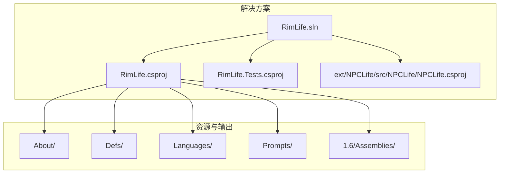
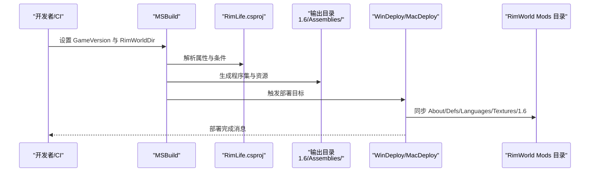
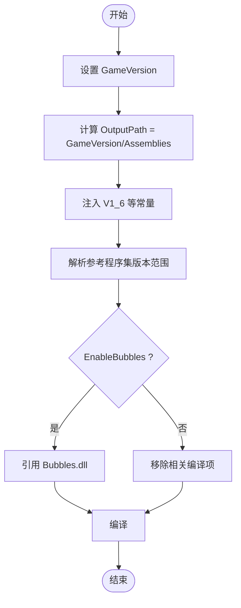
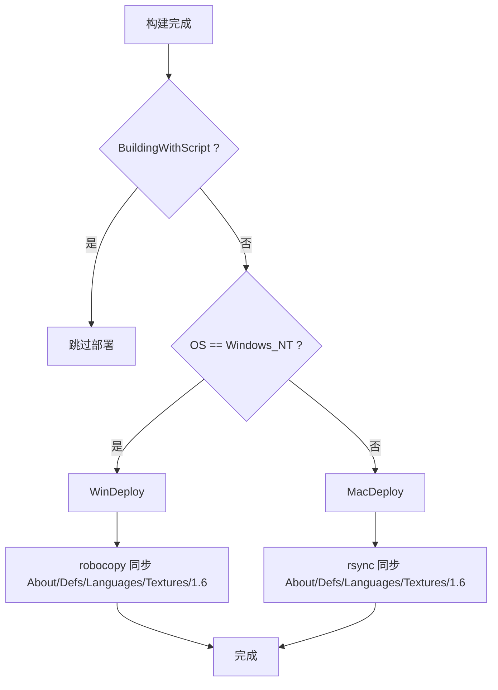
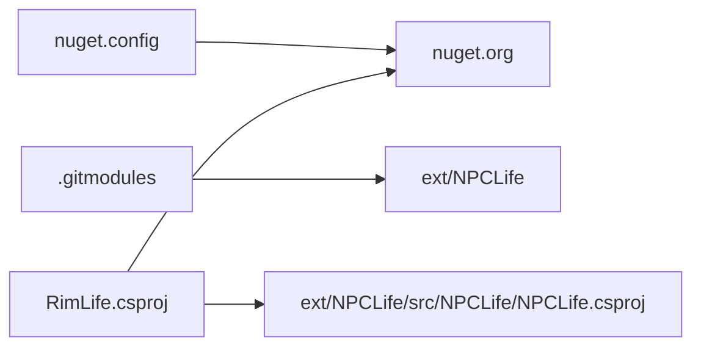
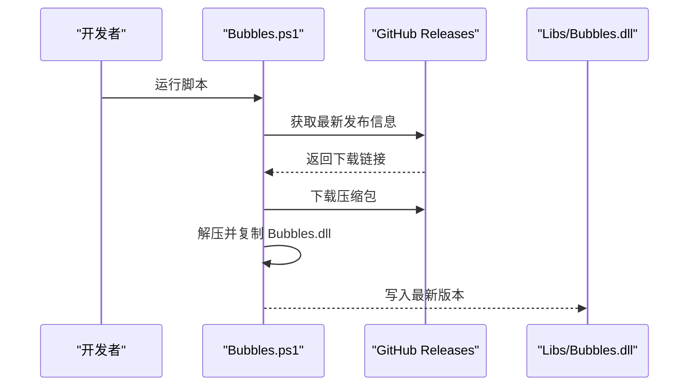
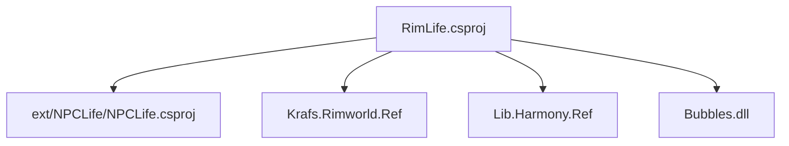

# 部署和发布

<cite>
**本文引用的文件**
- [RimLife.csproj](file://RimLife.csproj)
- [RimLife.sln](file://RimLife.sln)
- [nuget.config](file://nuget.config)
- [dotnet-tools.json](file://dotnet-tools.json)
- [Bubbles.sh](file://Libs/Bubbles.sh)
- [Bubbles.ps1](file://Libs/Bubbles.ps1)
- [.gitignore](file://.gitignore)
- [.gitattributes](file://.gitattributes)
- [.gitmodules](file://.gitmodules)
</cite>

## 目录
1. [简介](#简介)
2. [项目结构](#项目结构)
3. [核心组件](#核心组件)
4. [架构总览](#架构总览)
5. [详细组件分析](#详细组件分析)
6. [依赖分析](#依赖分析)
7. [性能考虑](#性能考虑)
8. [故障排查指南](#故障排查指南)
9. [结论](#结论)
10. [附录](#附录)

## 简介
本章节面向部署与发布的工程实践，围绕 RimWorld 模组的构建配置、多版本支持、自动部署、NuGet 包管理、外部依赖处理、模组打包、发布渠道与策略、版本控制与分支管理、发布前质量检查清单以及常见问题与回滚策略进行系统化说明。文档严格基于仓库内现有配置文件与构建脚本进行分析与总结，避免臆测。

## 项目结构
RimLife 采用多项目解决方案组织，核心为 RimLife 主项目与测试项目；通过子模块引入 ext/NPCLife 外部框架；资源与多版本输出目录位于 1.6/Assemblies 与各语言包、定义、提示文本等资源目录中。构建系统使用 .NET SDK 托管项目格式，通过 MSBuild 目标实现本地自动部署至 RimWorld 客户端 Mod 目录。

图表来源
- [RimLife.sln](file://RimLife.sln)
- [RimLife.csproj](file://RimLife.csproj)

章节来源
- [RimLife.sln](file://RimLife.sln)
- [RimLife.csproj](file://RimLife.csproj)

## 核心组件
- 构建与版本控制
  - 通过属性 GameVersion 控制目标 RimWorld 版本，默认 1.6，并在输出路径中体现。
  - 使用 DefineConstants 注入 V1_6 等常量以启用条件编译。
- 外部依赖与框架
  - 引用 Krafs.Rimworld.Ref 与 Lib.Harmony.Ref 的参考程序集，版本范围随 GameVersion 动态调整。
  - 子模块 ext/NPCLife 提供扩展框架，作为项目引用参与编译。
- 自动部署
  - 在构建后执行 WinDeploy/MacDeploy 目标，将 About、Defs、Languages、Textures 与对应版本目录同步到客户端 Mods/RimLife。
- 资源嵌入
  - Prompts 下的文本文件被嵌入为资源，便于运行时访问。
- 可选气泡库
  - EnableBubbles 开关控制是否包含 Bubbles.dll；若启用则引用该程序集但不私有复制。

章节来源
- [RimLife.csproj](file://RimLife.csproj)
- [.gitmodules](file://.gitmodules)

## 架构总览
下图展示从构建到部署的关键流程：开发者在本地或 CI 中设置 GameVersion 与 RimWorldDir，执行构建后触发 WinDeploy/MacDeploy，将资源与程序集复制到客户端 Mod 目录；同时通过 NuGet 获取参考程序集与 Harmony API。

图表来源
- [RimLife.csproj](file://RimLife.csproj)

## 详细组件分析

### 多版本支持与编译配置
- 版本选择
  - GameVersion 属性默认 1.6，可通过环境变量或命令行覆盖。
  - 输出路径 OutputPath 为 $(GameVersion)/Assemblies，确保不同版本产物隔离。
- 条件编译
  - 通过 DefineConstants 注入 V1_6 等常量，便于在代码中按版本分支。
- 参考程序集
  - 使用 Krafs.Rimworld.Ref 与 Lib.Harmony.Ref 的参考程序集，版本范围随 GameVersion 动态匹配，保证与目标游戏版本一致。
- 可选特性
  - EnableBubbles 控制是否包含 Bubbles.dll；禁用时移除相关编译项。

图表来源
- [RimLife.csproj](file://RimLife.csproj)

章节来源
- [RimLife.csproj](file://RimLife.csproj)

### 自动部署机制（WinDeploy/MacDeploy）
- 触发时机
  - 构建完成后自动执行，仅当未处于脚本驱动构建且已设置 RimWorldDir 时生效。
- 平台差异
  - Windows 使用 robocopy 同步目录，macOS 使用 rsync，均包含 About、Defs、Languages、Textures 与 $(GameVersion)。
- 部署路径
  - Windows: $(RimWorldDir)\Mods\RimLife\，macOS: $(RimWorldDir)/RimWorldMac.app/Contents/MacOS/Mods/RimLife/（注：实际路径依据项目属性，需确保正确配置）。

图表来源
- [RimLife.csproj](file://RimLife.csproj)

章节来源
- [RimLife.csproj](file://RimLife.csproj)

### NuGet 包管理与外部依赖
- 包源配置
  - nuget.config 清空默认源并显式指向 nuget.org，确保可复现的包恢复。
- 工具链
  - dotnet-tools.json 当前为空，未声明 CLI 工具。
- 外部框架
  - 通过 .gitmodules 声明 ext/NPCLife 子模块，RimLife.csproj 引用其项目文件作为编译依赖。

图表来源
- [nuget.config](file://nuget.config)
- [.gitmodules](file://.gitmodules)
- [RimLife.csproj](file://RimLife.csproj)

章节来源
- [nuget.config](file://nuget.config)
- [.gitmodules](file://.gitmodules)
- [RimLife.csproj](file://RimLife.csproj)

### 气泡库（Bubbles）下载与集成
- 目标
  - 在启用 EnableBubbles 时，将 Bubbles.dll 放置到 Libs/Bubbles.dll，供项目引用。
- 脚本行为
  - Bubbles.sh/Bubbles.ps1 从 GitHub Releases 获取最新发布，解压并复制 Assemblies/Bubbles.dll 到脚本所在目录。
- 注意事项
  - 脚本会覆盖本地 Bubbles.dll，请确保在受控环境中执行，避免破坏已有版本。
  - 若禁用 EnableBubbles，则移除相关编译项，避免误引用。

图表来源
- [Bubbles.ps1](file://Libs/Bubbles.ps1)
- [Bubbles.sh](file://Libs/Bubbles.sh)

章节来源
- [Bubbles.ps1](file://Libs/Bubbles.ps1)
- [Bubbles.sh](file://Libs/Bubbles.sh)
- [RimLife.csproj](file://RimLife.csproj)

### 模组打包与版本兼容性检查
- 文件组织
  - About、Defs、Languages、Prompts、1.6/Assemblies 等目录在部署阶段被完整复制到客户端 Mod 目录。
- 元数据配置
  - About.xml 位于 About/ 目录，用于描述模组元数据；请确保版本号与 GameVersion 对齐。
- 版本兼容性
  - 通过 GameVersion 与参考程序集版本范围匹配，确保与目标 RimWorld 版本一致。
  - 如需支持多版本，建议在 CI 中循环构建不同 GameVersion 并输出到对应目录，再统一打包。

章节来源
- [RimLife.csproj](file://RimLife.csproj)
- [About.xml](file://About/About.xml)

### 发布渠道与策略
- 渠道建议
  - Steam 创意工坊：适合公开分发，便于版本追踪与订阅管理。
  - GitHub Releases：适合开发者与早期测试者，便于快速迭代与反馈收集。
- 策略要点
  - 语义化版本：遵循主.次.修订，变更日志清晰记录功能与修复。
  - 多版本并行：对 1.4/1.5/1.6 分别维护独立构建与发布通道。
  - 自动化：结合 CI 在合并到主干时触发构建与发布流程。

（本节为通用实践说明，不直接分析具体文件）

### 版本控制与分支管理最佳实践
- 分支模型
  - 使用 Git Flow 或 GitHub Flow，主干保持稳定，功能在 feature 分支开发，修复在 hotfix 分支处理。
- 标签与版本
  - 通过 Git Tag 标记发布版本，配合 CI 自动打标签与发布。
- 文档与资源
  - .gitattributes 统一换行符，减少冲突；.gitignore 忽略构建产物与 IDE 临时文件。

章节来源
- [.gitattributes](file://.gitattributes)
- [.gitignore](file://.gitignore)

### 发布前质量检查清单
- 本地验证
  - 在目标 RimWorld 版本下构建并通过 WinDeploy/MacDeploy 部署到客户端，确认模组加载无异常。
  - 检查 About.xml 版本号与 GameVersion 一致。
- 自动化检查
  - CI 中执行构建与单元测试，确保无回归。
- 发布准备
  - 生成发布包（包含 1.6/Assemblies 与资源），在 GitHub Releases 或创意工坊创建发布页面，附带变更日志。

（本节为通用实践说明，不直接分析具体文件）

## 依赖分析
- 项目间关系
  - RimLife.csproj 依赖 ext/NPCLife 框架；解决方案包含测试项目 RimLife.Tests。
- 外部依赖
  - 参考程序集来自 nuget.org；Bubbles.dll 通过脚本从 GitHub Releases 获取。
- 潜在耦合点
  - EnableBubbles 与 Bubbles.dll 的存在性耦合；GameVersion 与参考程序集版本范围耦合。

图表来源
- [RimLife.csproj](file://RimLife.csproj)
- [.gitmodules](file://.gitmodules)

章节来源
- [RimLife.csproj](file://RimLife.csproj)
- [.gitmodules](file://.gitmodules)

## 性能考虑
- 构建性能
  - 使用参考程序集而非完整框架可缩短编译时间；合理拆分项目与子模块有助于增量构建。
- 部署效率
  - WinDeploy/MacDeploy 使用增量同步工具（robocopy/rsync），减少不必要的拷贝。
- 资源管理
  - 将大体积资源（如图片、音频）置于外部渠道，避免每次发布都上传。

（本节为通用指导，不直接分析具体文件）

## 故障排查指南
- 部署失败
  - 确认已设置 RimWorldDir；检查 WinDeploy/MacDeploy 的目标路径是否存在权限问题。
  - 若启用 EnableBubbles，确认 Libs/Bubbles.dll 是否存在且可读。
- 版本不匹配
  - 检查 GameVersion 与参考程序集版本范围是否一致；必要时更新 nuget.config 或项目属性。
- 子模块问题
  - 确保已初始化并更新子模块；检查 .gitmodules 与 .git/config 中的 URL 与路径。
- 资源缺失
  - 确认 Prompts/About/Defs/Languages/Textures 目录存在且包含必需文件；查看构建日志中的资源嵌入情况。

章节来源
- [RimLife.csproj](file://RimLife.csproj)
- [.gitmodules](file://.gitmodules)
- [Bubbles.ps1](file://Libs/Bubbles.ps1)
- [Bubbles.sh](file://Libs/Bubbles.sh)

## 结论
本项目通过 MSBuild 目标实现了本地一键部署，结合 GameVersion 与参考程序集版本范围，能够灵活适配不同 RimWorld 版本。借助子模块与 NuGet 源，外部依赖得以清晰管理。建议在 CI 中完善自动化构建与发布流程，并建立完善的版本控制与回滚策略，以保障发布质量与可追溯性。

## 附录

### 构建与部署命令示例（基于现有配置）
- 设置版本并构建
  - 示例：在命令行设置 GameVersion 并执行构建，随后触发 WinDeploy/MacDeploy。
- 配置 RimWorldDir
  - 在 Windows 上设置环境变量或在命令行传入；在 macOS/Linux 上同样设置相应环境变量。
- 手动部署
  - 若未启用自动部署，可手动执行 robocopy/rsync 命令同步 About/Defs/Languages/Textures 与 1.6 目录。

章节来源
- [RimLife.csproj](file://RimLife.csproj)