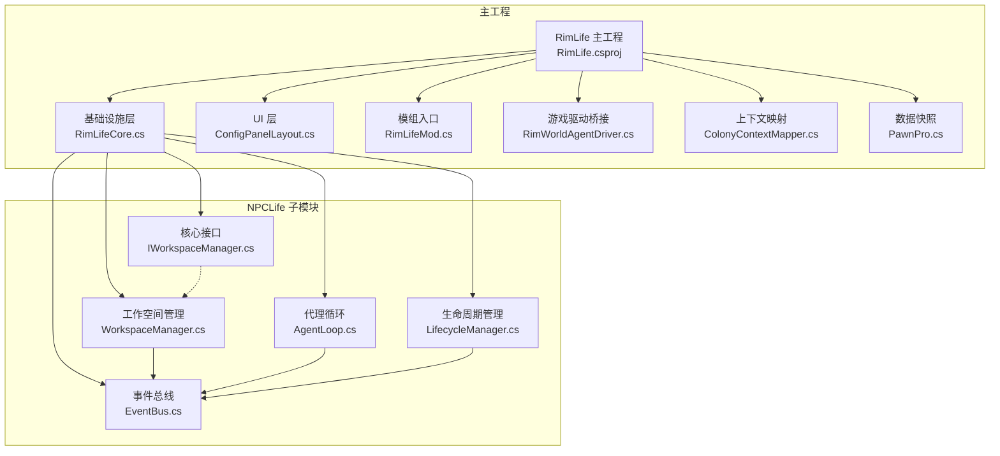
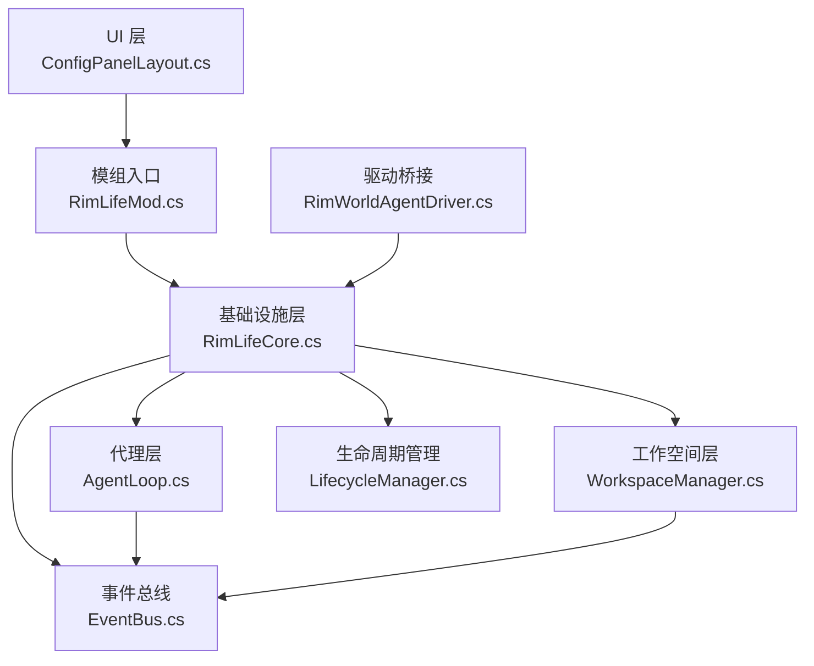
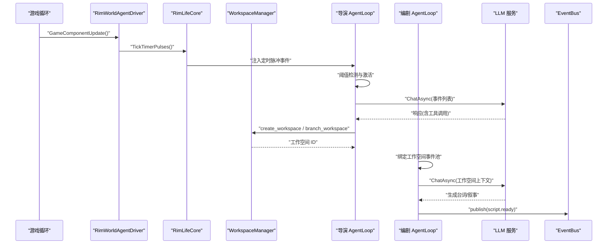
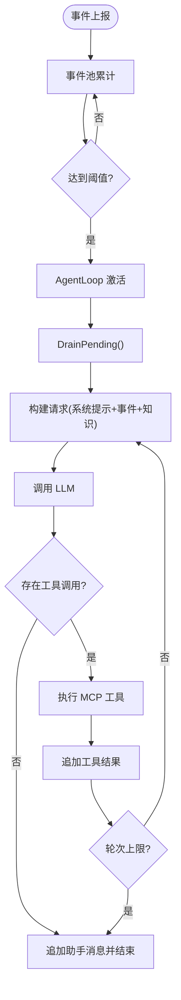
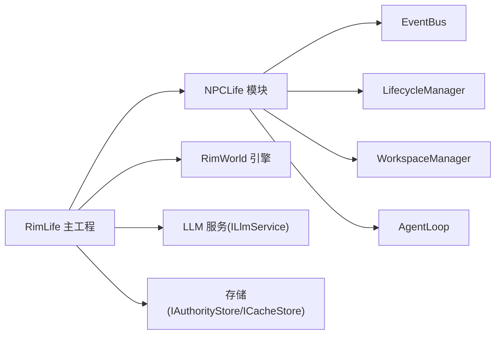

# 技术架构

<cite>
**本文引用的文件**
- [RimLife.csproj](file://RimLife.csproj)
- [README.md](file://ext/NPCLife/README.md)
- [RimLifeCore.cs](file://Source/Infrastructure/RimLifeCore.cs)
- [RimWorldAgentDriver.cs](file://Source/Infrastructure/RimWorldAgentDriver.cs)
- [IWorkspaceManager.cs](file://ext/NPCLife/src/NPCLife/Core/IWorkspaceManager.cs)
- [WorkspaceManager.cs](file://ext/NPCLife/src/NPCLife/Workspace/WorkspaceManager.cs)
- [AgentLoop.cs](file://ext/NPCLife/src/NPCLife/Agent/AgentLoop.cs)
- [EventBus.cs](file://ext/NPCLife/src/NPCLife/Framework/EventBus.cs)
- [LifecycleManager.cs](file://ext/NPCLife/src/NPCLife/Framework/LifecycleManager.cs)
- [ConfigPanelLayout.cs](file://Source/UI/ConfigPanelLayout.cs)
- [RimLifeMod.cs](file://Source/Settings/RimLifeMod.cs)
- [ColonyContextMapper.cs](file://Source/Mappers/ColonyContextMapper.cs)
- [PawnPro.cs](file://Source/Data/PawnPro/PawnPro.cs)
</cite>

## 目录
1. [引言](#引言)
2. [项目结构](#项目结构)
3. [核心组件](#核心组件)
4. [架构总览](#架构总览)
5. [详细组件分析](#详细组件分析)
6. [依赖分析](#依赖分析)
7. [性能考虑](#性能考虑)
8. [故障排查指南](#故障排查指南)
9. [结论](#结论)
10. [附录](#附录)

## 引言
本文件面向 RimLife 项目的技术架构说明，重点阐述以下方面：
- 分层架构、模块化设计与插件化架构的实现方式
- NPCLife 框架作为核心叙事引擎的集成与关系
- 多代理协作模式（导演、编剧、自由职业者）的职责与交互机制
- 工作空间管理与事件驱动的叙事触发机制
- 基础设施层、业务逻辑层、UI 层的职责划分与技术选型
- 为开发者提供系统化的架构理解，便于后续扩展与维护

## 项目结构
RimLife 采用“主工程 + 子模块（NPCLife）”的组织方式：
- 主工程负责 RimWorld 集成、UI、适配器与桥接
- NPCLife 作为独立的 C# 叙事中间件，提供工作空间、事件池、代理循环、MCP 工具、事件总线等能力
- 通过项目引用将 NPCLife 集成到主工程，形成统一的叙事与 LLM 能力栈

图示来源
- [RimLife.csproj](file://RimLife.csproj)
- [RimLifeCore.cs](file://Source/Infrastructure/RimLifeCore.cs)
- [WorkspaceManager.cs](file://ext/NPCLife/src/NPCLife/Workspace/WorkspaceManager.cs)
- [AgentLoop.cs](file://ext/NPCLife/src/NPCLife/Agent/AgentLoop.cs)
- [EventBus.cs](file://ext/NPCLife/src/NPCLife/Framework/EventBus.cs)
- [LifecycleManager.cs](file://ext/NPCLife/src/NPCLife/Framework/LifecycleManager.cs)
- [ConfigPanelLayout.cs](file://Source/UI/ConfigPanelLayout.cs)
- [RimWorldAgentDriver.cs](file://Source/Infrastructure/RimWorldAgentDriver.cs)
- [ColonyContextMapper.cs](file://Source/Mappers/ColonyContextMapper.cs)
- [PawnPro.cs](file://Source/Data/PawnPro/PawnPro.cs)

章节来源
- [RimLife.csproj](file://RimLife.csproj)
- [README.md](file://ext/NPCLife/README.md)

## 核心组件
- 基础设施层（RimLifeCore）
  - 统一适配器注入入口（日志、时间提供者、脚本消费者、提示词配置）
  - 生命周期管理（Initialize/Shutdown/Reset）、事件总线、度量系统、MCP 工具注册
  - 全局时钟脉冲驱动（TickTimerPulses），定时器脉冲路由至导演/自由职业者工作空间
  - 代理实例管理（导演、自由职业者、编剧），按需创建与释放
- 工作空间管理层（WorkspaceManager）
  - 工作空间 CRUD、分支/合并、事件路由、持久化
  - 通过 IAuthorityStore 持久化，支持跨存档切换与重载
- 代理循环（AgentLoop）
  - 基于事件池阈值被动激活，构建请求、调用 LLM、执行 MCP 工具、追加结果
  - 显式状态机与防重入机制，统一成功/失败路径
- 事件总线（EventBus）
  - 发布/订阅、优先级排序、错误隔离，预定义框架事件命名空间
- 生命周期管理（LifecycleManager）
  - 组件注册/级联销毁、OnInit/OnConfigReady/OnDestroy 钩子、幂等初始化与重置
- UI 层（ConfigPanelLayout）
  - 三区布局（侧栏/内容/状态栏），承载连接、叙事、提示词、知识、高级、调试等页面
- 游戏驱动桥接（RimWorldAgentDriver）
  - 每帧清空主线程回调队列、驱动全局时钟脉冲，间接驱动导演/自由职业者的定时任务

章节来源
- [RimLifeCore.cs](file://Source/Infrastructure/RimLifeCore.cs)
- [WorkspaceManager.cs](file://ext/NPCLife/src/NPCLife/Workspace/WorkspaceManager.cs)
- [AgentLoop.cs](file://ext/NPCLife/src/NPCLife/Agent/AgentLoop.cs)
- [EventBus.cs](file://ext/NPCLife/src/NPCLife/Framework/EventBus.cs)
- [LifecycleManager.cs](file://ext/NPCLife/src/NPCLife/Framework/LifecycleManager.cs)
- [ConfigPanelLayout.cs](file://Source/UI/ConfigPanelLayout.cs)
- [RimWorldAgentDriver.cs](file://Source/Infrastructure/RimWorldAgentDriver.cs)

## 架构总览
RimLife 采用“分层 + 插件化”的混合架构：
- 分层架构：基础设施层（适配器/调度）、业务逻辑层（工作空间/代理/事件）、UI 层（配置面板）
- 模块化设计：NPCLife 作为独立模块，通过接口解耦（IWorkspaceManager、ILlmService、IStorage 等）
- 插件化架构：MCP 工具注册（系统/知识/方向/写作/自由职业），Hook Provider 注入，支持自定义扩展

图示来源
- [ConfigPanelLayout.cs](file://Source/UI/ConfigPanelLayout.cs)
- [RimLifeMod.cs](file://Source/Settings/RimLifeMod.cs)
- [RimLifeCore.cs](file://Source/Infrastructure/RimLifeCore.cs)
- [WorkspaceManager.cs](file://ext/NPCLife/src/NPCLife/Workspace/WorkspaceManager.cs)
- [AgentLoop.cs](file://ext/NPCLife/src/NPCLife/Agent/AgentLoop.cs)
- [EventBus.cs](file://ext/NPCLife/src/NPCLife/Framework/EventBus.cs)
- [LifecycleManager.cs](file://ext/NPCLife/src/NPCLife/Framework/LifecycleManager.cs)
- [RimWorldAgentDriver.cs](file://Source/Infrastructure/RimWorldAgentDriver.cs)

## 详细组件分析

### NPCLife 框架集成与职责
- 集成方式
  - 通过项目引用引入 NPCLife 子模块，主工程在初始化阶段注入日志、时间提供者、脚本消费者等适配器
  - 通过 RimLifeCore 统一管理框架配置、提示词配置、MCP 工具注册、事件总线与生命周期
- 架构关系
  - IWorkspaceManager 定义工作空间管理契约，WorkspaceManager 提供实现
  - AgentLoop 作为纯逻辑组件，零引擎依赖，通过事件池阈值被动激活
  - EventBus 提供跨组件通信，LifecycleManager 管理组件生命周期钩子

章节来源
- [RimLife.csproj](file://RimLife.csproj)
- [IWorkspaceManager.cs](file://ext/NPCLife/src/NPCLife/Core/IWorkspaceManager.cs)
- [WorkspaceManager.cs](file://ext/NPCLife/src/NPCLife/Workspace/WorkspaceManager.cs)
- [AgentLoop.cs](file://ext/NPCLife/src/NPCLife/Agent/AgentLoop.cs)
- [EventBus.cs](file://ext/NPCLife/src/NPCLife/Framework/EventBus.cs)
- [LifecycleManager.cs](file://ext/NPCLife/src/NPCLife/Framework/LifecycleManager.cs)
- [README.md](file://ext/NPCLife/README.md)

### 多代理协作模式
- 角色与职责
  - 导演（Director）：审查事件池，决定事件路由与工作空间创建/分支
  - 编剧（Screenwriter）：针对工作空间内的事件生成具体台词与叙事
  - 自由职业者（Freelancer）：处理一次性或临时性事件
- 交互机制
  - 事件池阈值触发 AgentLoop，构建请求并调用 LLM
  - 通过 MCP 工具执行（如 create_workspace、branch_workspace），将事件路由到目标工作空间
  - 工具调用前后通过 AgentPipeline 拦截，支持度量与诊断
  - 事件总线广播 Agent 激活、轮次完成、LLM 请求/响应等事件

图示来源
- [RimWorldAgentDriver.cs](file://Source/Infrastructure/RimWorldAgentDriver.cs)
- [RimLifeCore.cs](file://Source/Infrastructure/RimLifeCore.cs)
- [WorkspaceManager.cs](file://ext/NPCLife/src/NPCLife/Workspace/WorkspaceManager.cs)
- [AgentLoop.cs](file://ext/NPCLife/src/NPCLife/Agent/AgentLoop.cs)
- [EventBus.cs](file://ext/NPCLife/src/NPCLife/Framework/EventBus.cs)

章节来源
- [README.md](file://ext/NPCLife/README.md)
- [AgentLoop.cs](file://ext/NPCLife/src/NPCLife/Agent/AgentLoop.cs)
- [WorkspaceManager.cs](file://ext/NPCLife/src/NPCLife/Workspace/WorkspaceManager.cs)
- [EventBus.cs](file://ext/NPCLife/src/NPCLife/Framework/EventBus.cs)

### 工作空间管理与事件驱动的叙事触发
- 工作空间管理
  - CRUD：创建、查询、列表、更新状态
  - 结构操作：分支（父子继承历史）、合并（多线汇合）
  - 事件路由：将事件写入目标工作空间的事件池
  - 持久化：统一序列化并写入权威存储
- 事件驱动触发
  - 全局时钟脉冲：每帧递增，按间隔触发导演/自由职业者的定时脉冲事件
  - 阈值触发：事件池积累到数量/重要度阈值后，AgentLoop 被动激活
  - 工具调用：通过 MCP 工具创建/分支工作空间，推动叙事进入新的工作空间

图示来源
- [RimLifeCore.cs](file://Source/Infrastructure/RimLifeCore.cs)
- [AgentLoop.cs](file://ext/NPCLife/src/NPCLife/Agent/AgentLoop.cs)
- [WorkspaceManager.cs](file://ext/NPCLife/src/NPCLife/Workspace/WorkspaceManager.cs)

章节来源
- [IWorkspaceManager.cs](file://ext/NPCLife/src/NPCLife/Core/IWorkspaceManager.cs)
- [WorkspaceManager.cs](file://ext/NPCLife/src/NPCLife/Workspace/WorkspaceManager.cs)
- [RimLifeCore.cs](file://Source/Infrastructure/RimLifeCore.cs)

### 基础设施层、业务逻辑层、UI 层的职责划分
- 基础设施层（RimLifeCore）
  - 适配器注入、配置管理、提示词配置、MCP 工具注册、事件总线、生命周期管理、度量系统
  - 全局时钟脉冲驱动、代理实例管理、存档切换重置
- 业务逻辑层（NPCLife）
  - 工作空间管理（CRUD/分支/合并/路由/持久化）
  - 代理循环（阈值触发、请求构建、LLM 调用、工具执行、结果追加）
  - 事件总线与生命周期管理
- UI 层（ConfigPanelLayout）
  - 三区布局（侧栏导航/内容展示/状态栏）
  - 页面分组与排序，承载连接、叙事、提示词、知识、高级、调试等配置页

章节来源
- [RimLifeCore.cs](file://Source/Infrastructure/RimLifeCore.cs)
- [ConfigPanelLayout.cs](file://Source/UI/ConfigPanelLayout.cs)
- [RimLifeMod.cs](file://Source/Settings/RimLifeMod.cs)

### 插件化架构与 MCP 工具体系
- MCP 工具注册
  - 系统工具（时间、存档切换、工作空间方向/写作/自由职业）
  - 知识工具（知识检索）
  - Hook Provider 注入（角色查询、环境感知、关系网络、记忆查询）
- 工具调用链路
  - AgentLoop 在 LLM 响应后遍历工具调用，执行前/后拦截，记录事件，最终将结果追加到消息历史
- 扩展点
  - 通过 RegisterHookProvider 注入自定义 IMcpHookProvider，实现业务域工具

章节来源
- [RimLifeCore.cs](file://Source/Infrastructure/RimLifeCore.cs)
- [AgentLoop.cs](file://ext/NPCLife/src/NPCLife/Agent/AgentLoop.cs)

### 数据与上下文映射
- ColonyContextMapper
  - 从 RimWorld 全局状态提取时间、殖民者、派系关系、资源与威胁等上下文
  - 将研究进度缓存到 CacheStore，供叙事生成时参考
- PawnPro
  - 轻量级 Pawn 代理，延迟加载健康、需求、情绪、技能、活动、视角、装备、背景、社交等信息
  - 适用于描述性/叙事性用途，不保证时序一致性

章节来源
- [ColonyContextMapper.cs](file://Source/Mappers/ColonyContextMapper.cs)
- [PawnPro.cs](file://Source/Data/PawnPro/PawnPro.cs)

## 依赖分析
- 主工程对 NPCLife 的依赖
  - 通过项目引用引入 NPCLife，主工程在初始化时注入适配器（日志、时间、脚本消费者、提示词）
  - 通过 RimLifeCore 统一管理框架配置、MCP 工具注册、事件总线与生命周期
- 组件耦合与内聚
  - 工作空间管理与事件池解耦，通过 IWorkspaceManager 接口交互
  - 代理循环与 LLM、MCP 工具解耦，通过接口与事件总线交互
  - UI 与业务逻辑通过事件总线与配置接口交互，降低耦合
- 外部依赖
  - RimWorld 引擎（Verse、UnityEngine）通过 GameComponent 与主线程调度
  - LLM 服务（OpenAI/Anthropic）通过 ILlmService 适配
  - 存储适配（IAuthorityStore/ICacheStore）通过 IStorage 接口适配

图示来源
- [RimLife.csproj](file://RimLife.csproj)
- [RimLifeCore.cs](file://Source/Infrastructure/RimLifeCore.cs)
- [WorkspaceManager.cs](file://ext/NPCLife/src/NPCLife/Workspace/WorkspaceManager.cs)
- [AgentLoop.cs](file://ext/NPCLife/src/NPCLife/Agent/AgentLoop.cs)
- [EventBus.cs](file://ext/NPCLife/src/NPCLife/Framework/EventBus.cs)
- [LifecycleManager.cs](file://ext/NPCLife/src/NPCLife/Framework/LifecycleManager.cs)

章节来源
- [RimLife.csproj](file://RimLife.csproj)
- [RimLifeCore.cs](file://Source/Infrastructure/RimLifeCore.cs)

## 性能考虑
- 事件阈值触发
  - 通过累计事件数量与重要度阈值控制 LLM 调用频率，降低 API 成本与延迟
- 代理循环限轮次
  - 最大轮次限制防止死循环，工具调用前后拦截与度量有助于定位瓶颈
- 度量与诊断
  - 运行时度量（Token 消耗、工具调用次数、工作空间操作计数）与诊断模式开关
- 序列化与持久化
  - 工作空间状态统一序列化并批量持久化，减少 IO 次数
- 主线程调度
  - 每帧清空主线程回调队列，确保异步回调及时执行，避免 UI 卡顿

## 故障排查指南
- 事件总线与生命周期
  - 使用 EventBus.Subscribe 订阅关键事件（如 AgentActivated、LlmResponseReceived、WorkspaceUpdated）
  - 通过 LifecycleManager.OnConfigReady/OnDestroy 注册钩子，定位初始化/销毁问题
- 代理循环状态
  - AgentLoop.State 反映当前运行状态（Idle/DrainingEvents/CallingLlm/ExecutingTools 等）
  - 失败路径会将事件回灌到池中，便于重试
- 存档切换
  - SaveLoaded/SaveUnloaded 事件用于重置组件，确保跨存档一致性
- UI 状态栏
  - LLM 状态栏显示当前激活模型与配置状态，便于快速确认配置有效性

章节来源
- [EventBus.cs](file://ext/NPCLife/src/NPCLife/Framework/EventBus.cs)
- [LifecycleManager.cs](file://ext/NPCLife/src/NPCLife/Framework/LifecycleManager.cs)
- [AgentLoop.cs](file://ext/NPCLife/src/NPCLife/Agent/AgentLoop.cs)
- [ConfigPanelLayout.cs](file://Source/UI/ConfigPanelLayout.cs)

## 结论
RimLife 通过将 NPCLife 作为核心叙事引擎，结合 RimWorld 的游戏循环与 UI，形成了清晰的分层、模块化与插件化架构。工作空间与事件驱动的叙事触发机制，配合导演/编剧/自由职业者的多代理协作，实现了对复杂叙事场景的动态响应。基础设施层统一适配器与生命周期管理，UI 层提供直观的配置与调试入口。该架构为后续扩展（自定义 MCP 工具、提示词策略、存档持久化策略）提供了良好的扩展点与维护性。

## 附录
- 开发者建议
  - 在 Initialize 阶段集中注入适配器与注册 Hook Provider
  - 使用 EventBus 订阅关键事件，结合 LifecycleManager 钩子进行可观测性建设
  - 通过提示词配置与阈值参数微调叙事节奏与成本
  - 在 UI 中增加必要的状态反馈与诊断信息，提升可运维性