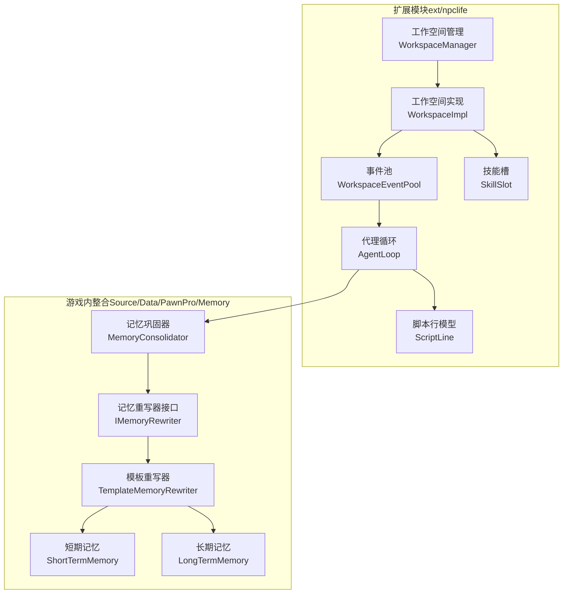
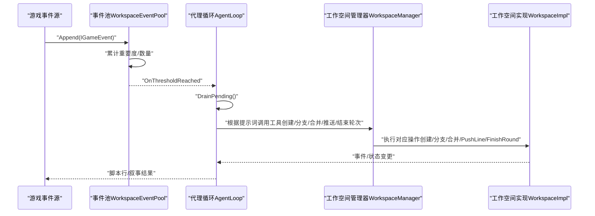
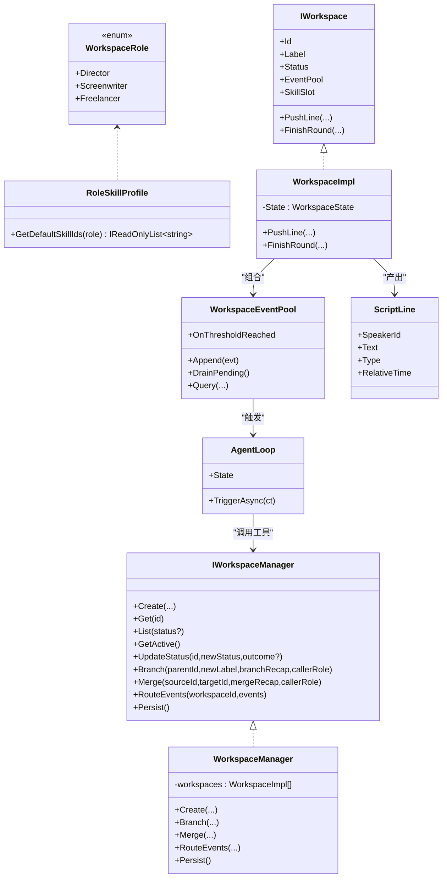
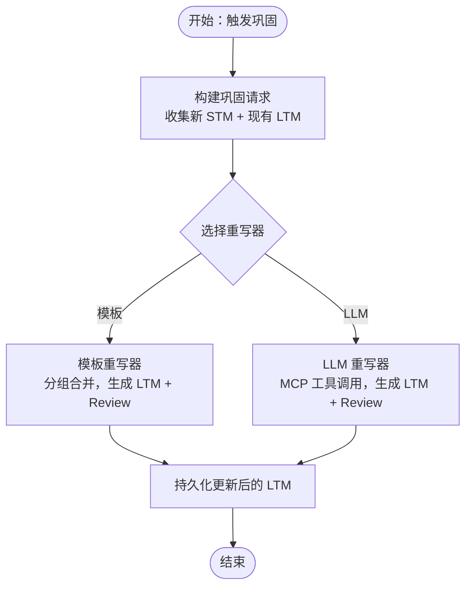
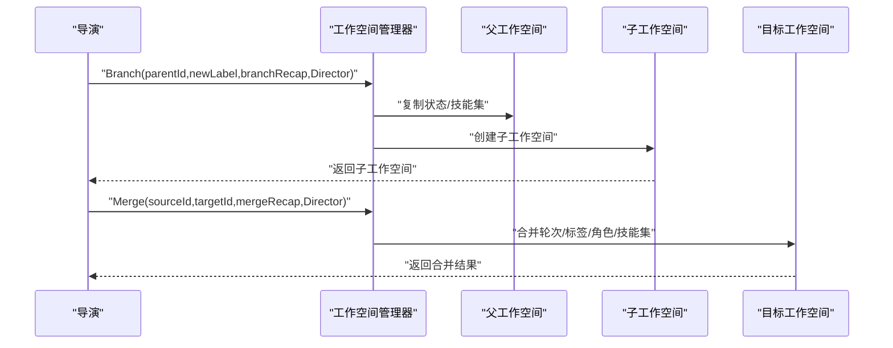
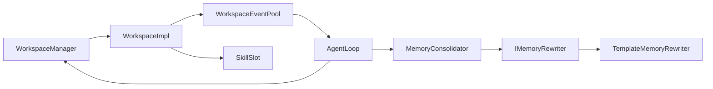

# 核心特性

<cite>
**本文引用的文件**
- [IWorkspaceManager.cs](file://ext/npclife/src/NPCLife/Core/IWorkspaceManager.cs)
- [WorkspaceManager.cs](file://ext/npclife/src/NPCLife/Workspace/WorkspaceManager.cs)
- [IWorkspace.cs](file://ext/npclife/src/NPCLife/Workspace/IWorkspace.cs)
- [WorkspaceImpl.cs](file://ext/npclife/src/NPCLife/Workspace/WorkspaceImpl.cs)
- [WorkspaceState.cs](file://ext/npclife/src/NPCLife/Workspace/WorkspaceState.cs)
- [SkillSlot.cs](file://ext/npclife/src/NPCLife/Workspace/SkillSlot.cs)
- [WorkspaceEventPool.cs](file://ext/npclife/src/NPCLife/Workspace/WorkspaceEventPool.cs)
- [RoleSkillProfile.cs](file://ext/npclife/src/NPCLife/Workspace/RoleSkillProfile.cs)
- [AgentLoop.cs](file://ext/npclife/src/NPCLife/Agent/AgentLoop.cs)
- [ScriptLine.cs](file://ext/npclife/src/NPCLife/Framework/Script/ScriptLine.cs)
- [MemoryConsolidator.cs](file://Source/Data/PawnPro/Memory/MemoryConsolidator.cs)
- [IMemoryRewriter.cs](file://Source/Data/PawnPro/Memory/IMemoryRewriter.cs)
- [TemplateMemoryRewriter.cs](file://Source/Data/PawnPro/Memory/TemplateMemoryRewriter.cs)
- [ShortTermMemory.cs](file://Source/Data/PawnPro/Memory/ShortTermMemory.cs)
- [LongTermMemory.cs](file://Source/Data/PawnPro/Memory/LongTermMemory.cs)
</cite>

## 目录
1. [简介](#简介)
2. [项目结构](#项目结构)
3. [核心组件](#核心组件)
4. [架构总览](#架构总览)
5. [详细组件分析](#详细组件分析)
6. [依赖分析](#依赖分析)
7. [性能考虑](#性能考虑)
8. [故障排查指南](#故障排查指南)
9. [结论](#结论)

## 简介
本文件面向 RimLife 项目的核心特性，围绕三大支柱展开：智能叙事生成系统（导演、编剧、自由职业者多代理协作）、角色记忆系统（短期到长期记忆的巩固机制）、工作空间管理系统（分支、合并、多线程故事发展）。文档解释每个特性的实现原理、技术架构与使用价值，并给出协同工作机制与典型使用场景，帮助读者理解如何通过这些特性为玩家提供沉浸式智能叙事体验。

## 项目结构
RimLife 的核心代码位于两个层面：
- 扩展模块 ext/npclife：提供“工作空间 + 多代理 + 记忆巩固”的上层叙事管线，包含工作空间管理、事件池、技能槽、Agent 循环、脚本行模型等。
- 游戏内整合 Source/Data/PawnPro/Memory：提供角色层面的记忆模型（短期/长期记忆）与巩固器，支撑 NPC 的个人记忆沉淀与再利用。

图表来源
- [WorkspaceManager.cs:1-622](file://ext/npclife/src/NPCLife/Workspace/WorkspaceManager.cs#L1-L622)
- [WorkspaceImpl.cs:1-199](file://ext/npclife/src/NPCLife/Workspace/WorkspaceImpl.cs#L1-L199)
- [WorkspaceEventPool.cs:1-186](file://ext/npclife/src/NPCLife/Workspace/WorkspaceEventPool.cs#L1-L186)
- [SkillSlot.cs:1-61](file://ext/npclife/src/NPCLife/Workspace/SkillSlot.cs#L1-L61)
- [AgentLoop.cs:1-680](file://ext/npclife/src/NPCLife/Agent/AgentLoop.cs#L1-L680)
- [ScriptLine.cs:1-43](file://ext/npclife/src/NPCLife/Framework/Script/ScriptLine.cs#L1-L43)
- [MemoryConsolidator.cs:1-61](file://Source/Data/PawnPro/Memory/MemoryConsolidator.cs#L1-L61)
- [IMemoryRewriter.cs:1-54](file://Source/Data/PawnPro/Memory/IMemoryRewriter.cs#L1-L54)
- [TemplateMemoryRewriter.cs:1-152](file://Source/Data/PawnPro/Memory/TemplateMemoryRewriter.cs#L1-L152)
- [ShortTermMemory.cs:1-48](file://Source/Data/PawnPro/Memory/ShortTermMemory.cs#L1-L48)
- [LongTermMemory.cs:1-53](file://Source/Data/PawnPro/Memory/LongTermMemory.cs#L1-L53)

章节来源
- [WorkspaceManager.cs:1-622](file://ext/npclife/src/NPCLife/Workspace/WorkspaceManager.cs#L1-L622)
- [WorkspaceImpl.cs:1-199](file://ext/npclife/src/NPCLife/Workspace/WorkspaceImpl.cs#L1-L199)
- [WorkspaceEventPool.cs:1-186](file://ext/npclife/src/NPCLife/Workspace/WorkspaceEventPool.cs#L1-L186)
- [AgentLoop.cs:1-680](file://ext/npclife/src/NPCLife/Agent/AgentLoop.cs#L1-L680)
- [MemoryConsolidator.cs:1-61](file://Source/Data/PawnPro/Memory/MemoryConsolidator.cs#L1-L61)

## 核心组件
- 工作空间管理器：负责工作空间的创建、查询、状态变更、分支/合并、事件路由与持久化。
- 工作空间实现：封装状态与组件（事件池、技能槽），提供叙事操作（推送台词、结束轮次）。
- 事件池：双缓冲（持久化 pending + 内存 recent），按阈值触发 Agent 激活。
- 技能槽：基于 MCP 技能注册表的激活/停用，动态注入工具集。
- 代理循环：被动触发的 LLM 工具调用循环，支持多轮工具调用与结果拼接。
- 记忆巩固器：两阶段（构建请求/异步重写），将短期记忆与长期记忆融合。
- 记忆重写器：模板降级与 LLM 重写两种实现，生成新的长期记忆与短期回顾。

章节来源
- [IWorkspaceManager.cs:1-58](file://ext/npclife/src/NPCLife/Core/IWorkspaceManager.cs#L1-L58)
- [WorkspaceManager.cs:1-622](file://ext/npclife/src/NPCLife/Workspace/WorkspaceManager.cs#L1-L622)
- [IWorkspace.cs:1-57](file://ext/npclife/src/NPCLife/Workspace/IWorkspace.cs#L1-L57)
- [WorkspaceImpl.cs:1-199](file://ext/npclife/src/NPCLife/Workspace/WorkspaceImpl.cs#L1-L199)
- [WorkspaceEventPool.cs:1-186](file://ext/npclife/src/NPCLife/Workspace/WorkspaceEventPool.cs#L1-L186)
- [SkillSlot.cs:1-61](file://ext/npclife/src/NPCLife/Workspace/SkillSlot.cs#L1-L61)
- [AgentLoop.cs:1-680](file://ext/npclife/src/NPCLife/Agent/AgentLoop.cs#L1-L680)
- [MemoryConsolidator.cs:1-61](file://Source/Data/PawnPro/Memory/MemoryConsolidator.cs#L1-L61)
- [IMemoryRewriter.cs:1-54](file://Source/Data/PawnPro/Memory/IMemoryRewriter.cs#L1-L54)
- [TemplateMemoryRewriter.cs:1-152](file://Source/Data/PawnPro/Memory/TemplateMemoryRewriter.cs#L1-L152)

## 架构总览
RimLife 的智能叙事以“工作空间”为基本单元，围绕事件驱动的 Agent 循环进行创作与执行。事件池作为触发器，当达到阈值时，AgentLoop 被动激活，构建提示词并调用 LLM，通过 MCP 工具执行具体动作（如创建/分支/合并工作空间、推送台词、结束轮次等）。同时，角色记忆系统在 NPC 层面持续巩固短期记忆为长期记忆，为叙事提供稳定的个人背景与情感线索。

图表来源
- [WorkspaceEventPool.cs:1-186](file://ext/npclife/src/NPCLife/Workspace/WorkspaceEventPool.cs#L1-L186)
- [AgentLoop.cs:1-680](file://ext/npclife/src/NPCLife/Agent/AgentLoop.cs#L1-L680)
- [WorkspaceManager.cs:1-622](file://ext/npclife/src/NPCLife/Workspace/WorkspaceManager.cs#L1-L622)
- [WorkspaceImpl.cs:1-199](file://ext/npclife/src/NPCLife/Workspace/WorkspaceImpl.cs#L1-L199)

## 详细组件分析

### 智能叙事生成系统（导演、编剧、自由职业者多代理协作）
- 角色与权限
  - 导演（Director）：拥有工作空间的结构管理权（创建、分支、合并、关闭），不直接参与叙事内容创作。
  - 编剧（Screenwriter）：负责叙事内容创作（推送台词、结束轮次），具备完整的角色/环境/关系/事件查询能力。
  - 自由职业者（Freelancer）：处理日常对话与突发独立事件，工具集最精简，无剧情上下文。
- 技能配置
  - 每个角色创建工作空间时会自动激活一组预设技能（MCP 工具集），由角色技能档案决定。
- Agent 循环
  - 事件池达到阈值后被动激活，构建用户消息（包含事件列表与知识检索结果），调用 LLM 并执行工具调用，最终产出脚本行或工作空间指令。
- 使用场景
  - 导演：在全局视角下创建主线/支线工作空间，必要时进行分支/合并，确保故事线清晰。
  - 编剧：在工作空间内推进剧情，通过推送台词与结束轮次形成连贯的叙事片段。
  - 自由职业者：对突发事件快速响应，产出简短对话或动作描述，维持世界活力。

图表来源
- [WorkspaceState.cs:9-20](file://ext/npclife/src/NPCLife/Workspace/WorkspaceState.cs#L9-L20)
- [RoleSkillProfile.cs:13-74](file://ext/npclife/src/NPCLife/Workspace/RoleSkillProfile.cs#L13-L74)
- [IWorkspaceManager.cs:14-56](file://ext/npclife/src/NPCLife/Core/IWorkspaceManager.cs#L14-L56)
- [WorkspaceManager.cs:19-622](file://ext/npclife/src/NPCLife/Workspace/WorkspaceManager.cs#L19-L622)
- [IWorkspace.cs:11-55](file://ext/npclife/src/NPCLife/Workspace/IWorkspace.cs#L11-L55)
- [WorkspaceImpl.cs:16-199](file://ext/npclife/src/NPCLife/Workspace/WorkspaceImpl.cs#L16-L199)
- [WorkspaceEventPool.cs:21-186](file://ext/npclife/src/NPCLife/Workspace/WorkspaceEventPool.cs#L21-L186)
- [AgentLoop.cs:43-680](file://ext/npclife/src/NPCLife/Agent/AgentLoop.cs#L43-L680)
- [ScriptLine.cs:25-43](file://ext/npclife/src/NPCLife/Framework/Script/ScriptLine.cs#L25-L43)

章节来源
- [WorkspaceState.cs:9-20](file://ext/npclife/src/NPCLife/Workspace/WorkspaceState.cs#L9-L20)
- [RoleSkillProfile.cs:13-74](file://ext/npclife/src/NPCLife/Workspace/RoleSkillProfile.cs#L13-L74)
- [IWorkspaceManager.cs:14-56](file://ext/npclife/src/NPCLife/Core/IWorkspaceManager.cs#L14-L56)
- [WorkspaceManager.cs:19-622](file://ext/npclife/src/NPCLife/Workspace/WorkspaceManager.cs#L19-L622)
- [IWorkspace.cs:11-55](file://ext/npclife/src/NPCLife/Workspace/IWorkspace.cs#L11-L55)
- [WorkspaceImpl.cs:16-199](file://ext/npclife/src/NPCLife/Workspace/WorkspaceImpl.cs#L16-L199)
- [WorkspaceEventPool.cs:21-186](file://ext/npclife/src/NPCLife/Workspace/WorkspaceEventPool.cs#L21-L186)
- [AgentLoop.cs:43-680](file://ext/npclife/src/NPCLife/Agent/AgentLoop.cs#L43-L680)
- [ScriptLine.cs:25-43](file://ext/npclife/src/NPCLife/Framework/Script/ScriptLine.cs#L25-L43)

### 角色记忆系统（短期到长期记忆的巩固机制）
- 数据模型
  - 短期记忆（ShortTermMemory）：记录 pawn 近期事件，带类型标签、摘要与关联角色，天然上限受时间窗口约束。
  - 长期记忆（LongTermMemory）：叙述性记忆，带主题标签、摘要与关联角色集合，用于稳定背景与情感线索。
- 巩固流程
  - 第一阶段（同步）：构建巩固请求，打包新 STM 与既有 LTM。
  - 第二阶段（异步）：调用记忆重写器（模板或 LLM），生成新的 LTM 列表与短期回顾。
- 重写器
  - 模板重写器：按事件类型与关联角色分组，合并旧叙述与新事件，生成稳定可读的长期记忆。
  - LLM 重写器：通过 MCP 工具调用 LLM，生成更丰富、上下文相关的长期记忆。
- 使用场景
  - NPC 互动后，短期记忆被巩固为长期记忆，形成稳定的“关系主题”或“战斗主题”，在后续事件中自然影响行为与对话。
  - 短期回顾帮助 NPC 在短时间内总结近期事件，为下一步行动提供依据。

图表来源
- [MemoryConsolidator.cs:12-61](file://Source/Data/PawnPro/Memory/MemoryConsolidator.cs#L12-L61)
- [IMemoryRewriter.cs:11-54](file://Source/Data/PawnPro/Memory/IMemoryRewriter.cs#L11-L54)
- [TemplateMemoryRewriter.cs:13-152](file://Source/Data/PawnPro/Memory/TemplateMemoryRewriter.cs#L13-L152)
- [ShortTermMemory.cs:9-48](file://Source/Data/PawnPro/Memory/ShortTermMemory.cs#L9-L48)
- [LongTermMemory.cs:10-53](file://Source/Data/PawnPro/Memory/LongTermMemory.cs#L10-L53)

章节来源
- [MemoryConsolidator.cs:12-61](file://Source/Data/PawnPro/Memory/MemoryConsolidator.cs#L12-L61)
- [IMemoryRewriter.cs:11-54](file://Source/Data/PawnPro/Memory/IMemoryRewriter.cs#L11-L54)
- [TemplateMemoryRewriter.cs:13-152](file://Source/Data/PawnPro/Memory/TemplateMemoryRewriter.cs#L13-L152)
- [ShortTermMemory.cs:9-48](file://Source/Data/PawnPro/Memory/ShortTermMemory.cs#L9-L48)
- [LongTermMemory.cs:10-53](file://Source/Data/PawnPro/Memory/LongTermMemory.cs#L10-L53)

### 工作空间管理系统（分支、合并、多线程故事发展）
- 功能概览
  - CRUD：创建、查询、列出、获取活动工作空间、更新状态。
  - 结构操作：从父工作空间分支出子工作空间，或将源工作空间合并到目标工作空间。
  - 事件路由：将游戏事件路由到指定工作空间的事件池，触发 Agent 激活。
  - 持久化：将内存中的所有工作空间状态保存到存储后端。
- 状态机与权限
  - 工作空间状态：活跃、挂起、完成、废弃。
  - 权限控制：只有导演可进行分支/合并/关闭；编剧/自由职业者可进行叙事操作。
- 多线程故事发展
  - 多个工作空间并行存在，各自承载不同剧情线，通过分支/合并实现交叉与整合。
  - 每个工作空间维护自己的轮次日志、事件缓存与技能集，确保创作独立性与可控性。

图表来源
- [IWorkspaceManager.cs:14-56](file://ext/npclife/src/NPCLife/Core/IWorkspaceManager.cs#L14-L56)
- [WorkspaceManager.cs:19-622](file://ext/npclife/src/NPCLife/Workspace/WorkspaceManager.cs#L19-L622)
- [WorkspaceState.cs:25-53](file://ext/npclife/src/NPCLife/Workspace/WorkspaceState.cs#L25-L53)

章节来源
- [IWorkspaceManager.cs:14-56](file://ext/npclife/src/NPCLife/Core/IWorkspaceManager.cs#L14-L56)
- [WorkspaceManager.cs:19-622](file://ext/npclife/src/NPCLife/Workspace/WorkspaceManager.cs#L19-L622)
- [WorkspaceState.cs:25-53](file://ext/npclife/src/NPCLife/Workspace/WorkspaceState.cs#L25-L53)

## 依赖分析
- 组件耦合
  - WorkspaceManager 与 WorkspaceImpl：管理器持有实现列表，实现封装状态与组件，二者松耦合。
  - WorkspaceImpl 与 WorkspaceEventPool/SkillSlot：组合关系，实现内部组件访问。
  - WorkspaceEventPool 与 AgentLoop：事件池通过 OnThresholdReached 主动触发 AgentLoop。
  - AgentLoop 与 IWorkspaceManager：通过 MCP 工具调用间接操作工作空间。
  - MemoryConsolidator 与 IMemoryRewriter：通过接口解耦模板与 LLM 两种重写策略。
- 外部依赖
  - MCP 技能注册表：动态注入工具集，支持不同角色的差异化能力。
  - 存储后端：通过 IAuthorityStore 持久化工作空间与事件池状态。
  - LLM 服务：通过 ILlmService 提供异步对话能力，支持工具调用与结果拼接。

图表来源
- [WorkspaceManager.cs:19-622](file://ext/npclife/src/NPCLife/Workspace/WorkspaceManager.cs#L19-L622)
- [WorkspaceImpl.cs:16-199](file://ext/npclife/src/NPCLife/Workspace/WorkspaceImpl.cs#L16-L199)
- [WorkspaceEventPool.cs:21-186](file://ext/npclife/src/NPCLife/Workspace/WorkspaceEventPool.cs#L21-L186)
- [AgentLoop.cs:43-680](file://ext/npclife/src/NPCLife/Agent/AgentLoop.cs#L43-L680)
- [MemoryConsolidator.cs:12-61](file://Source/Data/PawnPro/Memory/MemoryConsolidator.cs#L12-L61)
- [IMemoryRewriter.cs:11-54](file://Source/Data/PawnPro/Memory/IMemoryRewriter.cs#L11-L54)
- [TemplateMemoryRewriter.cs:13-152](file://Source/Data/PawnPro/Memory/TemplateMemoryRewriter.cs#L13-L152)

章节来源
- [WorkspaceManager.cs:19-622](file://ext/npclife/src/NPCLife/Workspace/WorkspaceManager.cs#L19-L622)
- [WorkspaceImpl.cs:16-199](file://ext/npclife/src/NPCLife/Workspace/WorkspaceImpl.cs#L16-L199)
- [WorkspaceEventPool.cs:21-186](file://ext/npclife/src/NPCLife/Workspace/WorkspaceEventPool.cs#L21-L186)
- [AgentLoop.cs:43-680](file://ext/npclife/src/NPCLife/Agent/AgentLoop.cs#L43-L680)
- [MemoryConsolidator.cs:12-61](file://Source/Data/PawnPro/Memory/MemoryConsolidator.cs#L12-L61)
- [IMemoryRewriter.cs:11-54](file://Source/Data/PawnPro/Memory/IMemoryRewriter.cs#L11-L54)
- [TemplateMemoryRewriter.cs:13-152](file://Source/Data/PawnPro/Memory/TemplateMemoryRewriter.cs#L13-L152)

## 性能考虑
- 事件池阈值控制：通过有效计数与重要度阈值平衡吞吐与延迟，避免频繁激活导致的开销。
- 双缓冲设计：持久化 pending 与内存 recent 分离，减少序列化压力并提升查询效率。
- 工具调用上限：限制最大轮次防止死循环，保障系统稳定性。
- 记忆巩固降级：在无 LLM 时使用模板重写器，保证基本功能可用且资源占用较低。
- 并发安全：工作空间管理器使用读写锁保护共享状态，降低竞争开销。

## 故障排查指南
- 事件未触发 Agent 激活
  - 检查事件池阈值设置与事件重要度累计是否达标。
  - 确认事件池是否正确订阅 OnThresholdReached 事件。
- 工具调用失败
  - 查看工具调用前/后拦截器是否取消了调用。
  - 检查凭证解析与模型引用配置是否正确。
- 工作空间状态异常
  - 确认状态转换是否符合允许的迁移规则（Active/Suspended/Completed/Abandoned）。
  - 检查分支/合并权限是否仅由导演执行。
- 记忆巩固未生效
  - 确认短期记忆是否正确提交至巩固器请求。
  - 检查重写器实现是否切换为模板或 LLM，并验证输入参数。

章节来源
- [WorkspaceEventPool.cs:81-90](file://ext/npclife/src/NPCLife/Workspace/WorkspaceEventPool.cs#L81-L90)
- [AgentLoop.cs:214-340](file://ext/npclife/src/NPCLife/Agent/AgentLoop.cs#L214-L340)
- [WorkspaceManager.cs:406-423](file://ext/npclife/src/NPCLife/Workspace/WorkspaceManager.cs#L406-L423)
- [MemoryConsolidator.cs:55-58](file://Source/Data/PawnPro/Memory/MemoryConsolidator.cs#L55-L58)

## 结论
RimLife 的三大核心特性共同构成了一个可扩展、可协作、可持续演进的智能叙事平台。工作空间管理提供结构化的多线程故事发展骨架；智能叙事生成系统通过多代理协作实现高效的内容创作；角色记忆系统则为 NPC 提供稳定而丰富的内在世界。三者协同，使玩家能够在 RimWorld 中体验到更具沉浸感与连贯性的智能叙事旅程。