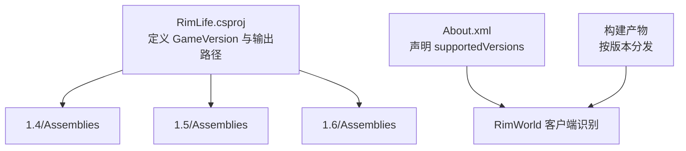
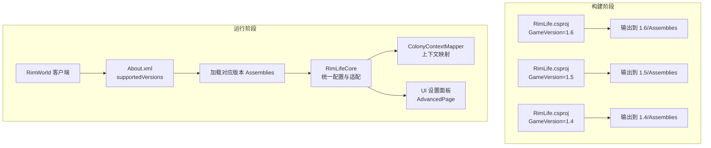
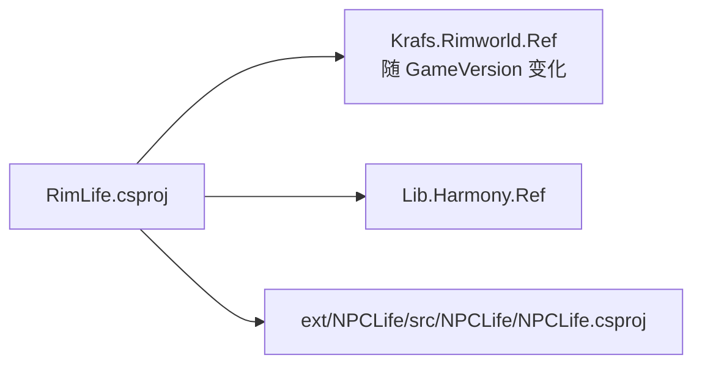

# 版本兼容性

<cite>
**本文引用的文件**
- [About.xml](file://About/About.xml)
- [RimLife.csproj](file://RimLife.csproj)
- [RimLifeCore.cs](file://Source/Infrastructure/RimLifeCore.cs)
- [ColonyContextMapper.cs](file://Source/Mappers/ColonyContextMapper.cs)
- [RimLifeMod.cs](file://Source/Settings/RimLifeMod.cs)
- [AdvancedPage.cs](file://Source/UI/Pages/AdvancedPage.cs)
- [RimLifeSelfTest.cs](file://Source/Tool/RimLifeSelfTest.cs)
- [1.6/Assemblies](file://1.6/Assemblies)
</cite>

## 目录
1. [简介](#简介)
2. [项目结构](#项目结构)
3. [核心组件](#核心组件)
4. [架构总览](#架构总览)
5. [详细组件分析](#详细组件分析)
6. [依赖分析](#依赖分析)
7. [性能考虑](#性能考虑)
8. [故障排查指南](#故障排查指南)
9. [结论](#结论)
10. [附录](#附录)

## 简介
本文件面向 RimLife 项目的使用者与维护者，系统阐述版本兼容性策略与实现机制，明确支持的 RimWorld 版本（1.4、1.5、1.6），说明多版本支持的构建与部署方式，解释版本选择建议、升级注意事项，以及项目如何处理版本间 API 变化与兼容性问题。目标是帮助用户基于自身 RimWorld 版本做出正确选择，避免因版本不兼容引发的功能异常或运行失败。

## 项目结构
RimLife 采用“按版本目录输出”的多版本打包策略：在构建时根据 GameVersion 参数将最终程序集输出至对应版本号的 Assemblies 目录（例如 1.6/Assemblies）。该策略确保同一份源码可在不同 RimWorld 版本上编译并独立部署，同时通过 Mod 元数据声明支持范围，使游戏客户端能够识别并加载。

图表来源
- [RimLife.csproj:14](file://RimLife.csproj#L14)
- [About/About.xml:5-8](file://About/About.xml#L5-L8)

章节来源
- [RimLife.csproj:1-120](file://RimLife.csproj#L1-L120)
- [About/About.xml:1-13](file://About/About.xml#L1-L13)

## 核心组件
- 构建与版本常量注入
  - 通过 MSBuild 属性组在构建时注入 GameVersion，并生成 V1_4/V1_5/V1_6 等编译常量，便于在代码中进行条件编译与版本分支控制。
- 输出路径与部署
  - 输出路径由 GameVersion 动态决定，构建后将 Assemblies 复制到对应版本目录；部署脚本会将该目录连同 About/Defs/Languages/Textures 等资源一并复制到 RimWorld Mods 目录。
- Mod 元数据声明
  - About.xml 中的 supportedVersions 列表明确声明支持 1.4、1.5、1.6，供游戏客户端识别与加载。

章节来源
- [RimLife.csproj:3-23](file://RimLife.csproj#L3-L23)
- [RimLife.csproj:77-112](file://RimLife.csproj#L77-L112)
- [About/About.xml:5-8](file://About/About.xml#L5-L8)

## 架构总览
下图展示 RimLife 在多版本环境中的整体架构：构建系统依据 GameVersion 生成不同版本的程序集；运行时，RimWorld 客户端根据 About.xml 的 supportedVersions 选择加载对应版本的 Assemblies；核心框架通过统一的适配层与配置入口对外提供能力。

图表来源
- [RimLife.csproj:4](file://RimLife.csproj#L4)
- [RimLife.csproj:14](file://RimLife.csproj#L14)
- [About/About.xml:5-8](file://About/About.xml#L5-L8)
- [RimLifeCore.cs:24-142](file://Source/Infrastructure/RimLifeCore.cs#L24-L142)
- [ColonyContextMapper.cs:18-47](file://Source/Mappers/ColonyContextMapper.cs#L18-L47)
- [AdvancedPage.cs:188-200](file://Source/UI/Pages/AdvancedPage.cs#L188-L200)

## 详细组件分析

### 版本声明与支持范围
- Mod 元数据
  - About.xml 的 supportedVersions 明确列出 1.4、1.5、1.6，表示该版本的发布包在上述三个主版本上均可被识别与加载。
- 构建常量
  - 通过 DefineConstants 注入 V1_4/V1_5/V1_6 编译常量，便于在代码中进行条件编译与版本分支逻辑。

章节来源
- [About/About.xml:5-8](file://About/About.xml#L5-L8)
- [RimLife.csproj:20-23](file://RimLife.csproj#L20-L23)

### 构建与输出机制
- GameVersion 默认值与输出路径
  - 默认 GameVersion=1.6，输出路径为 $(GameVersion)/Assemblies，即 1.6/Assemblies。
- 条件编译常量
  - 将 GameVersion 中的点号替换为下划线，生成 V1_6 等常量，用于在源码中进行版本分支判断。
- 部署脚本
  - Win/macOS 部署目标会将 About、Defs、Languages、Textures 与 $(GameVersion) 目录整体复制到 Mods/RimLife 下，确保对应版本的程序集与资源完整。

章节来源
- [RimLife.csproj:4](file://RimLife.csproj#L4)
- [RimLife.csproj:14](file://RimLife.csproj#L14)
- [RimLife.csproj:21-23](file://RimLife.csproj#L21-L23)
- [RimLife.csproj:77-112](file://RimLife.csproj#L77-L112)

### 运行时配置与适配层
- 统一配置入口
  - 通过 RimLifeCore.Configure 应用并冻结配置，同步到驱动、诊断等子系统，并发布配置就绪事件。
- 适配器注入
  - InitializeAdapter 支持注入日志与时间提供者，作为框架与游戏侧的适配层，保证在不同版本下行为一致。
- UI 设置面板
  - AdvancedPage 从配置中读取功能开关与诊断选项，初始化界面状态，确保不同版本下 UI 行为一致。

章节来源
- [RimLifeCore.cs:83-142](file://Source/Infrastructure/RimLifeCore.cs#L83-L142)
- [RimLifeCore.cs:75-81](file://Source/Infrastructure/RimLifeCore.cs#L75-L81)
- [AdvancedPage.cs:188-200](file://Source/UI/Pages/AdvancedPage.cs#L188-L200)

### 上下文映射与版本无关性
- ColonyContextMapper
  - 通过统一的映射流程（时间、殖民者、派系关系、地图统计、难度、科技、开始时间等）生成 ColonyContext，内部对异常进行捕获与告警，避免因 API 变化导致崩溃。
- 事件日志集成测试
  - 自检工具包含对事件日志 Append 的集成测试，验证工作空间与事件池在不同版本下的可用性。

章节来源
- [ColonyContextMapper.cs:18-47](file://Source/Mappers/ColonyContextMapper.cs#L18-L47)
- [ColonyContextMapper.cs:101-104](file://Source/Mappers/ColonyContextMapper.cs#L101-L104)
- [RimLifeSelfTest.cs:312-342](file://Source/Tool/RimLifeSelfTest.cs#L312-L342)

### 版本选择建议与升级注意事项
- 推荐选择
  - 若已有 RimWorld 1.6 存档或希望获得最新功能与稳定性，优先选择 1.6。
  - 若使用 1.5 存档且尚未迁移，可选择 1.5；若使用 1.4 存档，建议先升级至 1.5 或 1.6。
- 升级注意事项
  - 升级 RimWorld 主版本后，应重新构建并部署对应版本的 Assemblies。
  - 如启用或调整功能开关（如记忆整合、指标采集、知识库等），请在 UI 设置面板确认并保存配置。
  - 若遇到异常，查看日志并参考自检工具的测试步骤定位问题。

章节来源
- [AdvancedPage.cs:188-200](file://Source/UI/Pages/AdvancedPage.cs#L188-L200)
- [RimLifeSelfTest.cs:312-342](file://Source/Tool/RimLifeSelfTest.cs#L312-L342)

## 依赖分析
- 外部依赖
  - 通过 PackageReference 引入 RimWorld 反射库与 Harmony 反射库，版本范围由 GameVersion 控制，确保与目标 RimWorld 版本匹配。
- 内部依赖
  - 项目引用 ext/NPCLife 子模块，作为通用框架层，RimLife 在其之上提供适配与业务逻辑。

图表来源
- [RimLife.csproj:54-57](file://RimLife.csproj#L54-L57)

章节来源
- [RimLife.csproj:54-57](file://RimLife.csproj#L54-L57)

## 性能考虑
- 日志与诊断
  - 通过 Configure 启用/关闭详细日志与事件追踪，有助于在不同版本下评估性能与定位瓶颈。
- UI 主线程调度
  - 设置面板在渲染时主动 Drain 主线程队列，确保异步回调及时执行，减少 UI 卡顿。
- 上下文映射健壮性
  - 对时间、研究进度等易受版本影响的 API 调用进行异常捕获与降级处理，避免崩溃影响整体体验。

章节来源
- [RimLifeCore.cs:135](file://Source/Infrastructure/RimLifeCore.cs#L135)
- [RimLifeMod.cs:59-66](file://Source/Settings/RimLifeMod.cs#L59-L66)
- [ColonyContextMapper.cs:101-104](file://Source/Mappers/ColonyContextMapper.cs#L101-L104)

## 故障排查指南
- 常见问题
  - 加载失败：确认 About.xml 的 supportedVersions 与实际输出的 Assemblies 版本一致。
  - 功能不可用：检查 UI 设置面板中的功能开关是否开启，必要时重新应用默认配置。
  - 运行异常：查看日志，关注时间映射、研究进度缓存等关键路径的警告信息。
- 自检步骤
  - 使用自检工具对事件日志 Append 进行测试，验证工作空间与事件池可用性。
  - 在不同版本下重复上述测试，对比行为差异。

章节来源
- [About/About.xml:5-8](file://About/About.xml#L5-L8)
- [AdvancedPage.cs:188-200](file://Source/UI/Pages/AdvancedPage.cs#L188-L200)
- [RimLifeSelfTest.cs:312-342](file://Source/Tool/RimLifeSelfTest.cs#L312-L342)

## 结论
RimLife 通过“按版本输出 + Mod 元数据声明 + 统一适配层”的方案实现了对 1.4/1.5/1.6 的稳定兼容。构建时以 GameVersion 为驱动，运行时以 About.xml 为准绳，配合健壮的异常处理与自检工具，能够在不同版本间保持一致的功能体验。建议用户根据自身 RimWorld 版本选择对应 Assemblies，并在升级后重新部署与验证。

## 附录
- 快速对照
  - 支持版本：1.4、1.5、1.6
  - 默认构建版本：1.6
  - 输出目录：$(GameVersion)/Assemblies
  - 部署对象：About、Defs、Languages、Textures 与 Assemblies
- 相关文件索引
  - [About.xml](file://About/About.xml)
  - [RimLife.csproj](file://RimLife.csproj)
  - [RimLifeCore.cs](file://Source/Infrastructure/RimLifeCore.cs)
  - [ColonyContextMapper.cs](file://Source/Mappers/ColonyContextMapper.cs)
  - [RimLifeMod.cs](file://Source/Settings/RimLifeMod.cs)
  - [AdvancedPage.cs](file://Source/UI/Pages/AdvancedPage.cs)
  - [RimLifeSelfTest.cs](file://Source/Tool/RimLifeSelfTest.cs)
  - [1.6/Assemblies](file://1.6/Assemblies)