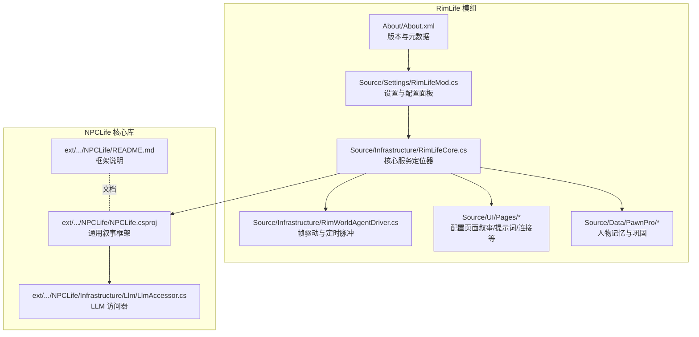
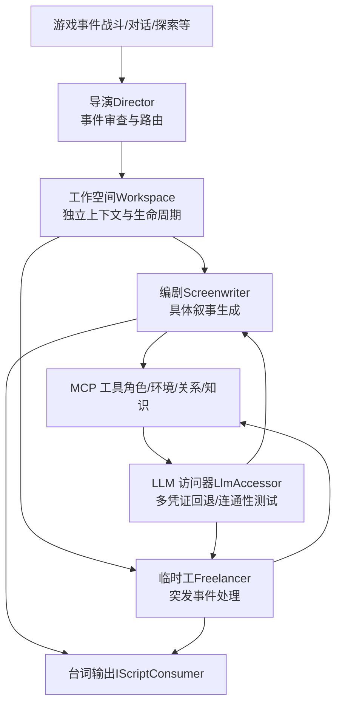
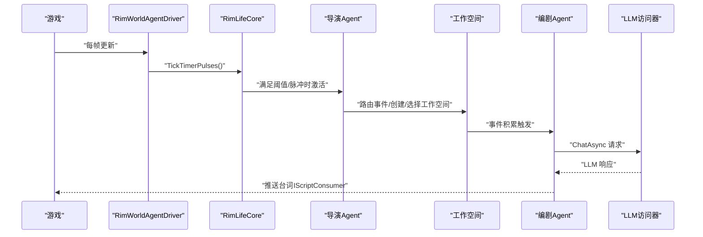
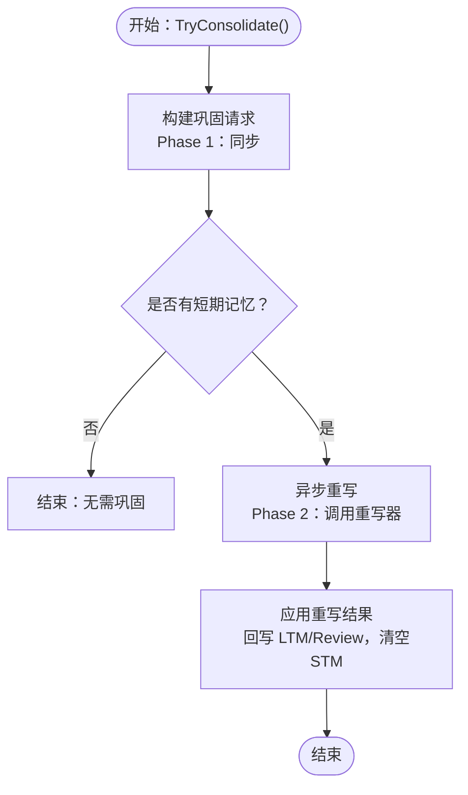
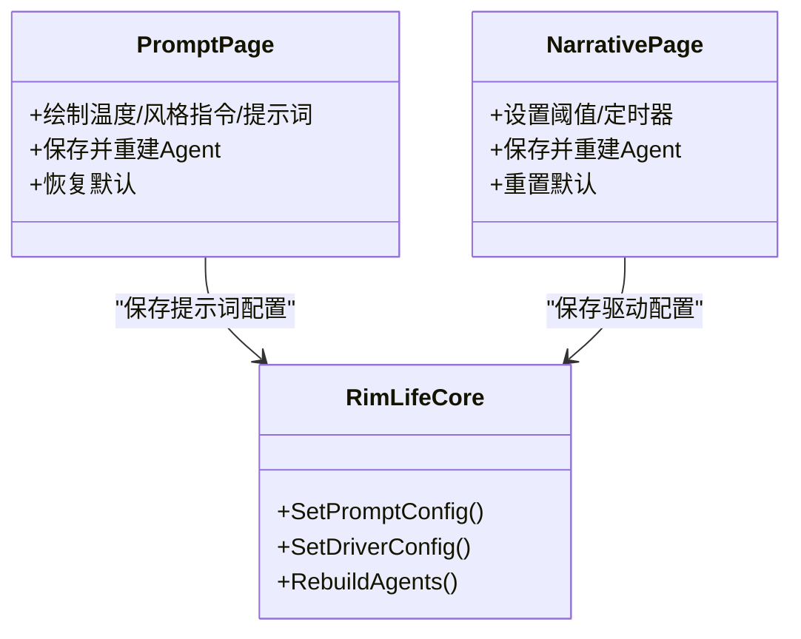
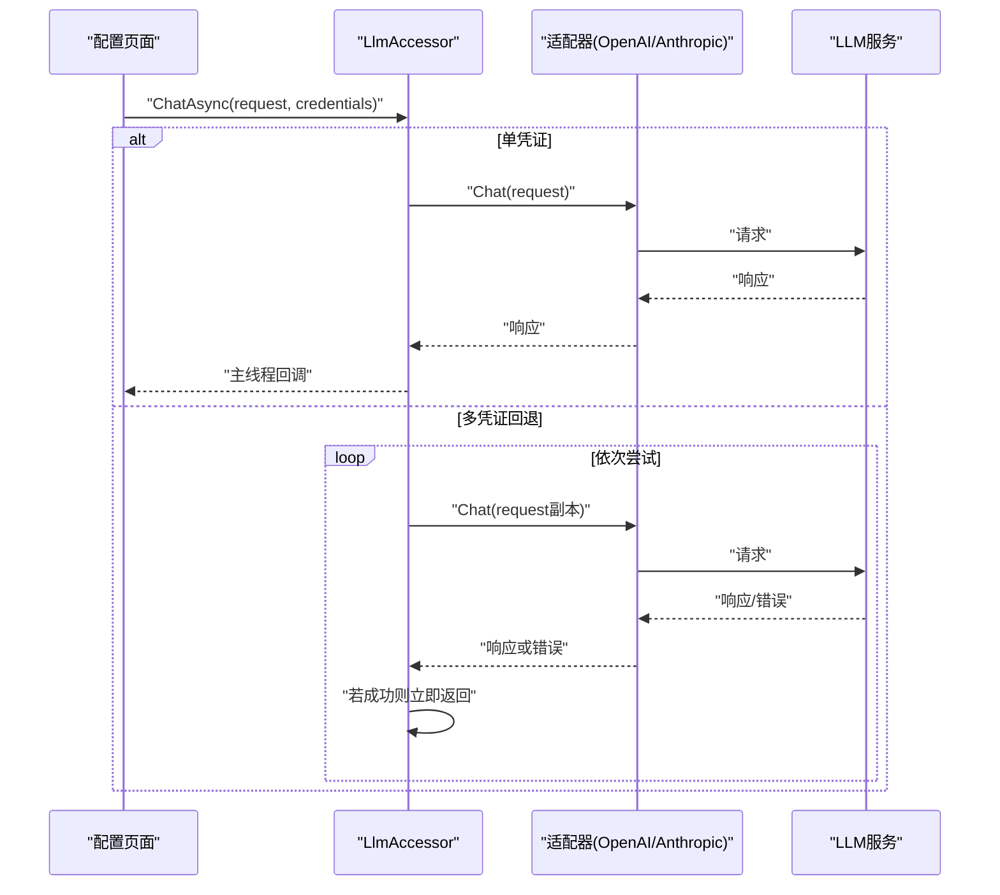
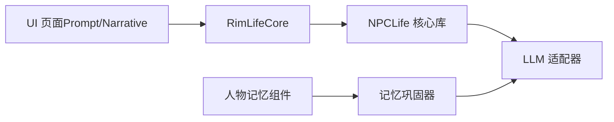

# 项目介绍

<cite>
**本文引用的文件**   
- [About.xml](file://About/About.xml)
- [RimLife.csproj](file://RimLife.csproj)
- [NPCLife.csproj](file://ext/NPCLife/src/NPCLife/NPCLife.csproj)
- [README.md](file://ext/NPCLife/README.md)
- [RimLifeMod.cs](file://Source/Settings/RimLifeMod.cs)
- [RimLifeCore.cs](file://Source/Infrastructure/RimLifeCore.cs)
- [RimWorldAgentDriver.cs](file://Source/Infrastructure/RimWorldAgentDriver.cs)
- [NarrativePage.cs](file://Source/UI/Pages/NarrativePage.cs)
- [PromptPage.cs](file://Source/UI/Pages/PromptPage.cs)
- [LlmAccessor.cs](file://ext/npclife/src/NPCLife/Infrastructure/Llm/LlmAccessor.cs)
- [LongTermMemory.cs](file://Source/Data/PawnPro/Memory/LongTermMemory.cs)
- [MemoryConsolidator.cs](file://Source/Data/PawnPro/Memory/MemoryConsolidator.cs)
- [HediffComp_PawnMemory.cs](file://Source/Data/PawnPro/Memory/HediffComp_PawnMemory.cs)
</cite>

## 目录
1. [引言](#引言)
2. [项目结构](#项目结构)
3. [核心组件](#核心组件)
4. [架构总览](#架构总览)
5. [详细组件分析](#详细组件分析)
6. [依赖关系分析](#依赖关系分析)
7. [性能考量](#性能考量)
8. [故障排查指南](#故障排查指南)
9. [结论](#结论)
10. [附录](#附录)

## 引言
RimLife 是一个为 RimWorld 提供 LLM 驱动智能叙事体验的模组，它从 RimTalk 分离而来，专注于打造“多代理协作 + 智能记忆管理”的动态叙事系统。其核心价值在于：
- 将游戏事件转化为可驱动的叙事线索，通过导演、编剧、临时工三类 AI 角色协同，持续生成 NPC 台词与剧情推进。
- 以工作空间（Workspace）为单位进行上下文隔离与分支/合并管理，保证多条故事线并行而不互相干扰。
- 提供可调的提示词与驱动参数，允许玩家与模组使用者按需定制叙事风格与触发节奏。

RimLife 的设计理念强调“事件驱动 + 阈值触发 + 异步协作”，既降低 LLM 调用成本，又保持叙事的连贯性与创造性。与传统 RimWorld 模组相比，RimLife 的优势体现在：
- 更强的系统化叙事管线：导演负责事件路由、编剧负责具体创作、临时工处理突发事件，形成稳定的异步消息流。
- 更完善的上下文管理：工作空间内独立的事件池、对话历史与角色集合，避免上下文污染。
- 更灵活的记忆与提示词体系：支持长期记忆巩固、风格指令叠加与温度调节，便于微调叙事风格。

## 项目结构
RimLife 采用 RimWorld 模组标准结构，并包含一个独立的 NPCLife 核心库（ext/.../NPCLife），用于承载通用的 LLM 驱动叙事框架。主要目录与职责如下：
- About：模组元数据与版本信息
- Source：RimLife 的 C# 源码，包含 UI、配置、基础设施、数据模型与工作空间集成
- ext/.../NPCLife：通用叙事框架库，提供多代理、MCP 工具协议、工作空间管理与 LLM 适配
- Prompts：预置提示词模板
- Languages：本地化词条（简体中文）

**图表来源**
- [About.xml:1-13](file://About/About.xml#L1-L13)
- [RimLifeMod.cs:1-69](file://Source/Settings/RimLifeMod.cs#L1-L69)
- [RimLifeCore.cs:1-1095](file://Source/Infrastructure/RimLifeCore.cs#L1-L1095)
- [RimWorldAgentDriver.cs:1-25](file://Source/Infrastructure/RimWorldAgentDriver.cs#L1-L25)
- [LlmAccessor.cs:1-331](file://ext/npclife/src/NPCLife/Infrastructure/Llm/LlmAccessor.cs#L1-L331)
- [README.md:1-93](file://ext/npclife/README.md#L1-L93)

**章节来源**
- [About.xml:1-13](file://About/About.xml#L1-L13)
- [RimLife.csproj](file://RimLife.csproj)
- [NPCLife.csproj:1-38](file://ext/npclife/src/NPCLife/NPCLife.csproj#L1-L38)
- [README.md:1-93](file://ext/npclife/README.md#L1-L93)

## 核心组件
- 设置与配置面板：提供“叙事”“提示词”“连接”“调试”等页面，支持实时调整阈值、定时器、提示词与采样参数，并即时生效。
- 核心服务定位器（RimLifeCore）：集中管理日志、提示词配置、驱动配置、工作空间、知识库、LLM 访问器与 Agent 生命周期，提供幂等初始化与状态报告。
- 帧驱动与定时脉冲：通过 RimWorldAgentDriver 每帧清空主线程回调队列并驱动导演/临时工的定时脉冲，保障异步任务与 UI 线程安全。
- LLM 访问器：支持多凭证回退、连通性测试与模型列表查询，适配 OpenAI 与 Anthropic 等提供商。
- 人物记忆与巩固：短期记忆到长期记忆的两阶段巩固流程，支持模板重写与 LLM 重写器替换。

**章节来源**
- [RimLifeMod.cs:1-69](file://Source/Settings/RimLifeMod.cs#L1-L69)
- [RimLifeCore.cs:1-1095](file://Source/Infrastructure/RimLifeCore.cs#L1-L1095)
- [RimWorldAgentDriver.cs:1-25](file://Source/Infrastructure/RimWorldAgentDriver.cs#L1-L25)
- [LlmAccessor.cs:1-331](file://ext/npclife/src/NPCLife/Infrastructure/Llm/LlmAccessor.cs#L1-L331)
- [LongTermMemory.cs:1-53](file://Source/Data/PawnPro/Memory/LongTermMemory.cs#L1-L53)
- [MemoryConsolidator.cs:1-61](file://Source/Data/PawnPro/Memory/MemoryConsolidator.cs#L1-L61)

## 架构总览
RimLife 的整体架构围绕“事件 → 导演审查 → 工作空间路由 → 编剧生成 → 台词输出”的闭环展开。NPCLife 作为通用叙事框架，提供多代理、MCP 工具协议与工作空间管理；RimLife 在其之上完成 RimWorld 的适配与 UI 集成。

**图表来源**
- [RimLifeCore.cs:1-1095](file://Source/Infrastructure/RimLifeCore.cs#L1-L1095)
- [LlmAccessor.cs:1-331](file://ext/npclife/src/NPCLife/Infrastructure/Llm/LlmAccessor.cs#L1-L331)
- [README.md:1-93](file://ext/npclife/README.md#L1-L93)

## 详细组件分析

### 多代理协作系统
- 导演（Director）：负责审查事件池，决定哪些事件值得发展为剧情线，并将事件路由到对应工作空间；同时汇总工作空间状态，指导后续策略。
- 编剧（Screenwriter）：为分配到的工作空间生成具体的 NPC 台词与叙事，支持动态上下文注入（如工作空间 ID、关联角色、格式规范）。
- 临时工（Freelancer）：处理一次性或临时性事件，适合快速反应型剧情推进。
- 定时脉冲：通过全局时钟脉冲驱动导演与临时工的周期性轮询，避免每帧调用 LLM。

**图表来源**
- [RimWorldAgentDriver.cs:1-25](file://Source/Infrastructure/RimWorldAgentDriver.cs#L1-L25)
- [RimLifeCore.cs:488-527](file://Source/Infrastructure/RimLifeCore.cs#L488-L527)
- [LlmAccessor.cs:42-191](file://ext/npclife/src/NPCLife/Infrastructure/Llm/LlmAccessor.cs#L42-L191)

**章节来源**
- [RimLifeCore.cs:545-733](file://Source/Infrastructure/RimLifeCore.cs#L545-L733)
- [NarrativePage.cs:1-221](file://Source/UI/Pages/NarrativePage.cs#L1-L221)

### 智能记忆管理系统
- 短期记忆到长期记忆的两阶段巩固：先构建巩固请求（打包新事件与既有长期记忆），再异步调用重写器生成新的长期记忆摘要。
- 记忆条目包含主题标签、相关角色与摘要文本，支持按主题检索与过滤。
- 巩固过程在主线程调度器中回写，确保 UI 与存档一致性。

**图表来源**
- [MemoryConsolidator.cs:1-61](file://Source/Data/PawnPro/Memory/MemoryConsolidator.cs#L1-L61)
- [HediffComp_PawnMemory.cs:240-301](file://Source/Data/PawnPro/Memory/HediffComp_PawnMemory.cs#L240-L301)
- [LongTermMemory.cs:1-53](file://Source/Data/PawnPro/Memory/LongTermMemory.cs#L1-L53)

**章节来源**
- [MemoryConsolidator.cs:1-61](file://Source/Data/PawnPro/Memory/MemoryConsolidator.cs#L1-L61)
- [HediffComp_PawnMemory.cs:240-301](file://Source/Data/PawnPro/Memory/HediffComp_PawnMemory.cs#L240-L301)
- [LongTermMemory.cs:1-53](file://Source/Data/PawnPro/Memory/LongTermMemory.cs#L1-L53)

### 提示词与驱动参数配置
- 提示词页面：支持导演、编剧、临时工三类提示词的全文编辑，以及全局风格指令与采样温度调节；修改后可即时保存并重建 Agent 生效。
- 叙事页面：针对三类 Agent 的事件数阈值、重要度阈值与定时器间隔进行精细控制，支持重置默认值与即时应用。

**图表来源**
- [PromptPage.cs:1-288](file://Source/UI/Pages/PromptPage.cs#L1-L288)
- [NarrativePage.cs:1-221](file://Source/UI/Pages/NarrativePage.cs#L1-L221)
- [RimLifeCore.cs:106-142](file://Source/Infrastructure/RimLifeCore.cs#L106-L142)

**章节来源**
- [PromptPage.cs:1-288](file://Source/UI/Pages/PromptPage.cs#L1-L288)
- [NarrativePage.cs:1-221](file://Source/UI/Pages/NarrativePage.cs#L1-L221)
- [RimLifeCore.cs:83-142](file://Source/Infrastructure/RimLifeCore.cs#L83-L142)

### LLM 适配与连接性
- LLM 访问器支持多凭证回退、连通性测试与模型列表查询，按凭证顺序尝试，失败自动切换下一个，提升稳定性。
- 适配器按凭证提供商类型动态创建（OpenAI/Anthropic），每次调用创建新实例，避免状态耦合。

**图表来源**
- [LlmAccessor.cs:42-191](file://ext/npclife/src/NPCLife/Infrastructure/Llm/LlmAccessor.cs#L42-L191)

**章节来源**
- [LlmAccessor.cs:1-331](file://ext/npclife/src/NPCLife/Infrastructure/Llm/LlmAccessor.cs#L1-L331)

## 依赖关系分析
- 模组与框架：RimLife 通过 RimLifeCore 聚合 NPCLife 的多代理、工作空间与 LLM 适配能力，并注入 RimWorld 的存储、日志与时间提供者。
- UI 与核心：配置页面通过 RimLifeCore 的配置接口写入缓存并触发 Agent 重建，确保参数变更即时生效。
- 记忆模块：人物记忆组件依赖 MemoryConsolidator 完成短期到长期的巩固流程，并通过主线程调度器回写结果。

**图表来源**
- [RimLifeCore.cs:1-1095](file://Source/Infrastructure/RimLifeCore.cs#L1-L1095)
- [LlmAccessor.cs:1-331](file://ext/npclife/src/NPCLife/Infrastructure/Llm/LlmAccessor.cs#L1-L331)
- [MemoryConsolidator.cs:1-61](file://Source/Data/PawnPro/Memory/MemoryConsolidator.cs#L1-L61)

**章节来源**
- [RimLifeCore.cs:1-1095](file://Source/Infrastructure/RimLifeCore.cs#L1-L1095)
- [NPCLife.csproj:1-38](file://ext/npclife/src/NPCLife/NPCLife.csproj#L1-L38)

## 性能考量
- 事件阈值与定时脉冲：通过“事件数阈值 + 重要度阈值 + 定时器间隔”控制 LLM 调用频率，避免高频调用带来的延迟与成本。
- 异步与回退：LLM 调用采用异步回调模式，配合多凭证回退，减少 UI 阻塞与失败重试开销。
- 记忆巩固：短期记忆到长期记忆的异步重写在后台线程执行，主线程仅做回写与状态更新，降低主线程压力。
- 运行时度量：可选启用运行时度量系统，统计会话数、Token 消耗与工具调用次数，辅助优化与成本控制。

[本节为通用性能建议，不直接分析特定文件]

## 故障排查指南
- LLM 连接失败：使用“连接”页面的连通性测试功能，确认凭证与模型名称正确；若多凭证，观察回退日志以定位问题凭证。
- Agent 不生效：检查“叙事”页面的阈值与定时器设置，确认已保存并重建 Agent；查看核心状态报告（如 LLM、Workspace、KnowledgeBase）。
- 台词不输出：确认已注入 IScriptConsumer 实现并由 RimLifeCore 注入；检查事件是否达到阈值并进入工作空间。
- 记忆不巩固：确认短期记忆是否积累足够，查看 MemoryConsolidator 的请求构建与重写结果回写日志。

**章节来源**
- [PromptPage.cs:1-288](file://Source/UI/Pages/PromptPage.cs#L1-L288)
- [NarrativePage.cs:1-221](file://Source/UI/Pages/NarrativePage.cs#L1-L221)
- [RimLifeCore.cs:311-333](file://Source/Infrastructure/RimLifeCore.cs#L311-L333)
- [LlmAccessor.cs:194-240](file://ext/npclife/src/NPCLife/Infrastructure/Llm/LlmAccessor.cs#L194-L240)
- [HediffComp_PawnMemory.cs:240-301](file://Source/Data/PawnPro/Memory/HediffComp_PawnMemory.cs#L240-L301)

## 结论
RimLife 将 NPCLife 的通用叙事框架深度适配到 RimWorld，提供了事件驱动、阈值触发与多代理协作的智能叙事方案。其核心创新点包括：
- 以工作空间为中心的上下文隔离与分支/合并机制
- 导演/编剧/临时工三角色的异步消息协作
- 可调的提示词与驱动参数，支持风格与节奏定制
- 人物长期记忆的两阶段巩固流程，增强叙事连贯性

对于新用户而言，建议从“连接”页面完成 LLM 凭证配置，“提示词”页面进行风格与温度微调，“叙事”页面设定事件阈值与定时器，随后即可体验 RimLife 带来的动态叙事增强。

[本节为总结性内容，不直接分析特定文件]

## 附录
- 项目元数据与版本：RimLife 支持 RimWorld 1.4/1.5/1.6，来源于分离自 RimTalk 的全新模组。
- NPCLife 框架定位：通用叙事中间件，提供多代理、MCP 工具协议与工作空间管理，可嵌入任意游戏引擎。

**章节来源**
- [About.xml:1-13](file://About/About.xml#L1-L13)
- [NPCLife.csproj:1-38](file://ext/npclife/src/NPCLife/NPCLife.csproj#L1-L38)
- [README.md:1-93](file://ext/npclife/README.md#L1-L93)