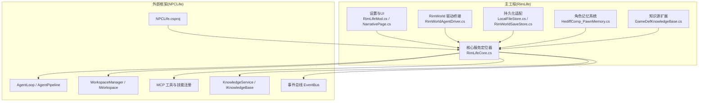
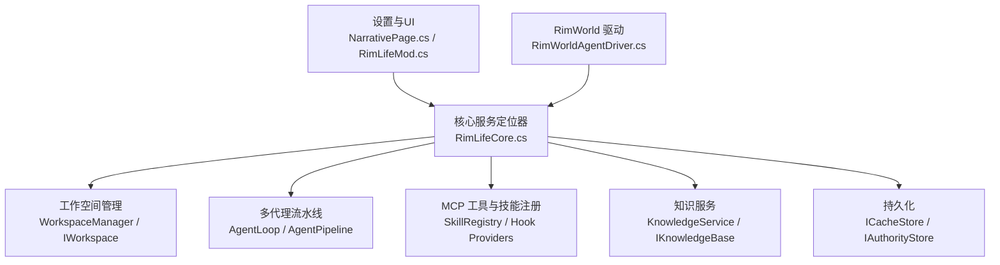
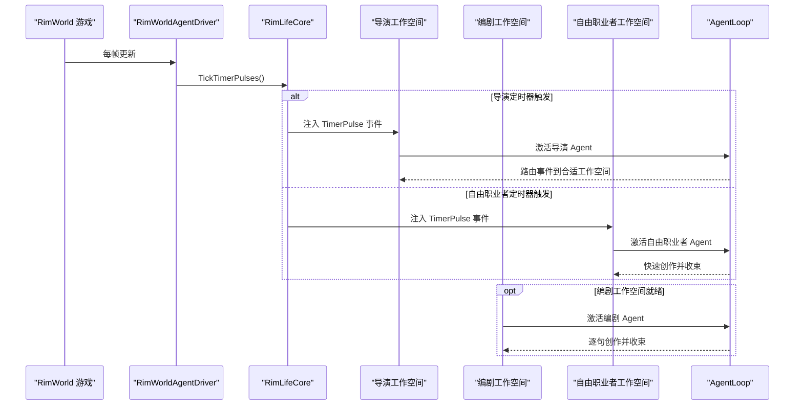
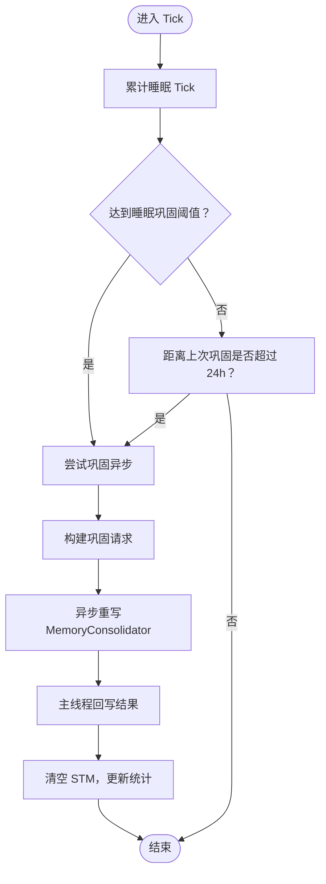
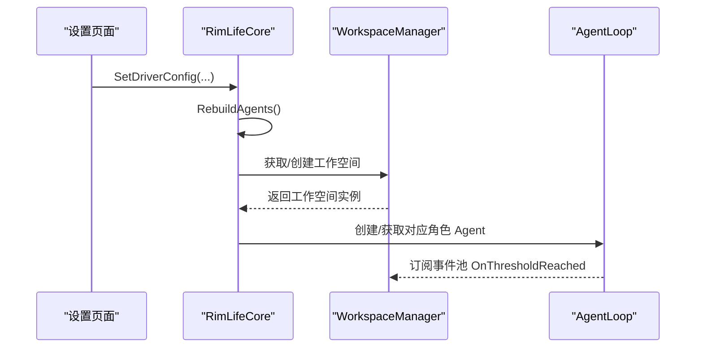
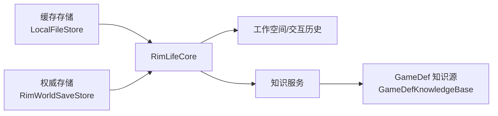
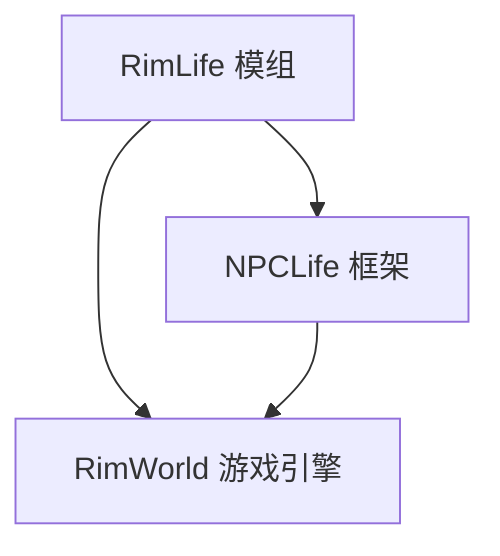

# 项目概述

<cite>
**本文引用的文件**
- [About.xml](file://About/About.xml)
- [RimLifeMod.cs](file://Source/Settings/RimLifeMod.cs)
- [RimLifeCore.cs](file://Source/Infrastructure/RimLifeCore.cs)
- [RimWorldAgentDriver.cs](file://Source/Infrastructure/RimWorldAgentDriver.cs)
- [NarrativePage.cs](file://Source/UI/Pages/NarrativePage.cs)
- [LocalFileStore.cs](file://Source/Infrastructure/LocalFileStore.cs)
- [RimWorldSaveStore.cs](file://Source/Infrastructure/RimWorldSaveStore.cs)
- [GameDefKnowledgeBase.cs](file://Source/Infrastructure/Knowledge/GameDefKnowledgeBase.cs)
- [HediffComp_PawnMemory.cs](file://Source/Data/PawnPro/Memory/HediffComp_PawnMemory.cs)
- [DirectorPrompt.txt](file://Prompts/DirectorPrompt.txt)
- [ScreenwriterPrompt.txt](file://Prompts/ScreenwriterPrompt.txt)
- [FreelancerPrompt.txt](file://Prompts/FreelancerPrompt.txt)
- [NPCLife.csproj](file://ext/NPCLife/src/NPCLife/NPCLife.csproj)
</cite>

## 目录
1. [引言](#引言)
2. [项目结构](#项目结构)
3. [核心组件](#核心组件)
4. [架构总览](#架构总览)
5. [详细组件分析](#详细组件分析)
6. [依赖分析](#依赖分析)
7. [性能考虑](#性能考虑)
8. [故障排查指南](#故障排查指南)
9. [结论](#结论)
10. [附录](#附录)

## 引言
RimLife 是一个面向 RimWorld 1.6 的智能叙事增强模组，旨在通过 LLM 驱动的多代理协作系统，为殖民地故事叙述注入动态、连贯且富有沉浸感的体验。它将导演（Director）、编剧（Screenwriter）、自由职业者（Freelancer）三类智能代理置于统一的“工作空间”（Workspace）之上，借助 MCP 工具协议与知识库，围绕事件流进行分层治理与创作，形成“事件收集—剧情规划—分线创作—即时叙事”的闭环。

RimLife 的创新点在于：
- 三层代理分工明确：导演负责宏观规划与路由，编剧专注长线剧情创作，自由职业者处理突发与即兴事件；
- 工作空间驱动的多线叙事：每个工作空间承载特定角色、目标与上下文，支持并行创作与独立收束；
- 与 NPCLife 框架深度集成：复用其多代理流水线、MCP 工具体系、事件总线与生命周期管理；
- 角色记忆系统：为每个角色提供短期/长期记忆、即时心境与定期巩固机制，支撑更自然的人格化叙事；
- 存档级持久化：通过权威存储与缓存存储分离，保障跨存档一致性与运行时性能。

## 项目结构
RimLife 采用“主工程 + 外部 NPCLife 框架”的双仓结构：
- 主工程（RimLife）：包含 RimWorld 适配层、UI 设置、持久化适配、角色记忆与知识源扩展等；
- 外部框架（ext/NPCLife）：NPCLife 通用多代理叙事框架，提供 Agent 流水线、MCP 工具、工作空间、事件总线、知识服务等能力。

图表来源
- [RimLifeMod.cs:1-69](file://Source/Settings/RimLifeMod.cs#L1-L69)
- [RimLifeCore.cs:1-1095](file://Source/Infrastructure/RimLifeCore.cs#L1-L1095)
- [RimWorldAgentDriver.cs:1-25](file://Source/Infrastructure/RimWorldAgentDriver.cs#L1-L25)
- [LocalFileStore.cs:1-145](file://Source/Infrastructure/LocalFileStore.cs#L1-L145)
- [RimWorldSaveStore.cs:1-113](file://Source/Infrastructure/RimWorldSaveStore.cs#L1-L113)
- [GameDefKnowledgeBase.cs:1-242](file://Source/Infrastructure/Knowledge/GameDefKnowledgeBase.cs#L1-L242)
- [NPCLife.csproj:1-38](file://ext/npclife/src/NPCLife/NPCLife.csproj#L1-L38)

章节来源
- [About.xml:1-13](file://About/About.xml#L1-L13)
- [NPCLife.csproj:1-38](file://ext/npclife/src/NPCLife/NPCLife.csproj#L1-L38)

## 核心组件
- 多代理协作系统
  - 导演（Director）：审查事件、挑选主线潜力事件、路由至工作空间、必要时合并/拆分工作空间。
  - 编剧（Screenwriter）：在工作空间内根据上下文创作台词，逐句输出并收束轮次。
  - 自由职业者（Freelancer）：处理突发与独立事件，快速即兴创作，不维护跨轮次延续。
- 工作空间（Workspace）
  - 每个工作空间绑定一组角色、目标与上下文，支持并行存在与独立收束；导演工作空间负责全局规划，自由职业者工作空间处理即兴事件，其他工作空间由剧情线驱动。
- MCP 工具与技能注册
  - 通过技能注册表集中管理工具元数据，扫描工具类型自动生成技能→工具映射；游戏侧通过 Hook Provider 注入查询工具（角色、环境、关系、知识、记忆等）。
- 事件驱动与定时脉冲
  - 全局时钟脉冲（每 tick 递增），导演与自由职业者按配置间隔触发 TimerPulse 事件，驱动 Agent 激活与创作。
- 持久化与知识
  - 缓存存储（本地文件）与权威存储（存档文件）分离；知识库接入 RimWorld 官方 Def 数据，提供只读外部知识源。

章节来源
- [RimLifeCore.cs:1-1095](file://Source/Infrastructure/RimLifeCore.cs#L1-L1095)
- [RimWorldAgentDriver.cs:1-25](file://Source/Infrastructure/RimWorldAgentDriver.cs#L1-L25)
- [LocalFileStore.cs:1-145](file://Source/Infrastructure/LocalFileStore.cs#L1-L145)
- [RimWorldSaveStore.cs:1-113](file://Source/Infrastructure/RimWorldSaveStore.cs#L1-L113)
- [GameDefKnowledgeBase.cs:1-242](file://Source/Infrastructure/Knowledge/GameDefKnowledgeBase.cs#L1-L242)

## 架构总览
RimLife 的整体架构以 RimLifeCore 为核心枢纽，向上对接 UI 设置与事件驱动，向下整合持久化、知识与 MCP 工具，并通过 NPCLife 框架提供多代理流水线与工作空间管理。

图表来源
- [RimLifeCore.cs:1-1095](file://Source/Infrastructure/RimLifeCore.cs#L1-L1095)
- [RimWorldAgentDriver.cs:1-25](file://Source/Infrastructure/RimWorldAgentDriver.cs#L1-L25)
- [NarrativePage.cs:1-221](file://Source/UI/Pages/NarrativePage.cs#L1-L221)
- [RimLifeMod.cs:1-69](file://Source/Settings/RimLifeMod.cs#L1-L69)

## 详细组件分析

### 多代理协作与提示词设计
- 导演职责：审查事件、挑选主线潜力事件、路由至工作空间、合并/拆分工作空间。
- 编剧职责：在工作空间内逐句创作台词，完成轮次收束，提供前情提要与结果摘要。
- 自由职业者职责：处理突发与独立事件，快速即兴创作，不维护跨轮次延续。
- 提示词来源：DirectorPrompt.txt、ScreenwriterPrompt.txt、FreelancerPrompt.txt。

图表来源
- [RimWorldAgentDriver.cs:18-22](file://Source/Infrastructure/RimWorldAgentDriver.cs#L18-L22)
- [RimLifeCore.cs:493-543](file://Source/Infrastructure/RimLifeCore.cs#L493-L543)
- [RimLifeCore.cs:627-716](file://Source/Infrastructure/RimLifeCore.cs#L627-L716)
- [DirectorPrompt.txt:1-17](file://Prompts/DirectorPrompt.txt#L1-L17)
- [ScreenwriterPrompt.txt:1-16](file://Prompts/ScreenwriterPrompt.txt#L1-L16)
- [FreelancerPrompt.txt:1-17](file://Prompts/FreelancerPrompt.txt#L1-L17)

章节来源
- [DirectorPrompt.txt:1-17](file://Prompts/DirectorPrompt.txt#L1-L17)
- [ScreenwriterPrompt.txt:1-16](file://Prompts/ScreenwriterPrompt.txt#L1-L16)
- [FreelancerPrompt.txt:1-17](file://Prompts/FreelancerPrompt.txt#L1-L17)
- [RimLifeCore.cs:627-716](file://Source/Infrastructure/RimLifeCore.cs#L627-L716)

### 角色记忆系统（PawnMemory）
- 记忆分区：短期记忆（STM）、长期记忆（LTM）、短期回顾（Review）、即时心境（Mindset）。
- 巩固机制：满足时间间隔或睡眠阈值时触发异步巩固，将 STM 转换为 LTM 并清理 STM。
- 查询接口：按主题标签、关联角色筛选；提供最近记忆与关键记忆快照。
- 写入入口：仅通过 MCP 工具调用更新即时心境，保证一致性与可审计性。

图表来源
- [HediffComp_PawnMemory.cs:232-328](file://Source/Data/PawnPro/Memory/HediffComp_PawnMemory.cs#L232-L328)
- [HediffComp_PawnMemory.cs:382-398](file://Source/Data/PawnPro/Memory/HediffComp_PawnMemory.cs#L382-L398)

章节来源
- [HediffComp_PawnMemory.cs:1-408](file://Source/Data/PawnPro/Memory/HediffComp_PawnMemory.cs#L1-L408)

### 工作空间与事件驱动
- 工作空间角色：导演、自由职业者、编剧（其他）。
- 事件池：每个工作空间维护事件池，定时脉冲与外部事件注入其中，AgentLoop 基于阈值与轮次限制自动激活。
- 配置参数：事件数阈值、重要度阈值、定时器间隔、历史缓冲容量、最大轮数等，通过 UI 页面实时调整并重建 Agent 生效。

图表来源
- [NarrativePage.cs:112-157](file://Source/UI/Pages/NarrativePage.cs#L112-L157)
- [RimLifeCore.cs:663-716](file://Source/Infrastructure/RimLifeCore.cs#L663-L716)

章节来源
- [NarrativePage.cs:1-221](file://Source/UI/Pages/NarrativePage.cs#L1-L221)
- [RimLifeCore.cs:493-543](file://Source/Infrastructure/RimLifeCore.cs#L493-L543)

### 持久化与知识
- 缓存存储（ICacheStore）：以本地文件形式按存档 GUID 命名缓存 JSON，用于驱动配置、提示词配置等非存档关键数据。
- 权威存储（IAuthorityStore）：通过世界组件嵌入 RimWorld 存档文件，持久化工作空间、交互历史与知识条目。
- 知识源扩展：注册 RimWorld 官方 Def 类型（ThingDef、PawnKindDef、HediffDef 等），提供语义标签与多层匹配策略，作为只读外部知识源接入知识服务。

图表来源
- [LocalFileStore.cs:14-145](file://Source/Infrastructure/LocalFileStore.cs#L14-L145)
- [RimWorldSaveStore.cs:14-113](file://Source/Infrastructure/RimWorldSaveStore.cs#L14-L113)
- [GameDefKnowledgeBase.cs:15-242](file://Source/Infrastructure/Knowledge/GameDefKnowledgeBase.cs#L15-L242)
- [RimLifeCore.cs:368-426](file://Source/Infrastructure/RimLifeCore.cs#L368-L426)

章节来源
- [LocalFileStore.cs:1-145](file://Source/Infrastructure/LocalFileStore.cs#L1-L145)
- [RimWorldSaveStore.cs:1-113](file://Source/Infrastructure/RimWorldSaveStore.cs#L1-L113)
- [GameDefKnowledgeBase.cs:1-242](file://Source/Infrastructure/Knowledge/GameDefKnowledgeBase.cs#L1-L242)

## 依赖分析
- 模组版本兼容：支持 RimWorld 1.4/1.5/1.6。
- 外部框架依赖：NPCLife 作为核心框架，提供多代理、MCP、工作空间、事件总线与知识服务。
- 游戏适配层：通过 RimLifeCore 注入日志、时间提供者、脚本消费者与脚本行解析器；通过 Hook Provider 注入角色、环境、关系、知识、记忆等查询工具。
- UI 与设置：RimLifeMod 负责设置窗口绘制与凭据持久化；NarrativePage 提供驱动配置的可视化编辑。

图表来源
- [About.xml:5-8](file://About/About.xml#L5-L8)
- [NPCLife.csproj:12](file://ext/npclife/src/NPCLife/NPCLife.csproj#L12)
- [RimLifeMod.cs:47-67](file://Source/Settings/RimLifeMod.cs#L47-L67)

章节来源
- [About.xml:1-13](file://About/About.xml#L1-L13)
- [NPCLife.csproj:1-38](file://ext/npclife/src/NPCLife/NPCLife.csproj#L1-L38)
- [RimLifeMod.cs:1-69](file://Source/Settings/RimLifeMod.cs#L1-L69)

## 性能考虑
- 异步巩固：记忆巩固在 Task 中执行，完成后通过主线程调度器回写，避免阻塞游戏主线程。
- 定时脉冲：全局时钟每 tick 递增，导演与自由职业者按配置间隔触发，避免频繁激活导致的性能抖动。
- 工具调用限制：通过最大轮数与阈值控制 Agent 激活频率与工具调用次数，防止死循环与过度 API 调用。
- 缓存与持久化：缓存存储与权威存储分离，减少存档文件体积与 IO 压力；驱动配置与提示词配置缓存于本地文件，提升启动速度。

## 故障排查指南
- 设置页面无法保存或生效
  - 检查 UI 是否正确调用 SetDriverConfig 并触发 RebuildAgents。
  - 确认日志中是否存在配置校验失败信息。
- Agent 未被创建或未激活
  - 确认存档已加载且权威存储已注册；确认 LLM 凭证已配置。
  - 检查定时器间隔与阈值设置是否合理。
- 记忆巩固未发生
  - 检查是否满足睡眠阈值或 24 小时强制触发条件。
  - 查看日志中是否有巩固重写失败警告。
- 知识查询结果为空
  - 确认 GameDef 知识源已正确注册相关 Def 类型。
  - 检查查询关键词是否符合精确/包含匹配策略。

章节来源
- [NarrativePage.cs:112-157](file://Source/UI/Pages/NarrativePage.cs#L112-L157)
- [RimLifeCore.cs:124-142](file://Source/Infrastructure/RimLifeCore.cs#L124-L142)
- [HediffComp_PawnMemory.cs:256-281](file://Source/Data/PawnPro/Memory/HediffComp_PawnMemory.cs#L256-L281)
- [GameDefKnowledgeBase.cs:94-164](file://Source/Infrastructure/Knowledge/GameDefKnowledgeBase.cs#L94-L164)

## 结论
RimLife 将 NPCLife 的通用多代理叙事框架与 RimWorld 的具体需求相结合，形成了以工作空间为中心、以事件驱动为核心的 LLM 驱动智能叙事系统。通过导演、编剧、自由职业者的角色分工与 MCP 工具协议，RimLife 能够在保持高可玩性的同时，提供连贯、多样且可持续的叙事体验。配合角色记忆系统与知识源扩展，RimLife 不仅提升了殖民地故事的真实感与沉浸感，也为未来扩展（如多线并行、跨存档叙事）奠定了坚实基础。

## 附录
- 实际使用场景示例
  - 主线剧情推进：导演收集多起事件后，路由到新的工作空间，编剧逐句创作关键对话，最终由导演评估是否继续推进。
  - 日常即兴事件：自由职业者在定时脉冲触发下，快速创作一次性的对话或事件，不引入复杂剧情负担。
  - 角色成长叙事：通过角色记忆系统记录关键事件与心境变化，编剧在后续轮次中引用这些记忆，形成连贯的角色弧光。
- 版本兼容性
  - 支持 RimWorld 1.4/1.5/1.6。

章节来源
- [About.xml:5-8](file://About/About.xml#L5-L8)